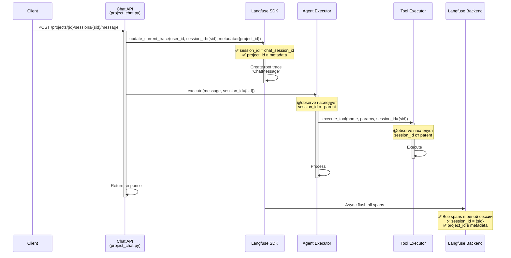
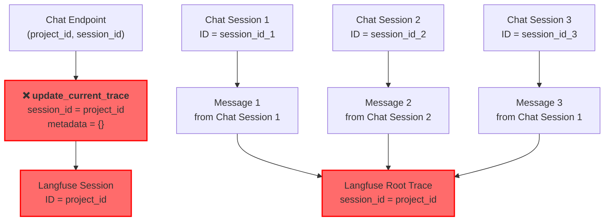
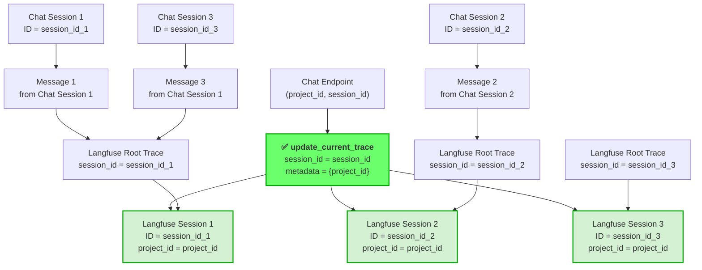
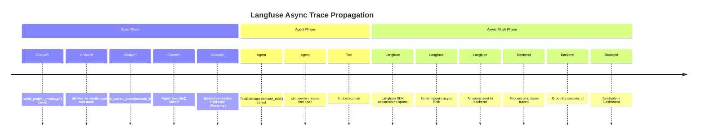

# SESSION_ID_PROPAGATION_IMPLEMENTATION_PLAN

## 1. Проблема и решение

### Текущая проблема

В текущей реализации Langfuse интеграции (v4) обнаружена критическая ошибка логики группировки traces:

**Файл:** [`app/routes/project_chat.py:219-222`](app/routes/project_chat.py:219-222)
```python
langfuse_client.client.update_current_trace(
    user_id=str(user_id),
    session_id=str(project_id),  # ❌ ПРОБЛЕМА: session_id = project_id
)
```

**Файл:** [`app/services/langfuse_client.py:99-101`](app/services/langfuse_client.py:99-101)
```python
self.client.update_current_trace(
    user_id=str(user_id),
    session_id=str(project_id),  # ❌ ПРОБЛЕМА: session_id = project_id
    tags=all_tags,
)
```

### Последствия проблемы

1. **Неправильная группировка traces**: Все traces от всех чат-сессий одного проекта группируются в одну Langfuse session
2. **Невозможность отслеживания conversation flows**: Отдельные conversation flows не различаются в Langfuse UI
3. **Потеря granularity**: Невозможно отследить metrics по отдельной чат-сессии
4. **Нарушение контекста**: Spans из разных чат-сессий смешиваются в одной сессии

**Пример проблемы:**
```
Проект "Customer Support" имеет 5 активных чат-сессий:
- Session 1 (Customer A)
- Session 2 (Customer B)
- Session 3 (Customer C)
- Session 4 (Customer D)
- Session 5 (Customer E)

Текущая реализация → Langfuse Session:
  "session_id": "project-123"
  traces: [
    - Message 1 от Customer A (Session 1)
    - Message 2 от Customer B (Session 2)
    - Message 3 от Customer A (Session 1)  ← Нельзя отличить от Customer B
    - Message 4 от Customer C (Session 3)
    - ...
  ]
```

### Ожидаемое поведение после исправления

```
Проект "Customer Support" имеет 5 активных чат-сессий:

Langfuse Sessions (ПО ОДНОЙ НА ЧАТ-СЕССИЮ):
  Session: "session-1"
    user_id: "user-123"
    metadata.project_id: "project-123"
    traces: [
      - Message 1 от Customer A
      - Message 3 от Customer A
    ]

  Session: "session-2"
    user_id: "user-123"
    metadata.project_id: "project-123"
    traces: [
      - Message 2 от Customer B
    ]

  Session: "session-3"
    user_id: "user-123"
    metadata.project_id: "project-123"
    traces: [
      - Message 4 от Customer C
    ]
  ...
```

### Архитектурное решение

**Ключевые изменения:**

1. **Отделить context'ы:**
   - `session_id` → используется для группировки traces в одну чат-сессию (реальный chat_session_id)
   - `project_id` → переместить в metadata для отладки и фильтрации

2. **Propagation hierarchy:**
   ```
   Chat Endpoint (project_id, session_id)
   └─ update_current_trace(session_id=chat_session_id, metadata.project_id=project_id)
      └─ Agent Executor (наследует session_id из parent)
         └─ Tool Executor (наследует session_id из parent)
   ```

3. **Обратная совместимость:**
   - Не нарушать существующие методы
   - Добавить новые параметры в update_trace_metadata()
   - Graceful degradation если session_id не передается

---

## 2. Изменения в коде

### Фаза 1: Исправление root trace (КРИТИЧНО) 🔴

**Приоритет:** Исправить НЕМЕДЛЕННО - это основная проблема

**Файл:** [`app/routes/project_chat.py`](app/routes/project_chat.py)

#### Текущая реализация (НЕПРАВИЛЬНО)

```python
@router.post("/{session_id}/message/", response_model=MessageResponse)
@observe(name="ChatMessage")
async def send_project_message(
    project_id: UUID,
    session_id: UUID,  # ← Это реальный chat_session_id
    message_request: MessageRequest,
    request: Request,
    ...
) -> MessageResponse:
    """Send message to chat session in project."""
    user_id = get_current_user_id(request)
    
    # ❌ НЕПРАВИЛЬНО: session_id установлена на project_id
    try:
        langfuse_client = get_langfuse_client()
        if langfuse_client.enabled and langfuse_client.client:
            langfuse_client.client.update_current_trace(
                user_id=str(user_id),
                session_id=str(project_id),  # ❌ ОШИБКА!
            )
    except Exception:
        pass
    
    # остальной код...
```

#### Правильная реализация

```python
@router.post("/{session_id}/message/", response_model=MessageResponse)
@observe(name="ChatMessage")
async def send_project_message(
    project_id: UUID,
    session_id: UUID,  # ← Это реальный chat_session_id
    message_request: MessageRequest,
    request: Request,
    ...
) -> MessageResponse:
    """Send message to chat session in project."""
    user_id = get_current_user_id(request)
    
    # ✅ ПРАВИЛЬНО: session_id = chat_session_id, project_id в metadata
    try:
        langfuse_client = get_langfuse_client()
        if langfuse_client.enabled and langfuse_client.client:
            langfuse_client.client.update_current_trace(
                user_id=str(user_id),
                session_id=str(session_id),  # ✅ Используем реальный chat_session_id
                metadata={
                    "project_id": str(project_id),  # ✅ Добавляем project_id в metadata
                }
            )
    except Exception:
        pass
    
    # остальной код...
```

#### Что изменилось

| Параметр | Было | Стало | Причина |
|----------|------|-------|---------|
| `session_id` | `str(project_id)` | `str(session_id)` | Группировка по реальной чат-сессии |
| `metadata` | Не использовалось | `{"project_id": str(project_id)}` | Контекст проекта в метаданных |

#### Пример кода (Полный diff)

```python
# ДО:
langfuse_client.client.update_current_trace(
    user_id=str(user_id),
    session_id=str(project_id),
)

# ПОСЛЕ:
langfuse_client.client.update_current_trace(
    user_id=str(user_id),
    session_id=str(session_id),  # ← Изменено
    metadata={                    # ← Добавлено
        "project_id": str(project_id),
    }
)
```

---

### Фаза 2: Расширение LangfuseClient (ОПЦИОНАЛЬНО) 🟡

**Приоритет:** Рекомендуется для лучшей API консистентности

**Файл:** [`app/services/langfuse_client.py`](app/services/langfuse_client.py:79-115)

#### Текущая реализация

```python
def update_trace_metadata(
    self,
    user_id: UUID,
    project_id: UUID,
    tags: Optional[list[str]] = None,
) -> None:
    """Update current trace with metadata.

    Args:
        user_id: User identifier
        project_id: Project identifier
        tags: Optional list of tags
    """
    if not self.enabled or not self.client:
        return

    try:
        all_tags = ["v0.2.0"] + (tags or [])

        self.client.update_current_trace(
            user_id=str(user_id),
            session_id=str(project_id),  # ❌ Неправильно
            tags=all_tags,
        )
        # ...
    except Exception as e:
        logger.warning("trace_metadata_update_failed", error=str(e))
```

#### Расширенная реализация с поддержкой session_id

```python
def update_trace_metadata(
    self,
    user_id: UUID,
    project_id: UUID,
    tags: Optional[list[str]] = None,
    session_id: Optional[UUID] = None,  # ← Новый параметр
    metadata: Optional[dict] = None,    # ← Новый параметр
) -> None:
    """Update current trace with metadata.

    Args:
        user_id: User identifier
        project_id: Project identifier
        tags: Optional list of tags
        session_id: Optional chat session ID (for proper session grouping)
        metadata: Optional dict with additional metadata

    Notes:
        - If session_id is provided, it will be used for trace grouping
        - If session_id is None, defaults to project_id for backward compatibility
        - project_id is always included in metadata
    """
    if not self.enabled or not self.client:
        return

    try:
        all_tags = ["v0.2.0"] + (tags or [])
        
        # Build metadata
        trace_metadata = metadata or {}
        trace_metadata["project_id"] = str(project_id)
        
        # Use session_id if provided, otherwise fall back to project_id
        trace_session_id = str(session_id) if session_id else str(project_id)
        
        self.client.update_current_trace(
            user_id=str(user_id),
            session_id=trace_session_id,  # ✅ Использует session_id если есть
            tags=all_tags,
            metadata=trace_metadata,  # ✅ Добавляет metadata
        )

        logger.debug(
            "trace_metadata_updated",
            user_id=str(user_id),
            session_id=trace_session_id,
            project_id=str(project_id),
            tags=all_tags,
        )

    except Exception as e:
        logger.warning(
            "trace_metadata_update_failed",
            error=str(e),
        )
```

#### Использование расширенного метода

```python
# Вариант 1: С явным session_id (рекомендуется для chat endpoints)
langfuse_client.update_trace_metadata(
    user_id=user_id,
    project_id=project_id,
    session_id=session_id,  # ✅ Явно передаем session_id
    tags=["chat", "orchestrated"]
)

# Вариант 2: С дополнительным metadata
langfuse_client.update_trace_metadata(
    user_id=user_id,
    project_id=project_id,
    session_id=session_id,
    metadata={
        "mode": "orchestrated",
        "agent_count": 3,
    },
    tags=["chat", "multi-agent"]
)

# Вариант 3: Backward compatible (без session_id)
langfuse_client.update_trace_metadata(
    user_id=user_id,
    project_id=project_id,
    tags=["legacy"]
)
# → session_id будет = project_id (для совместимости)
```

#### Что изменилось

| Аспект | Было | Стало |
|--------|------|-------|
| Параметры | `user_id, project_id, tags` | `user_id, project_id, tags, session_id, metadata` |
| session_id обработка | Жестко кодирован = project_id | Параметр с fallback на project_id |
| metadata обработка | Не используется | Поддерживается через параметр metadata |
| Backward compatibility | N/A | ✅ session_id опционален (fallback на project_id) |

---

### Фаза 3: Обновление спецификации 🟢

**Приоритет:** Обновить документацию

**Файл:** [`openspec/specs/agent-workflow-tracing/spec.md`](openspec/specs/agent-workflow-tracing/spec.md)

#### Обновление описания session_id

**Текущий текст (неправильный):**
```markdown
- **THEN** текущий trace получает:
  - `user_id`: идентификатор пользователя (для row-level security)
  - `session_id`: ID проекта (для группировки traces в сессию)
  - `tags`: включают версию приложения и кастомные теги
```

**Исправленный текст:**
```markdown
- **THEN** текущий trace получает:
  - `user_id`: идентификатор пользователя (для row-level security)
  - `session_id`: ID чат-сессии (для группировки traces одной conversation)
  - `metadata.project_id`: ID проекта (для контекста и фильтрации)
  - `tags`: включают версию приложения и кастомные теги
```

#### Обновление примера кода в спецификации

**Было:**
```python
langfuse_client.client.update_current_trace(
    user_id=str(user_id),
    session_id=str(project_id),
)
```

**Стало:**
```python
langfuse_client.client.update_current_trace(
    user_id=str(user_id),
    session_id=str(session_id),
    metadata={
        "project_id": str(project_id),
    }
)
```

#### Добавление уточнения в Requirements

**Добавить новое requirement:**

```markdown
### Requirement: Правильная пропагация session_id

Traces ДОЛЖНЫ группироваться по чат-сессиям, а не по проектам.

#### Scenario: Session ID Propagation in Chat Endpoint
- **WHEN** [`send_project_message`](app/routes/project_chat.py:195) обновляет metadata trace
- **THEN** session_id устанавливается на реальный `chat_session_id` (не `project_id`)
- **AND** `project_id` добавляется в `metadata` для контекста
- **AND** все child spans наследуют корректный `session_id` из parent trace

#### Scenario: Metadata Structure
- **WHEN** trace обновляется через `update_current_trace()`
- **THEN** metadata включает:
  - `user_id`: для row-level security
  - `session_id`: ID чат-сессии (для группировки)
  - `metadata.project_id`: ID проекта (для фильтрации и контекста)
  - Дополнительные поля (mode, agent_id, target_model и т.д.)
```

---

## 3. Дополнительные улучшения

### Расширенные метаданные

После исправления основной проблемы рекомендуется расширить metadata для лучшего анализа:

#### В Chat Endpoint

```python
# Вариант 1: Минимальный (Фаза 1)
metadata = {
    "project_id": str(project_id),
}

# Вариант 2: Расширенный (Рекомендуется)
metadata = {
    "project_id": str(project_id),
    "mode": message_request.mode,  # "direct", "orchestrated"
    "target_agent_id": str(message_request.target_agent_id) if message_request.target_agent_id else None,
    "user_id": str(user_id),
}
```

#### В Agent Executor

```python
# Добавить metadata в @observe декоратор
@observe(
    name="Executor",
    metadata={
        "agent_id": str(self.agent_id),
        "agent_name": self.agent_name,
        "model": model_name,
    }
)
async def execute(self, ...):
    # ...
```

#### В Tool Executor

```python
# Добавить metadata в @observe декоратор
@observe(
    as_type="tool",
    name="ExecuteTool",
    metadata={
        "tool_category": "file_operations",  # или "web", "computation" и т.д.
        "requires_approval": requires_approval,
    }
)
async def execute_tool(self, tool_name: str, ...):
    # ...
```

### Улучшенные теги для фильтрации

```python
# В Chat Endpoint
tags = [
    "v0.2.0",
    message_request.mode,  # "direct" или "orchestrated"
    "project:" + str(project_id),
    "user:" + str(user_id),
]

if message_request.target_agent_id:
    tags.append("agent:" + str(message_request.target_agent_id))

langfuse_client.client.update_current_trace(
    user_id=str(user_id),
    session_id=str(session_id),
    tags=tags,
    metadata={...}
)
```

### Примеры кода для дополнительных улучшений

#### Пример 1: Полный metadata с дополнительным контекстом

```python
# app/routes/project_chat.py
langfuse_client.client.update_current_trace(
    user_id=str(user_id),
    session_id=str(session_id),
    tags=[
        "v0.2.0",
        message_request.mode,
        "chat_message",
    ],
    metadata={
        "project_id": str(project_id),
        "mode": message_request.mode,
        "target_agent_id": str(message_request.target_agent_id) 
            if message_request.target_agent_id else None,
        "has_history": session_history is not None,
        "message_length": len(message_request.content),
    }
)
```

#### Пример 2: Metadata в Agent Executor

```python
# app/agents/contextual_agent.py
@observe(
    name="Executor",
    metadata={
        "agent_id": str(self.agent_id),
        "agent_name": self.agent_name,
        "model": model_name,
        "provider_type": provider_type,
    }
)
async def execute(
    self,
    user_message: str,
    session_history: list[dict[str, str]] | None = None,
    task_id: str | None = None,
    session_id: UUID | None = None,
) -> dict[str, Any]:
    # ...
```

#### Пример 3: Metadata в Tool Executor

```python
# app/core/tools/executor.py
@observe(
    as_type="tool",
    name="ExecuteTool",
    metadata={
        "tool_category": self._get_tool_category(tool_name),
        "requires_approval": self.risk_assessor.assess(tool_name),
        "user_id": str(self.user_id),
        "project_id": str(self.project_id),
    }
)
async def execute_tool(
    self,
    tool_name: str,
    tool_params: dict,
    session_id: Optional[UUID] = None,
) -> ToolExecutionResponse:
    # ...
```

---

## 4. Что НЕ требует изменений

### ✅ Автоматическая propagation через @observe

**Декораторы в Agent и ToolExecutor уже правильно пропагируют session_id:**

```python
# Эти декораторы РАБОТАЮТ КОРРЕКТНО
@observe(name="Executor")  # ← Автоматически наследует session_id из parent
async def execute(self, ...):
    pass

@observe(as_type="tool", name="ExecuteTool")  # ← Автоматически наследует session_id
async def execute_tool(self, ...):
    pass
```

**Что происходит автоматически:**
- Langfuse SDK v4 автоматически связывает parent и child spans
- session_id наследуется из parent trace в child spans
- Не нужно явно передавать session_id в декораторах

### ✅ Передача session_id через параметры функций

**Это УЖЕ реализовано и работает:**

```python
# app/agents/contextual_agent.py
async def execute(
    self,
    user_message: str,
    session_id: UUID | None = None,  # ← Уже есть параметр
) -> dict[str, Any]:
    # session_id может использоваться для логирования, tool execution и т.д.
```

### ✅ Использование contextvars

**Langfuse SDK v4 сам управляет контекстом:**
- Не нужно явно устанавливать contextvars
- SDK автоматически отслеживает текущий trace через asyncio context
- Decorators handle the context management

---

## 5. План тестирования

### 5.1 Unit тесты

#### Тест 1: Проверка правильности session_id в root trace

```python
# tests/test_langfuse_integration.py

async def test_chat_message_session_id_is_correct(
    client: TestClient,
    db: AsyncSession,
    redis: Redis,
    monkeypatch,
):
    """Verify that session_id in root trace is chat_session_id, not project_id"""
    
    # Mock Langfuse client
    mock_langfuse = AsyncMock()
    monkeypatch.setattr("app.routes.project_chat.get_langfuse_client", 
                       lambda: mock_langfuse)
    
    # Prepare test data
    user = await create_test_user(db)
    project = await create_test_project(db, user_id=user.id)
    session = await create_test_chat_session(db, project_id=project.id)
    
    # Send message
    response = await client.post(
        f"/projects/{project.id}/sessions/{session.id}/message",
        json={"content": "Test message"},
        headers={"Authorization": f"Bearer {create_test_token(user.id)}"}
    )
    
    # Verify update_current_trace was called with correct session_id
    mock_langfuse.update_current_trace.assert_called_once()
    call_args = mock_langfuse.update_current_trace.call_args
    
    # ✅ Проверяем, что session_id = session.id, а не project.id
    assert call_args.kwargs["session_id"] == str(session.id)
    assert call_args.kwargs["metadata"]["project_id"] == str(project.id)
```

#### Тест 2: Проверка metadata содержит project_id

```python
async def test_chat_message_metadata_includes_project_id(
    client: TestClient,
    db: AsyncSession,
    monkeypatch,
):
    """Verify that metadata includes project_id"""
    
    mock_langfuse = AsyncMock()
    monkeypatch.setattr("app.routes.project_chat.get_langfuse_client", 
                       lambda: mock_langfuse)
    
    user = await create_test_user(db)
    project = await create_test_project(db, user_id=user.id)
    session = await create_test_chat_session(db, project_id=project.id)
    
    response = await client.post(
        f"/projects/{project.id}/sessions/{session.id}/message",
        json={"content": "Test"},
        headers={"Authorization": f"Bearer {create_test_token(user.id)}"}
    )
    
    call_args = mock_langfuse.update_current_trace.call_args
    
    # ✅ Проверяем, что metadata содержит project_id
    assert "metadata" in call_args.kwargs
    assert call_args.kwargs["metadata"]["project_id"] == str(project.id)
```

#### Тест 3: Backward compatibility LangfuseClient

```python
async def test_update_trace_metadata_backward_compatibility():
    """Verify that update_trace_metadata works without session_id (backward compat)"""
    
    client = LangfuseClient(settings)
    client.enabled = True
    client.client = AsyncMock()
    
    # Call without session_id (old API)
    client.update_trace_metadata(
        user_id=UUID("12345678-1234-5678-1234-567812345678"),
        project_id=UUID("87654321-4321-8765-4321-876543218765"),
        tags=["test"]
    )
    
    # Verify that session_id defaults to project_id
    call_args = client.client.update_current_trace.call_args
    assert call_args.kwargs["session_id"] == "87654321-4321-8765-4321-876543218765"
```

#### Тест 4: update_trace_metadata с session_id

```python
async def test_update_trace_metadata_with_session_id():
    """Verify that update_trace_metadata uses session_id when provided"""
    
    client = LangfuseClient(settings)
    client.enabled = True
    client.client = AsyncMock()
    
    session_id = UUID("11111111-2222-3333-4444-555555555555")
    project_id = UUID("99999999-8888-7777-6666-555555555555")
    
    # Call with session_id
    client.update_trace_metadata(
        user_id=UUID("12345678-1234-5678-1234-567812345678"),
        project_id=project_id,
        session_id=session_id,
        tags=["test"]
    )
    
    # Verify that session_id is used, and project_id is in metadata
    call_args = client.client.update_current_trace.call_args
    assert call_args.kwargs["session_id"] == str(session_id)
    assert call_args.kwargs["metadata"]["project_id"] == str(project_id)
```

### 5.2 Integration тесты

#### Тест 5: Propagation session_id через child spans

```python
async def test_session_id_propagation_to_agent_span(
    client: TestClient,
    db: AsyncSession,
    redis: Redis,
    monkeypatch,
):
    """Verify that session_id is propagated from chat to agent to tool spans"""
    
    # Mock Langfuse to capture all trace updates
    captured_traces = []
    
    original_observe = observe
    def mock_observe(*args, **kwargs):
        def decorator(func):
            async def wrapper(*call_args, **call_kwargs):
                # Capture trace info
                captured_traces.append({
                    "name": kwargs.get("name"),
                    "type": kwargs.get("as_type"),
                })
                return await func(*call_args, **call_kwargs)
            return wrapper
        return decorator
    
    monkeypatch.setattr("app.routes.project_chat.observe", mock_observe)
    monkeypatch.setattr("app.agents.contextual_agent.observe", mock_observe)
    
    # Send message
    user = await create_test_user(db)
    project = await create_test_project(db, user_id=user.id)
    session = await create_test_chat_session(db, project_id=project.id)
    
    response = await client.post(
        f"/projects/{project.id}/sessions/{session.id}/message",
        json={"content": "Test", "target_agent_id": str(project.default_agent_id)},
        headers={"Authorization": f"Bearer {create_test_token(user.id)}"}
    )
    
    # ✅ Verify spans were created
    assert len(captured_traces) >= 2
    assert captured_traces[0]["name"] == "ChatMessage"
    assert captured_traces[1]["name"] == "Executor"
```

#### Тест 6: Проверка metadata в Langfuse UI (Integration)

```python
async def test_langfuse_metadata_visible_in_dashboard(
    langfuse_client_live,
    db: AsyncSession,
):
    """Verify that metadata is visible in actual Langfuse dashboard"""
    
    # This is an integration test that requires live Langfuse instance
    user = await create_test_user(db)
    project = await create_test_project(db, user_id=user.id)
    session = await create_test_chat_session(db, project_id=project.id)
    
    # Send trace to Langfuse
    trace = langfuse_client_live.client.trace(
        name="ChatMessage",
        session_id=str(session.id),
        user_id=str(user.id),
        metadata={
            "project_id": str(project.id),
            "mode": "direct",
        }
    )
    
    trace.span(
        name="TestSpan",
        input={"message": "test"},
        output={"response": "ok"}
    )
    
    langfuse_client_live.flush()
    
    # Fetch trace from Langfuse API
    import asyncio
    await asyncio.sleep(2)  # Wait for async flush
    
    traces = langfuse_client_live.client.get_traces(
        session_id=str(session.id)
    )
    
    # ✅ Verify trace exists with correct session_id
    assert len(traces) >= 1
    assert traces[0]["sessionId"] == str(session.id)
    assert traces[0]["metadata"]["project_id"] == str(project.id)
```

### 5.3 Проверка в Langfuse UI (Manual)

#### Checklist для ручного тестирования

- [ ] **Проверка grouping по session_id:**
  1. Создать проект с несколькими чат-сессиями
  2. Отправить 2-3 сообщения в каждую сессию
  3. Открыть Langfuse Dashboard
  4. Проверить, что каждая сессия в Langfuse содержит traces только от одной чат-сессии
  5. Проверить, что session_id в Langfuse совпадает с chat_session_id (не project_id)

- [ ] **Проверка metadata:**
  1. Открыть trace в Langfuse UI
  2. Проверить, что metadata содержит:
     - `project_id`: корректный ID проекта
     - `user_id`: корректный ID пользователя
  3. Проверить, что session_id соответствует чат-сессии

- [ ] **Проверка фильтрации:**
  1. В Langfuse Dashboard найти фильтр по metadata
  2. Фильтровать по `project_id`
  3. Проверить, что отфильтрованы traces только от этого проекта
  4. Проверить, что traces из разных чат-сессий показаны отдельно

- [ ] **Проверка иерархии spans:**
  1. Открыть trace из чат-сессии
  2. Проверить, что все child spans (Executor, Tool execution и т.д.) содержат корректный session_id
  3. Проверить, что duration и timing корректны

---

## 6. Диаграммы

### 6.1 Sequence diagram - Правильная propagation session_id



### 6.2 Архитектурная диаграмма ДО/ПОСЛЕ

#### ДО (НЕПРАВИЛЬНО)



**Проблема:** Все traces от разных чат-сессий группируются в одну Langfuse session!

#### ПОСЛЕ (ПРАВИЛЬНО)



**Решение:** Каждая чат-сессия имеет свою Langfuse session с правильным session_id!

### 6.3 Data flow diagram - Metadata propagation

```mermaid
graph LR
    A["1. Chat Endpoint<br/>(project_id, session_id)"]
    B["2. update_current_trace<br/>session_id={sid}<br/>metadata={proj_id}"]
    C["3. Langfuse Root Trace"]
    D["4. Agent @observe<br/>наследует session_id"]
    E["5. Tool @observe<br/>наследует session_id"]
    F["6. Langfuse Backend<br/>сессия правильно<br/>сгруппирована"]
    
    A -->|user_id, project_id,<br/>session_id| B
    B -->|create| C
    C -->|parent| D
    D -->|parent| E
    E -->|all spans| F
    
    C -->|session_id={sid}| F
    D -->|session_id={sid}| F
    E -->|session_id={sid}| F
    
    style A fill:#e3f2fd
    style B fill:#fff3e0
    style C fill:#f3e5f5
    style D fill:#e8f5e9
    style E fill:#e8f5e9
    style F fill:#fce4ec
```

### 6.4 Timing diagram - Async propagation



---

## 7. Реализация: Пошаговый план

### Этап 1: Подготовка (1-2 часа)
1. ✅ Создать feature branch `fix/session-id-propagation`
2. ✅ Добавить unit тесты (но НЕ запускать, они пока будут падать)
3. ✅ Обновить changelog с описанием изменений

### Этап 2: Реализация Фазы 1 (КРИТИЧНО) (30-60 минут)
1. ✅ Изменить [`app/routes/project_chat.py:219-222`](app/routes/project_chat.py:219-222)
   - `session_id=str(project_id)` → `session_id=str(session_id)`
   - Добавить `metadata={"project_id": str(project_id)}`

2. ✅ Запустить unit тесты для проверки
3. ✅ Ручное тестирование с Langfuse Dashboard

### Этап 3: Реализация Фазы 2 (ОПЦИОНАЛЬНО) (1-2 часа)
1. ✅ Расширить [`app/services/langfuse_client.py:79-115`](app/services/langfuse_client.py:79-115)
   - Добавить параметры `session_id` и `metadata`
   - Реализовать fallback logic
   
2. ✅ Обновить все вызовы `update_trace_metadata()` в коде
3. ✅ Запустить unit тесты

### Этап 4: Реализация Фазы 3 (ОБНОВЛЕНИЕ ДОКУМЕНТАЦИИ) (30-45 минут)
1. ✅ Обновить спецификацию [`openspec/specs/agent-workflow-tracing/spec.md`](openspec/specs/agent-workflow-tracing/spec.md)
2. ✅ Добавить новое requirement для session_id propagation
3. ✅ Обновить примеры кода

### Этап 5: Полное тестирование (1-2 часа)
1. ✅ Запустить все unit тесты
2. ✅ Запустить integration тесты
3. ✅ Ручное тестирование в Langfuse Dashboard:
   - Проверить grouping по session_id
   - Проверить metadata presence
   - Проверить фильтрацию по project_id

### Этап 6: Документирование и PR (30-45 минут)
1. ✅ Обновить `CHANGELOG.md`
2. ✅ Создать PR с описанием
3. ✅ Code review
4. ✅ Merge в main

---

## 8. Файлы для изменения (Резюме)

| Файл | Фаза | Приоритет | Статус |
|------|------|-----------|--------|
| [`app/routes/project_chat.py:219-222`](app/routes/project_chat.py:219-222) | 1 | 🔴 КРИТИЧНО | Требует изменения |
| [`app/services/langfuse_client.py:79-115`](app/services/langfuse_client.py:79-115) | 2 | 🟡 РЕКОМЕНДУЕТСЯ | Опционально |
| [`openspec/specs/agent-workflow-tracing/spec.md`](openspec/specs/agent-workflow-tracing/spec.md) | 3 | 🟢 ДОКУМЕНТАЦИЯ | Требует обновления |
| [`tests/test_langfuse_integration.py`](tests/test_langfuse_integration.py) | 5 | 🟡 РЕКОМЕНДУЕТСЯ | Добавить тесты |
| [`CHANGELOG.md`](CHANGELOG.md) | 6 | 🟢 ДОКУМЕНТАЦИЯ | Обновить |

---

## 9. Заключение

Эта реализация исправляет критическую проблему в Langfuse интеграции, которая препятствует правильному отслеживанию conversation flows. После внедрения этих изменений:

✅ **Каждая чат-сессия будет иметь свою Langfuse session**
✅ **Traces будут правильно сгруппированы по session_id**
✅ **Контекст проекта будет сохранен в metadata для фильтрации**
✅ **Все child spans будут наследовать корректный session_id**
✅ **Backward compatibility будет сохранена**

Документ готов к передаче в режим Code для реализации.
