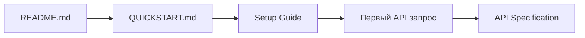
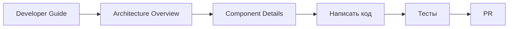
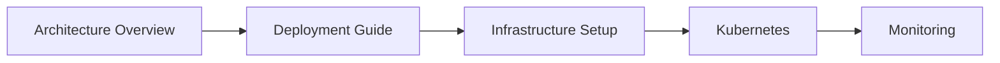
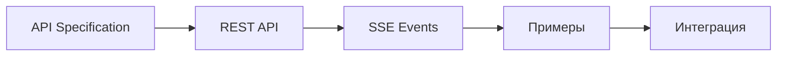

# Документация CodeLab Core Service

## 📚 Полный индекс документации

Добро пожаловать в документацию CodeLab Core Service - персональной мультиагентной AI платформы с полной изоляцией пользователей.

---

## 🎯 Быстрый доступ

### Для новых пользователей
1. 📖 [README](../README.md) - Начните здесь
2. ⚡ [Quick Start](../QUICKSTART.md) - Быстрый запуск за 5 минут
3. 🔧 [Setup Guide](./setup-guide.md) - Детальная установка

### Для разработчиков
1. 👨‍💻 [Developer Guide](./architecture/developer-guide.md) - Руководство разработчика
2. 🏗️ [Architecture Overview](./architecture/system-overview.md) - Архитектура системы
3. 🧪 [Testing Guide](../tests/README.md) - Тестирование

### Для DevOps
1. 🚀 [Deployment Guide](./architecture/deployment-guide.md) - Развертывание
2. 📊 [Infrastructure Setup](./infrastructure-setup.md) - Настройка инфраструктуры
3. 🔍 [Monitoring](./architecture/deployment-guide.md#мониторинг) - Мониторинг

### Для API пользователей
1. 🌐 [API Specification](./architecture/api-specification.md) - REST API
2. 📡 [SSE Events](./sse-event-streaming.md) - Real-time события
3. 📋 [REST API Details](./rest-api.md) - Детали API

---

## 📂 Структура документации

```
doc/
├── INDEX.md                          # 👈 Вы здесь
│
├── architecture/                     # 🏗️ Архитектурная документация
│   ├── README.md                     # Обзор архитектурных документов
│   ├── system-overview.md            # Обзор архитектуры системы
│   ├── component-details.md          # Детали компонентов
│   ├── api-specification.md          # Спецификация API
│   ├── deployment-guide.md           # Руководство по развертыванию
│   └── developer-guide.md            # Руководство разработчика
│
├── setup-guide.md                    # Руководство по установке
├── infrastructure-setup.md           # Настройка инфраструктуры
├── rest-api.md                       # REST API документация
├── sse-event-streaming.md            # SSE события
├── litellm-integration.md            # Интеграция с LiteLLM
├── agent-context.md                  # Контекстное хранилище
├── samples.md                        # Примеры использования
├── techincal-requrements.md          # Технические требования
└── bugfix-agent-config-validation.md # История исправлений
```

---

## 📖 Документы по категориям

### 🎓 Обучающие материалы

#### [README.md](../README.md)
**Основная документация проекта**
- Обзор возможностей
- Быстрый старт (3 варианта)
- Структура проекта
- Примеры API
- Мониторинг

#### [QUICKSTART.md](../QUICKSTART.md)
**Быстрый старт за 5 минут**
- Автоматическая настройка
- Минимальная конфигурация
- Первый запрос

#### [Setup Guide](./setup-guide.md)
**Детальное руководство по установке**
- Требования к системе
- Пошаговая установка
- Настройка окружения
- Решение проблем

---

### 🏗️ Архитектура

#### [Architecture Overview](./architecture/system-overview.md)
**Обзор архитектуры системы**
- Ключевые принципы
- Высокоуровневая архитектура (Mermaid диаграммы)
- Компоненты системы
- Потоки данных
- Схема базы данных
- Масштабируемость
- Безопасность
- Мониторинг

#### [Component Details](./architecture/component-details.md)
**Детальное описание компонентов**
- User Isolation Middleware
- Agent Manager
- Agent Bus
- Contextual Agent
- SSE Manager
- Agent Context Store

С диаграммами, примерами кода и объяснениями.

#### [API Specification](./architecture/api-specification.md)
**Полная спецификация REST API**
- Аутентификация (JWT)
- Все endpoints
- Схемы данных
- Коды ошибок
- Rate limiting
- Примеры (Python, JS, cURL)

#### [Deployment Guide](./architecture/deployment-guide.md)
**Руководство по развертыванию**
- Локальная разработка
- Docker Compose
- Kubernetes (полная конфигурация)
- Мониторинг (Prometheus, Grafana)
- Резервное копирование
- Troubleshooting

#### [Developer Guide](./architecture/developer-guide.md)
**Руководство для разработчиков**
- Настройка окружения
- Структура проекта
- Стандарты кодирования
- Тестирование
- Отладка
- Добавление функций
- Best practices

---

### 🔧 Технические руководства

#### [Infrastructure Setup](./infrastructure-setup.md)
**Настройка инфраструктуры**
- Обзор компонентов
- Схема базы данных
- Миграции
- Docker Compose конфигурации
- Health checks
- Seed data
- Troubleshooting

#### [REST API](./rest-api.md)
**REST API документация**
- Endpoints описание
- Request/Response примеры
- Аутентификация
- Обработка ошибок

#### [SSE Event Streaming](./sse-event-streaming.md)
**Server-Sent Events**
- Типы событий
- Подключение к SSE
- Обработка событий
- Примеры клиентов

#### [LiteLLM Integration](./litellm-integration.md)
**Интеграция с LiteLLM**
- Настройка LiteLLM прокси
- Конфигурация
- Использование разных провайдеров
- Примеры

#### [Agent Context](./agent-context.md)
**Контекстное хранилище агентов**
- Архитектура RAG
- Qdrant интеграция
- Поиск контекста
- Управление памятью

---

### 🧪 Тестирование

#### [Testing Guide](../tests/README.md)
**Руководство по тестированию**
- Структура тестов
- Запуск тестов
- Fixtures
- Coverage

#### [Test Report](../tests/TEST_REPORT.md)
**Отчеты о тестировании**
- Результаты тестов
- Coverage метрики
- Известные проблемы

#### [Agents API Tests](../tests/TEST_AGENTS_API.md)
**Тесты API агентов**
- Тестовые сценарии
- Примеры запросов
- Ожидаемые результаты

---

### 🛠️ Утилиты и скрипты

#### [Scripts README](../scripts/README.md)
**Документация скриптов**
- init_db.py - Инициализация БД
- generate_test_jwt.py - Генерация JWT
- gradio_ui.py - Тестовый UI

#### [Gradio Client](../scripts/GRADIO_CLIENT.md)
**Gradio UI клиент**
- Установка
- Использование
- Функции

---

### 📋 Спецификации

#### [Technical Requirements](./techincal-requrements.md)
**Техническое задание v5.0**
- Цели проекта
- Архитектура системы
- Функциональные требования
- База данных
- User Isolation
- Мультиагентное взаимодействие
- Qdrant RAG
- Approval Manager
- SSE Event Stream
- Нефункциональные требования
- Этапы разработки

#### [Samples](./samples.md)
**Примеры использования**
- Примеры кода
- Use cases
- Интеграции

---

### 📝 История и изменения

#### [Infrastructure Complete](../INFRASTRUCTURE_COMPLETE.md)
**Статус инфраструктуры**
- Реализованные компоненты
- Текущий статус
- Следующие шаги

#### [Bugfix: Agent Config Validation](./bugfix-agent-config-validation.md)
**История исправлений**
- Описание проблемы
- Решение
- Тесты

---

## 🎯 Сценарии использования

### Сценарий 1: Первый запуск проекта



**Шаги**:
1. Прочитать [README.md](../README.md)
2. Следовать [QUICKSTART.md](../QUICKSTART.md)
3. При проблемах - [Setup Guide](./setup-guide.md)
4. Изучить [API Specification](./architecture/api-specification.md)

---

### Сценарий 2: Разработка новой функции



**Шаги**:
1. [Developer Guide](./architecture/developer-guide.md) - стандарты
2. [Architecture Overview](./architecture/system-overview.md) - понимание системы
3. [Component Details](./architecture/component-details.md) - детали компонента
4. Написать код и тесты
5. Создать PR

---

### Сценарий 3: Развертывание в production



**Шаги**:
1. [Architecture Overview](./architecture/system-overview.md) - понимание архитектуры
2. [Deployment Guide](./architecture/deployment-guide.md) - инструкции
3. [Infrastructure Setup](./infrastructure-setup.md) - настройка
4. Развертывание в Kubernetes
5. Настройка мониторинга

---

### Сценарий 4: Интеграция с API



**Шаги**:
1. [API Specification](./architecture/api-specification.md) - полная спецификация
2. [REST API](./rest-api.md) - детали endpoints
3. [SSE Events](./sse-event-streaming.md) - real-time обновления
4. [Samples](./samples.md) - примеры кода
5. Реализация интеграции

---

## 🔍 Поиск информации

### По теме

| Тема | Документы |
|------|-----------|
| **Установка** | [README](../README.md), [QUICKSTART](../QUICKSTART.md), [Setup Guide](./setup-guide.md) |
| **Архитектура** | [System Overview](./architecture/system-overview.md), [Component Details](./architecture/component-details.md) |
| **API** | [API Specification](./architecture/api-specification.md), [REST API](./rest-api.md) |
| **Развертывание** | [Deployment Guide](./architecture/deployment-guide.md), [Infrastructure Setup](./infrastructure-setup.md) |
| **Разработка** | [Developer Guide](./architecture/developer-guide.md), [Testing Guide](../tests/README.md) |
| **Real-time** | [SSE Events](./sse-event-streaming.md) |
| **LLM** | [LiteLLM Integration](./litellm-integration.md), [Agent Context](./agent-context.md) |

### По роли

| Роль | Рекомендуемые документы |
|------|-------------------------|
| **Новый разработчик** | README → Developer Guide → Architecture Overview → Component Details |
| **Frontend разработчик** | API Specification → REST API → SSE Events → Samples |
| **Backend разработчик** | Developer Guide → Component Details → Testing Guide |
| **DevOps/SRE** | Architecture Overview → Deployment Guide → Infrastructure Setup |
| **Архитектор** | System Overview → Component Details → Technical Requirements |
| **QA Engineer** | Testing Guide → Test Report → API Specification |

---

## 📊 Диаграммы и визуализации

Все архитектурные диаграммы используют **Mermaid** и находятся в:
- [System Overview](./architecture/system-overview.md) - высокоуровневые диаграммы
- [Component Details](./architecture/component-details.md) - детальные диаграммы компонентов
- [Deployment Guide](./architecture/deployment-guide.md) - диаграммы развертывания

### Типы диаграмм
- 🏗️ Архитектурные (graph)
- 🔄 Sequence диаграммы (sequenceDiagram)
- 📊 ER диаграммы (erDiagram)
- 🌊 Flowcharts (flowchart)
- 📈 State диаграммы (stateDiagram)

---

## 🆘 Получение помощи

### Документация не отвечает на вопрос?

1. **Поиск в документации**: Используйте Ctrl+F в GitHub или IDE
2. **GitHub Issues**: Создайте issue с тегом `documentation`
3. **Slack**: #codelab-dev для вопросов разработки
4. **Email**: techlead@company.com для архитектурных вопросов

### Нашли ошибку в документации?

1. Создайте issue на GitHub
2. Или сразу PR с исправлением
3. Следуйте [Developer Guide](./architecture/developer-guide.md) для стиля

---

## 🔄 Обновление документации

### Когда обновлять

- ✅ Добавлены новые компоненты
- ✅ Изменены API endpoints
- ✅ Изменена архитектура
- ✅ Добавлены зависимости
- ✅ Изменен процесс развертывания

### Как обновлять

1. Найдите соответствующий документ
2. Обновите содержимое
3. Обновите диаграммы (если нужно)
4. Проверьте ссылки
5. Создайте PR

---

## 📈 Версионирование

**Текущая версия документации**: 0.1.0  
**Дата**: 2026-02-13  
**Статус**: Initial Release

### История версий

#### v0.1.0 (2026-02-13)
- ✨ Начальная версия документации
- 📋 System Overview с Mermaid диаграммами
- 🔧 Component Details для всех компонентов
- 🌐 API Specification с примерами
- 🚀 Deployment Guide для Docker и Kubernetes
- 👨‍💻 Developer Guide с best practices
- 📚 Организация всей документации

---

## 🎓 Дополнительные ресурсы

### Внешние ресурсы

- [FastAPI Documentation](https://fastapi.tiangolo.com/)
- [SQLAlchemy 2.0 Documentation](https://docs.sqlalchemy.org/en/20/)
- [Pydantic Documentation](https://docs.pydantic.dev/)
- [Qdrant Documentation](https://qdrant.tech/documentation/)
- [Kubernetes Documentation](https://kubernetes.io/docs/)

### Внутренние ресурсы

- GitHub Repository: https://github.com/pese-git/codelab-core-service

---

## 📞 Контакты

### Команда

- CodeLab Team

### Каналы связи

- **Email**: support@codelab.example.com
- **GitHub**: Issues и Discussions

---

## 📄 Лицензия

Документация распространяется под той же лицензией, что и код проекта.  
См. [LICENSE](../LICENSE) для деталей.

---

**Последнее обновление**: 2026-02-13  
**Мейнтейнер**: Tech Lead Team  
**Статус**: ✅ Актуально
