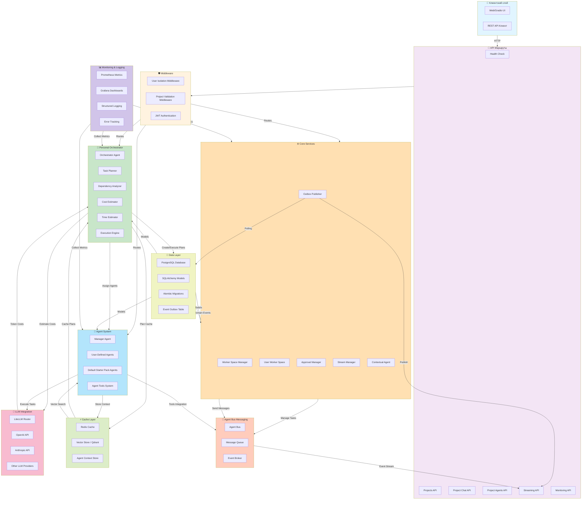
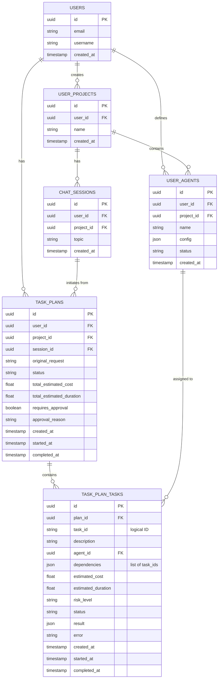
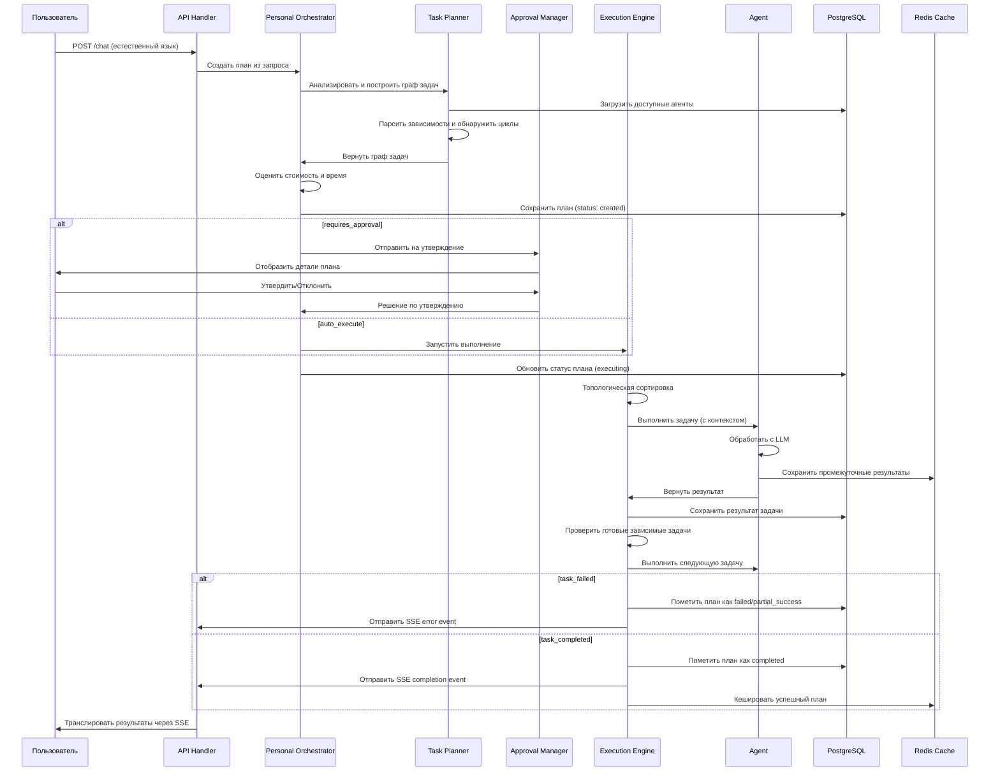
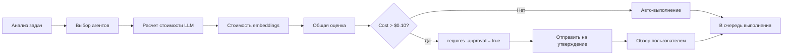
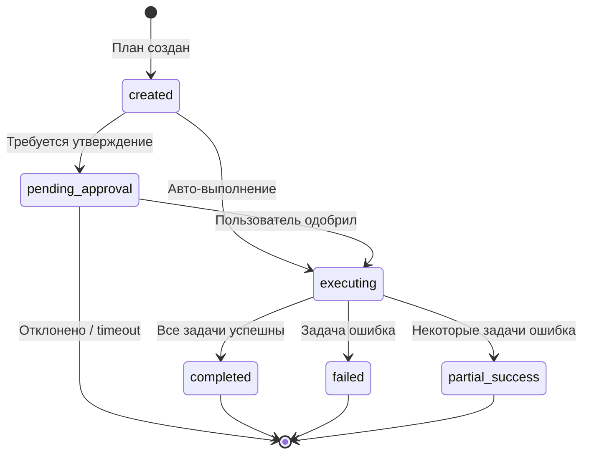

# Архитектура codelab-core-service

## Общая архитектура системы



## Схема базы данных (Task Plans)



## Workflow Personal Orchestrator



## Процесс оценки стоимости



## Взаимодействие ключевых подсистем

### 1. **Personal Orchestrator**
   - Анализирует естественный язык запросов
   - Строит графы зависимостей между задачами
   - Оценивает стоимость и длительность
   - Управляет workflow утверждения
   - Выполняет планы с правильной последовательностью

### 2. **Agent System**
   - Загружает агенты пользователя из БД
   - Выбирает агентов по требованиям задач
   - Выполняет задачи с назначенными LLM
   - Возвращает промежуточные результаты

### 3. **Storage Layer**
   - Сохраняет планы и задачи для восстановления
   - Ведет audit trail выполнения
   - Хранит промежуточные результаты

### 4. **Cache Layer**
   - Redis: Кеширует похожие планы (TTL 24h)
   - Qdrant: Векторный поиск по контексту
   - Сокращает время планирования

### 5. **Approval Manager**
   - Перехватывает планы, требующие утверждения
   - Предоставляет детали плана пользователю
   - Управляет timeout утверждения (300s)

### 6. **Agent Bus**
   - Маршрутизирует сообщения между агентами
   - Ведет event stream для SSE
   - Координирует параллельное выполнение

### 7. **Event Outbox + Publisher (Event Logging System)**
   - **Event Outbox**: Таблица для дурабельного хранения доменных событий
     - Записывает message_created, agent_switched и другие доменные события атомарно с изменением состояния
     - Использует JSONB для гибкого payload, индексы на (status, next_retry_at), (user_id), (project_id)
     - Гарантирует: нет потери событий, все-или-ничего при коммите
   
   - **Outbox Publisher**: Background сервис для надежной доставки
     - Периодически выбирает pending события с блокировкой FOR UPDATE SKIP LOCKED
     - Публикует в StreamManager через broadcast_event()
     - Exponential backoff retry (5s→10s→20s→40s→80s→300s)
     - Обновляет статус: pending → published/failed
     - Metrics: pending_count, published_total, failed_total, latency
   
   - **Analytics API**: Read-model на основе event_outbox
     - GET /my/projects/{project_id}/events (фильтры, пагинация)
     - GET /my/projects/{project_id}/analytics/sessions/{session_id}/events
     - GET /my/projects/{project_id}/analytics (агрегированные метрики)
     - User/Project изоляция через verify_project_access()

### 8. **Идемпотентность и надежность**
   - **Event ID**: outbox.id используется как event_id, стабилен при ретраях
   - **Consumer Deduplication**: Клиенты дедуплицируют по event_id в payload
   - **Exactly-Once Semantics**: At-least-once доставка + client-side deduplication
   - **Архитектурное разделение**:
     - Доменные события (message_created, agent_switched) → outbox-only
     - Технические события (DIRECT_AGENT_CALL, TASK_STARTED) → direct streaming + optional outbox

## Переходы статусов



## Индексы БД для производительности

```sql
-- таблица task_plans
CREATE INDEX ix_task_plans_user_id_project_id ON task_plans(user_id, project_id);
CREATE INDEX ix_task_plans_session_id ON task_plans(session_id);
CREATE INDEX ix_task_plans_status_created_at ON task_plans(status, created_at);

-- таблица task_plan_tasks
CREATE INDEX ix_task_plan_tasks_plan_id ON task_plan_tasks(plan_id);
CREATE INDEX ix_task_plan_tasks_agent_id ON task_plan_tasks(agent_id);
CREATE INDEX ix_task_plan_tasks_status ON task_plan_tasks(status);

-- таблица event_outbox (Event Logging System)
CREATE INDEX ix_event_outbox_status_next_retry ON event_outbox(status, next_retry_at, created_at);
CREATE INDEX ix_event_outbox_aggregate_id_created ON event_outbox(aggregate_id, created_at);
CREATE INDEX ix_event_outbox_project_id_created ON event_outbox(project_id, created_at);
CREATE INDEX ix_event_outbox_user_id_created ON event_outbox(user_id, created_at);
-- GIN индекс для JSONB поля payload (опционально для полнотекстового поиска)
CREATE INDEX ix_event_outbox_payload_gin ON event_outbox USING GIN (payload);
```

## Точки интеграции

1. **REST API Layer** → Маршрутизирует запросы в orchestrator
2. **User Isolation Middleware** → Обеспечивает контекст user_id
3. **Project Validation** → Валидирует доступ к project_id
4. **Authentication** → Валидация JWT токена
5. **Streaming API** → SSE события во время выполнения
6. **Monitoring** → Сбор метрик для dashboard

