# Детальное описание компонентов

## Содержание
- [User Isolation Middleware](#user-isolation-middleware)
- [Agent Manager](#agent-manager)
- [Agent Bus](#agent-bus)
- [Contextual Agent](#contextual-agent)
- [SSE Manager](#sse-manager)
- [Agent Context Store](#agent-context-store)

---

## User Isolation Middleware

### Назначение
Обеспечивает 100% изоляцию пользователей на уровне API, гарантируя, что каждый пользователь имеет доступ только к своим ресурсам.

### Архитектура

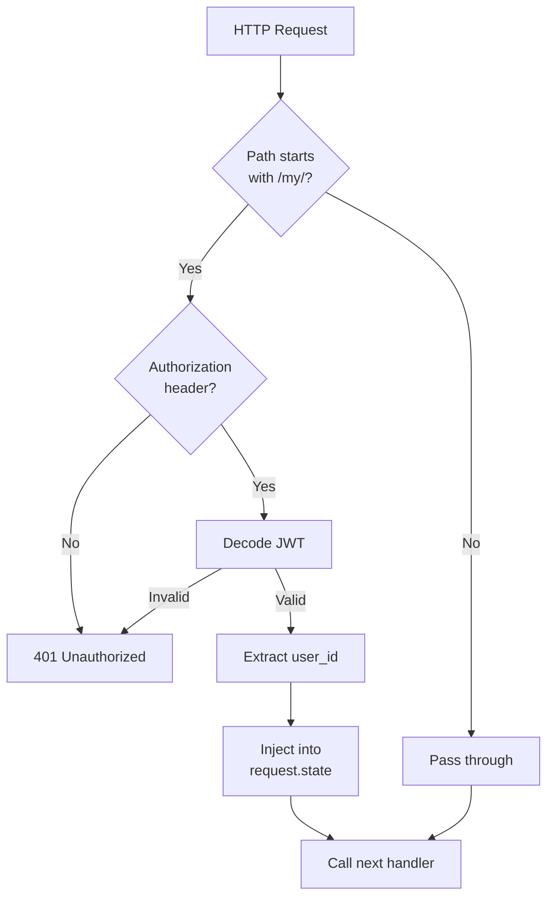

### Реализация

**Файл**: [`app/middleware/user_isolation.py`](../../app/middleware/user_isolation.py)

**Ключевые функции**:

```python
class UserIsolationMiddleware(BaseHTTPMiddleware):
    async def dispatch(self, request: Request, call_next):
        # 1. Проверка пути
        if not request.url.path.startswith("/my/"):
            return await call_next(request)
        
        # 2. Извлечение JWT токена
        auth_header = request.headers.get("Authorization")
        token = auth_header.split(" ")[1]
        
        # 3. Декодирование и валидация
        payload = jwt.decode(token, settings.jwt_secret_key, ...)
        user_id = UUID(payload.get("sub"))
        
        # 4. Инъекция контекста
        request.state.user_id = user_id
        request.state.user_prefix = f"user{user_id}"
        request.state.db_filter = {"user_id": user_id}
        
        # 5. Передача управления
        return await call_next(request)
```

### Инъектируемый контекст

| Атрибут | Тип | Описание |
|---------|-----|----------|
| `request.state.user_id` | UUID | Уникальный идентификатор пользователя |
| `request.state.user_prefix` | str | Префикс для ресурсов (например, "user123") |
| `request.state.db_filter` | dict | Фильтр для SQL запросов |

### Защищенные endpoints

Все endpoints с префиксом `/my/*`:
- `/my/agents/*` - управление агентами
- `/my/chat/*` - чат сессии
- `/my/sse/*` - SSE подключения
- `/my/orchestrators/*` - оркестраторы

### Обработка ошибок

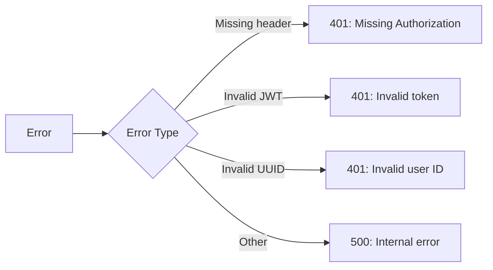

---

## Agent Manager

### Назначение
Управляет жизненным циклом персональных агентов пользователя: создание, чтение, обновление, удаление (CRUD).

### Архитектура

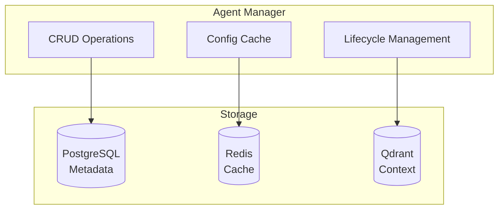

### Операции

#### 1. Создание агента

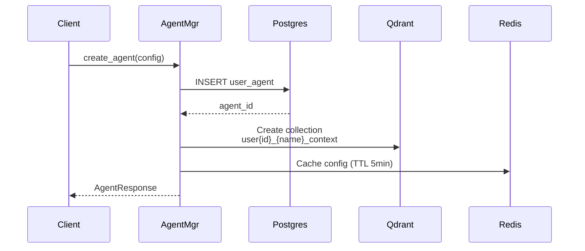

**Параметры конфигурации**:
```python
class AgentConfig:
    name: str                    # Имя агента
    system_prompt: str           # Системный промпт
    model: str                   # Модель LLM
    tools: list[str]             # Список инструментов
    concurrency_limit: int = 3   # Лимит параллельных задач
```

#### 2. Получение агента

```python
async def get_agent(agent_id: UUID) -> AgentResponse | None:
    # 1. Проверка кэша Redis
    cached = await redis.get(f"agent:{agent_id}:config")
    if cached:
        return parse_cached(cached)
    
    # 2. Запрос из PostgreSQL
    agent = await db.query(UserAgent).filter(
        UserAgent.id == agent_id,
        UserAgent.user_id == self.user_id  # Изоляция!
    ).first()
    
    # 3. Кэширование
    await redis.setex(f"agent:{agent_id}:config", 300, agent.config)
    
    return agent
```

#### 3. Обновление агента

- Обновление записи в PostgreSQL
- Инвалидация кэша в Redis
- Обновление конфигурации в Agent Bus (если зарегистрирован)

#### 4. Удаление агента

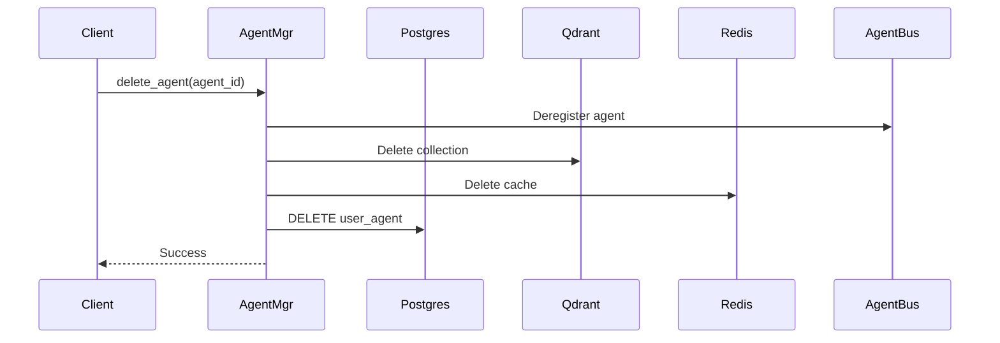

### Изоляция пользователей

Все операции автоматически фильтруются по `user_id`:

```sql
SELECT * FROM user_agents 
WHERE id = :agent_id 
  AND user_id = :user_id;  -- Критично!
```

---

## Agent Bus

### Назначение
Координирует выполнение задач между агентами с контролем параллелизма и управлением очередями.

### Архитектура

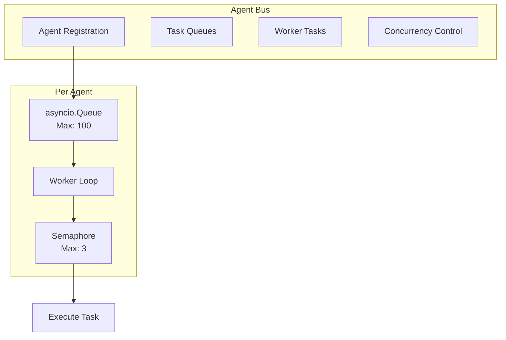

### Структура данных

```python
class AgentBus:
    queues: dict[UUID, asyncio.Queue]           # Очереди задач
    workers: dict[UUID, asyncio.Task]           # Worker tasks
    agent_handlers: dict[UUID, Callable]        # Обработчики
    max_concurrency: dict[UUID, int]            # Лимиты
    active_tasks: dict[UUID, int]               # Счетчики
```

### Жизненный цикл задачи

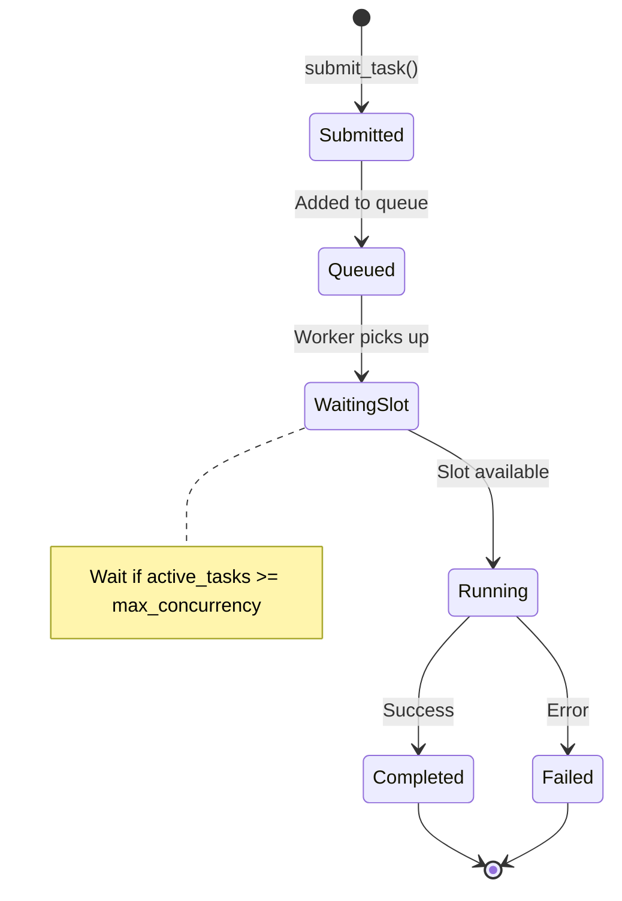

### Регистрация агента

```python
async def register_agent(
    agent_id: UUID,
    handler: Callable,
    max_concurrency: int = 3
):
    # 1. Создание очереди
    self.queues[agent_id] = asyncio.Queue(maxsize=100)
    
    # 2. Сохранение обработчика
    self.agent_handlers[agent_id] = handler
    
    # 3. Установка лимита
    self.max_concurrency[agent_id] = max_concurrency
    
    # 4. Запуск worker
    self.workers[agent_id] = asyncio.create_task(
        self._worker(agent_id)
    )
```

### Worker Loop

```python
async def _worker(agent_id: UUID):
    while True:
        # 1. Получить задачу из очереди
        task_item = await self.queues[agent_id].get()
        
        # 2. Ждать свободный слот
        while self.active_tasks[agent_id] >= self.max_concurrency[agent_id]:
            await asyncio.sleep(0.1)
        
        # 3. Увеличить счетчик
        self.active_tasks[agent_id] += 1
        
        # 4. Запустить обработку
        asyncio.create_task(self._process_task(agent_id, task_item))
```

### Обработка задачи

```python
async def _process_task(agent_id: UUID, task_item: TaskItem):
    try:
        # Выполнить обработчик
        handler = self.agent_handlers[agent_id]
        result = await handler(task_item)
        task_item.result = result
        
    except Exception as e:
        task_item.error = e
        
    finally:
        # Уменьшить счетчик
        self.active_tasks[agent_id] -= 1
        
        # Сигнализировать завершение
        task_item.completed.set()
        
        # Вызвать callback
        if task_item.callback:
            await task_item.callback(task_item.result)
```

### Метрики

```python
def get_stats() -> dict:
    return {
        "registered_agents": len(self.queues),
        "total_queue_size": sum(q.qsize() for q in self.queues.values()),
        "total_active_tasks": sum(self.active_tasks.values()),
        "agents": {
            str(agent_id): {
                "queue_size": self.queues[agent_id].qsize(),
                "active_tasks": self.active_tasks[agent_id],
                "max_concurrency": self.max_concurrency[agent_id],
            }
            for agent_id in self.queues
        }
    }
```

---

## Contextual Agent

### Назначение
Агент с семантической памятью, способный использовать RAG для контекстуализации ответов.

### Архитектура

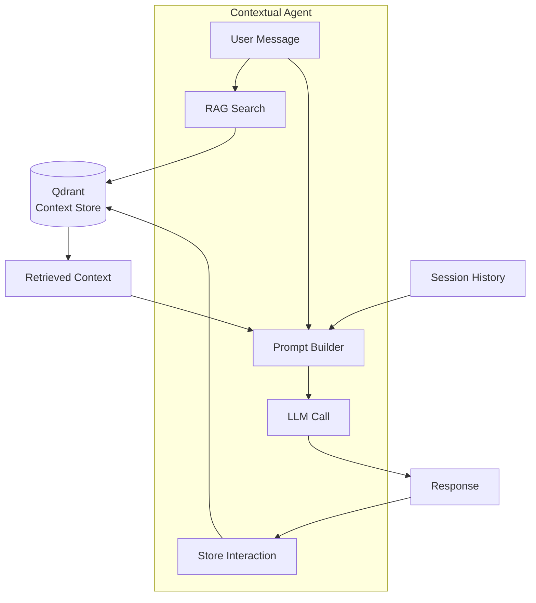

### Процесс выполнения

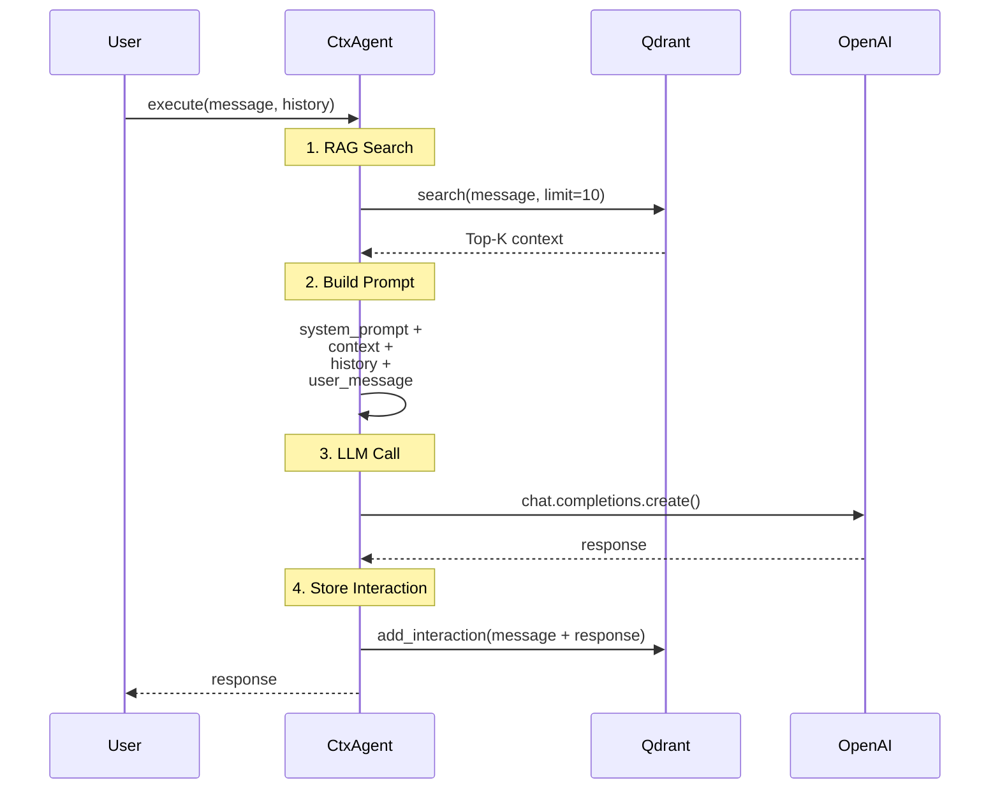

### Конфигурация

```python
class ContextualAgent:
    def __init__(
        self,
        agent_id: UUID,
        user_id: UUID,
        config: AgentConfig,
        qdrant_client: AsyncQdrantClient
    ):
        self.agent_id = agent_id
        self.user_id = user_id
        self.config = config
        
        # Инициализация контекстного хранилища
        self.context_store = AgentContextStore(
            client=qdrant_client,
            user_id=user_id,
            agent_name=config.name
        )
        
        # Инициализация LLM клиента
        self.llm_client = self._init_llm_client()
```

### RAG Search

```python
async def _get_relevant_context(
    self,
    query: str,
    limit: int = 10
) -> str:
    # Поиск релевантного контекста
    results = await self.context_store.search(
        query=query,
        limit=limit,
        filter_success=True  # Только успешные взаимодействия
    )
    
    # Форматирование контекста
    context_parts = []
    for result in results:
        context_parts.append(
            f"[Score: {result['score']:.2f}] {result['content']}"
        )
    
    return "\n\n".join(context_parts)
```

### Построение промпта

```python
def _build_messages(
    self,
    user_message: str,
    context: str,
    session_history: list[dict]
) -> list[dict]:
    messages = []
    
    # 1. Системный промпт с контекстом
    system_content = self.config.system_prompt
    if context:
        system_content += f"\n\nRelevant context:\n{context}"
    
    messages.append({
        "role": "system",
        "content": system_content
    })
    
    # 2. История сессии (последние 10 сообщений)
    messages.extend(session_history[-10:])
    
    # 3. Текущее сообщение пользователя
    messages.append({
        "role": "user",
        "content": user_message
    })
    
    return messages
```

### Обработка ошибок

```python
async def execute(self, user_message: str, ...) -> dict:
    try:
        # Выполнение
        response = await self._execute_internal(...)
        
        return {
            "success": True,
            "response": response,
            "context": context,
        }
        
    except Exception as e:
        logger.error("agent_execution_failed", error=str(e))
        
        return {
            "success": False,
            "error": str(e),
        }
```

---

## Stream Manager

### Назначение
Управляет streaming соединениями для real-time обновлений клиентов через Fetch API и NDJSON формат.

**Файл**: [`app/core/stream_manager.py`](../../app/core/stream_manager.py)

**Примечание**: Ранее назывался SSE Manager. Для обратной совместимости доступен алиас `SSEManager`.

### Архитектура

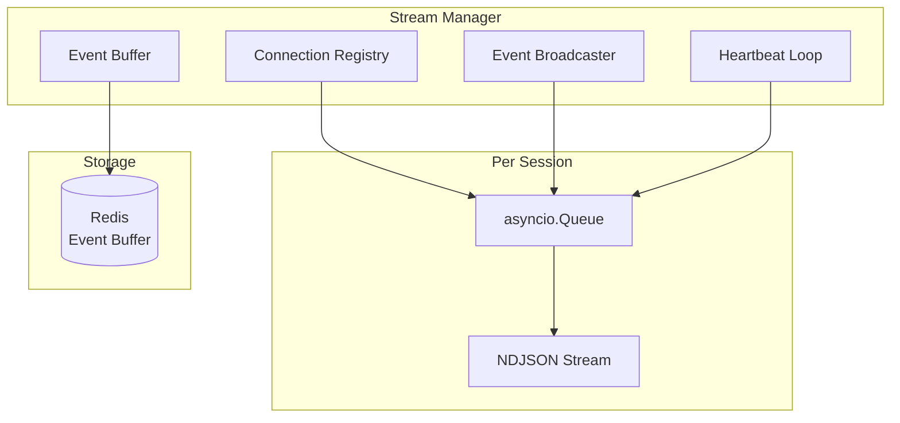

### Структура данных

```python
class StreamManager:
    # Соединения по сессиям
    connections: dict[UUID, list[StreamConnection]]
    
    # Сессии по пользователям
    user_sessions: dict[UUID, set[UUID]]
    
    # Heartbeat task
    _heartbeat_task: asyncio.Task | None
    
    # Константы
    MAX_BUFFER_SIZE = 100        # Максимум событий в буфере
    BUFFER_TTL = 300             # TTL буфера в Redis (5 минут)
    HEARTBEAT_INTERVAL = 30      # Интервал heartbeat (30 секунд)
    CONNECTION_TIMEOUT = 300     # Timeout соединения (5 минут)
    MAX_EVENT_SIZE = 10240       # Максимальный размер события (10KB)
```

### Регистрация соединения

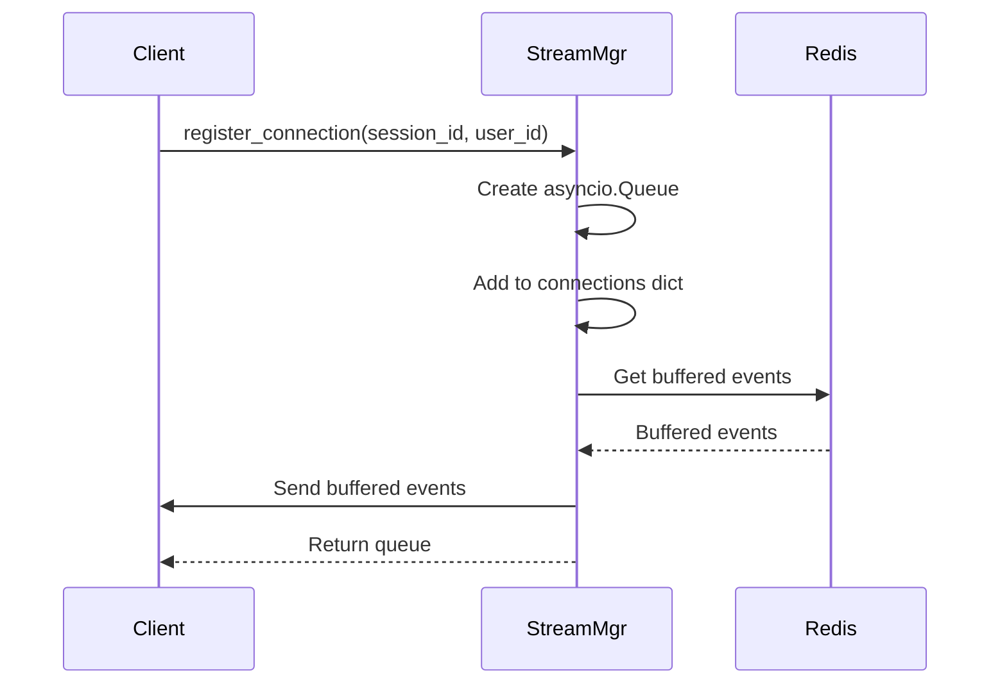

### Broadcast событий

```python
async def broadcast_event(
    self,
    session_id: UUID,
    event: StreamEvent,
    buffer: bool = True
) -> int:
    # 1. Валидация размера
    event_json = event.model_dump_json()
    if len(event_json) > self.MAX_EVENT_SIZE:
        # Усечение payload при превышении размера
        event.payload = {
            "error": "Payload too large",
            "truncated": True,
            "original_size": len(event_json)
        }
    
    # 2. Буферизация в Redis
    if buffer:
        await self._buffer_event(session_id, event)
    
    # 3. Отправка всем соединениям сессии
    sent_count = 0
    connections = self.connections.get(session_id, [])
    for conn in connections:
        if await conn.send_event(event):
            sent_count += 1
    
    return sent_count
```

### Буферизация событий

```python
async def _buffer_event(self, session_id: UUID, event: StreamEvent):
    buffer_key = f"stream:buffer:{session_id}"
    
    # 1. Добавить в список (FIFO)
    await self.redis.lpush(buffer_key, event.model_dump_json())
    
    # 2. Обрезать до максимального размера
    await self.redis.ltrim(buffer_key, 0, self.MAX_BUFFER_SIZE - 1)
    
    # 3. Установить TTL
    await self.redis.expire(buffer_key, self.BUFFER_TTL)
```

### Heartbeat Loop

```python
async def _heartbeat_loop(self):
    """Отправляет heartbeat всем активным соединениям каждые 30 секунд."""
    while True:
        await asyncio.sleep(self.HEARTBEAT_INTERVAL)
        
        async with self._lock:
            # Получить все соединения
            all_connections = [
                conn
                for conns in self.connections.values()
                for conn in conns
            ]
        
        # Отправить heartbeat
        for conn in all_connections:
            try:
                await conn.send_heartbeat()
            except Exception as e:
                logger.error(f"Heartbeat failed: {e}")
```

### Типы событий

```python
class StreamEventType(str, Enum):
    """Типы streaming событий."""
    DIRECT_AGENT_CALL = "direct_agent_call"
    AGENT_STATUS_CHANGED = "agent_status_changed"
    TASK_PLAN_CREATED = "task_plan_created"
    TASK_STARTED = "task_started"
    TASK_PROGRESS = "task_progress"
    TASK_COMPLETED = "task_completed"
    CONTEXT_RETRIEVED = "context_retrieved"
    TOOL_REQUEST = "tool_request"
    PLAN_REQUEST = "plan_request"
    APPROVAL_REQUIRED = "approval_required"
    HEARTBEAT = "heartbeat"
    ERROR = "error"
```

**Примечание**: Для обратной совместимости `SSEEventType` является алиасом для `StreamEventType`.

### Формат событий

События отправляются в формате JSON Lines (NDJSON):
```json
{"event_type":"task_started","payload":{"task_id":"...","description":"..."},"session_id":"...","timestamp":"2026-02-13T18:00:00Z"}
```

Каждое событие - это JSON объект на отдельной строке, завершающийся символом новой строки (`\n`).

---

## Agent Context Store

### Назначение
Хранит и извлекает семантический контекст агента используя Qdrant векторную базу данных.

### Архитектура

```mermaid
graph TB
    subgraph "Agent Context Store"
        Add[Add Interaction]
        Search[Search Context]
        Prune[Prune Old Vectors]
    end
    
    subgraph "Qdrant"
        Collection[Collection:<br/>user{id}_{name}_context]
        Vectors[Vectors: 1536-dim]
        Metadata[Metadata: content,<br/>type, timestamp]
    end
    
    subgraph "OpenAI"
        Embeddings[Embeddings API<br/>text-embedding-3-small]
    end
    
    Add --> Embeddings
    Search --> Embeddings
    Embeddings --> Collection
    Collection --> Vectors
    Collection --> Metadata
```

### Добавление взаимодействия

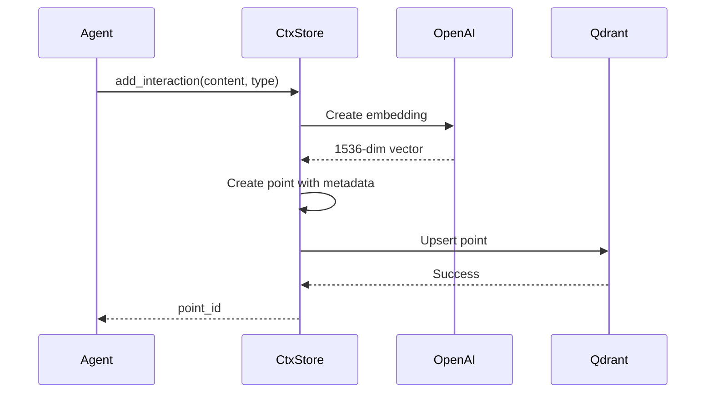

### Структура точки

```python
{
    "id": "uuid",
    "vector": [0.123, -0.456, ...],  # 1536 dimensions
    "payload": {
        "content": "User asked about...",
        "interaction_type": "user_query",
        "task_id": "task-123",
        "success": True,
        "timestamp": "2026-02-13T10:00:00Z",
        "metadata": {
            "model": "gpt-4",
            "tokens": 150
        }
    }
}
```

### Поиск контекста

```python
async def search(
    self,
    query: str,
    limit: int = 10,
    filter_success: bool | None = None,
    filter_type: str | None = None
) -> list[dict]:
    # 1. Создать embedding запроса
    response = await self.openai_client.embeddings.create(
        model=settings.openai_embedding_model,
        input=query
    )
    query_embedding = response.data[0].embedding
    
    # 2. Построить фильтр
    search_filter = self._build_filter(filter_success, filter_type)
    
    # 3. Выполнить поиск
    results = await self.client.query_points(
        collection_name=self.collection_name,
        query=query_embedding,
        limit=limit,
        query_filter=search_filter
    )
    
    # 4. Форматировать результаты
    return self._format_results(results)
```

### Pruning старых векторов

```python
async def prune(self, max_vectors: int = 1_000_000) -> int:
    stats = await self.get_stats()
    total_vectors = stats["total_vectors"]
    
    if total_vectors <= max_vectors:
        return 0
    
    # Удалить старые векторы (по timestamp)
    to_delete = int(total_vectors - max_vectors * 0.9)
    
    # Реализация удаления...
    
    return to_delete
```

### Fallback механизм

При недоступности OpenAI Embeddings API используется fallback:

```python
# Создание простого вектора из хеша контента
import hashlib

hash_obj = hashlib.sha256(content.encode())
hash_bytes = hash_obj.digest()

embedding = []
for i in range(1536):
    embedding.append((hash_bytes[i % len(hash_bytes)] / 255.0) - 0.5)
```

---

## Заключение

Все компоненты системы спроектированы с учетом:
- **Изоляции пользователей** на всех уровнях
- **Асинхронной архитектуры** для высокой производительности
- **Отказоустойчивости** с fallback механизмами
- **Масштабируемости** через stateless дизайн
- **Наблюдаемости** через логирование и метрики

Каждый компонент может быть независимо масштабирован и заменен при необходимости.
