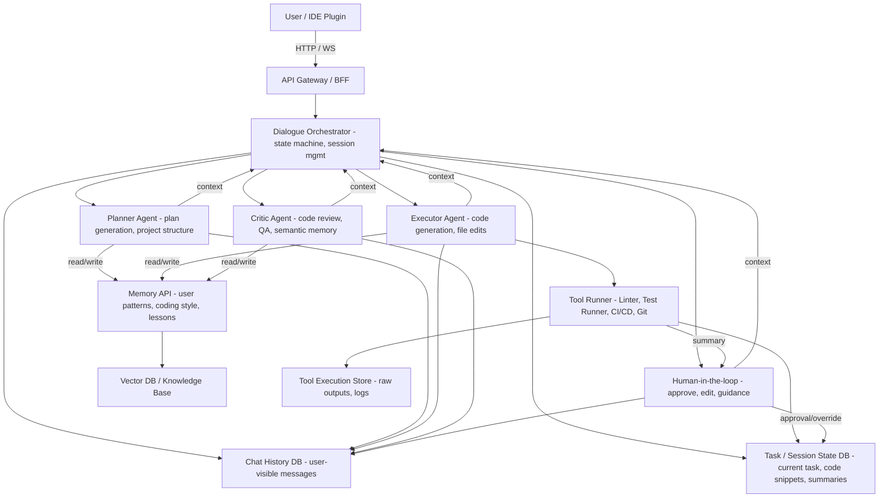
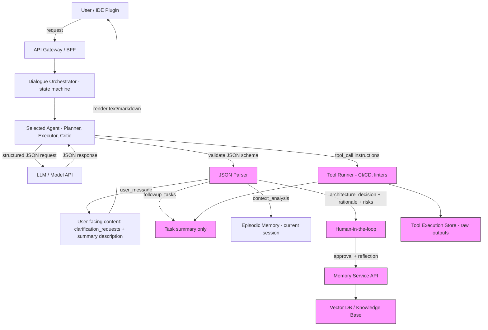

```mermaid
flowchart TD
    %% USER & SESSIONS
    User[User / IDE Plugin]

    %% SESSIONS
    User -->|connects| SessionA[Session A]
    User -->|connects| SessionB[Session B]

    %% CONVERSATIONS
    SessionA --> ConvA1[Conversation A1]
    SessionA --> ConvA2[Conversation A2]
    SessionB --> ConvB1[Conversation B1]

    %% ORCHESTRATOR
    ConvA1 --> OrchestratorA[Orchestrator - state machine]
    ConvA2 --> OrchestratorA2[Orchestrator]
    ConvB1 --> OrchestratorB[Orchestrator]

    %% CHAT HISTORY & TASK STATE
    OrchestratorA --> ChatHistoryA[Chat History DB - user-visible messages]
    OrchestratorA --> TaskStateA[Task State DB - current code snippets, task summary]
    OrchestratorA2 --> ChatHistoryA2[Chat History DB]
    OrchestratorA2 --> TaskStateA2[Task State DB]
    OrchestratorB --> ChatHistoryB[Chat History DB]
    OrchestratorB --> TaskStateB[Task State DB]

    %% AGENTS
    OrchestratorA --> PlannerA[Planner Agent]
    OrchestratorA --> ExecutorA[Executor Agent]
    OrchestratorA --> CriticA[Critic Agent]
    OrchestratorA --> HIL_A[Human-in-the-loop]

    %% MEMORY
    PlannerA -->|read| MemoryAPI[Memory API - user patterns, coding style]
    ExecutorA -->|read| MemoryAPI
    CriticA -->|write/reflection| MemoryAPI
    MemoryAPI --> VectorDB[Vector DB / Knowledge Base]

    %% TOOL EXECUTION
    ExecutorA --> ToolRunnerA[Tool Runner - linters, CI/CD, Git]
    ToolRunnerA --> ToolStoreA[Tool Execution Store - raw outputs, logs]
    ToolRunnerA --> TaskStateA[summary only]

    %% CHAT HISTORY WRITES
    PlannerA --> ChatHistoryA
    ExecutorA --> ChatHistoryA
    CriticA --> ChatHistoryA
    HIL_A --> ChatHistoryA

    %% CONTEXT FEED
    OrchestratorA -->|context prompt| PlannerA
    OrchestratorA -->|context prompt| ExecutorA
    OrchestratorA -->|context prompt| CriticA
    OrchestratorA -->|context prompt| HIL_A

    %% HUMAN IN LOOP FLOW
    ToolRunnerA -->|summary| HIL_A
    CriticA -->|review summary| HIL_A
    HIL_A -->|approval/override| TaskStateA

    %% RESTORE CONTEXT FLOW
    SessionA -->|resume| OrchestratorA
    OrchestratorA -->|load| ChatHistoryA
    OrchestratorA -->|load| TaskStateA
    OrchestratorA -->|load| MemoryAPI (user patterns, lessons)
    OrchestratorA -->|load| ToolStoreA summary only

    SessionB -->|resume| OrchestratorB
    OrchestratorB -->|load| ChatHistoryB
    OrchestratorB -->|load| TaskStateB
    OrchestratorB -->|load| MemoryAPI
    OrchestratorB -->|load| ToolStore summary only
```


