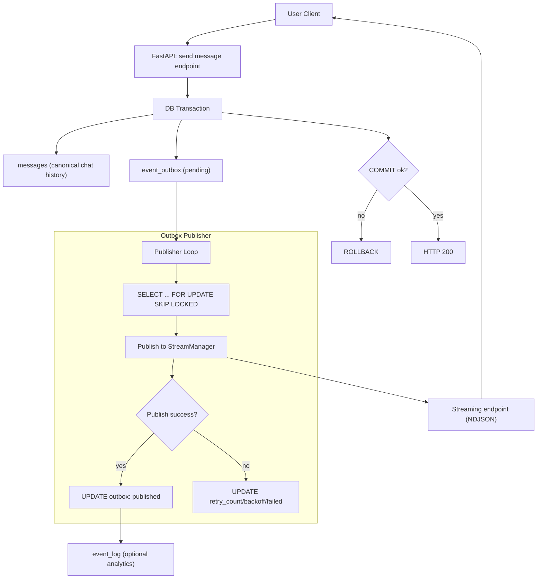
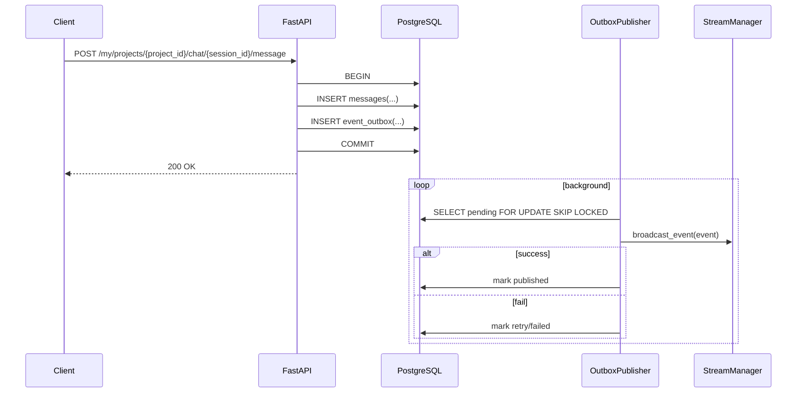

# Event Log + Outbox Architecture

## Обзор

Этот документ фиксирует целевую архитектуру для строгой консистентности чата:

- `messages` остаётся каноничной моделью истории чата
- события для realtime и интеграций фиксируются в `event_outbox` в той же транзакции
- асинхронный publisher публикует события из outbox в streaming канал
- опционально события пишутся в `event_log` для аналитики и аудита

Ключевой принцип: **state change и event intent коммитятся атомарно**.

---

## Цели и ограничения

### Цели

1. Гарантировать all-or-nothing для записи сообщений чата.
2. Исключить потерю событий при ошибках между DB и streaming.
3. Сохранить realtime UX через NDJSON/streaming.
4. Обеспечить идемпотентную доставку и повторные попытки.

### Не-цели

1. Exactly-once доставка на транспортном уровне.
2. Замена текущего streaming протокола.
3. Перенос всей аналитики в первый этап внедрения.

---

## Архитектурная схема

---

## Техническая модель данных

### Таблица `event_outbox`

Рекомендуемая структура:

| Поле | Тип | Назначение |
|------|-----|------------|
| `id` | UUID PK | Идентификатор outbox записи |
| `aggregate_type` | VARCHAR(50) | Например `chat_session` |
| `aggregate_id` | UUID | Обычно `session_id` |
| `project_id` | UUID | Изоляция проекта |
| `user_id` | UUID | Изоляция пользователя |
| `event_type` | VARCHAR(100) | Например `message_created`, `agent_switched` |
| `payload` | JSONB | Тело события |
| `status` | VARCHAR(20) | `pending`, `published`, `failed` |
| `retry_count` | INT | Количество ретраев |
| `next_retry_at` | TIMESTAMP WITH TZ | Время следующей попытки |
| `created_at` | TIMESTAMP WITH TZ | Время создания |
| `published_at` | TIMESTAMP WITH TZ NULL | Время успешной публикации |
| `last_error` | TEXT NULL | Последняя ошибка публикации |

Индексы:

1. `(status, next_retry_at, created_at)`
2. `(aggregate_id, created_at)`
3. `(project_id, created_at)`
4. `(user_id, created_at)`

### Таблица `event_log` (опционально)

Используется как read-model для аналитики и аудита. Пишется после успешной публикации из publisher.

---

## Границы транзакции

В рамках одного запроса `send_message`:

1. `INSERT` в `messages` (user/system/assistant).
2. `INSERT` в `event_outbox` для каждого доменного события.
3. Единый `COMMIT`.

Запрещено внутри этой транзакции:

1. Сетевой publish в streaming.
2. Внешние вызовы, которые могут зависнуть и сорвать commit.

Это обеспечивает строгую консистентность чата.

---

## Компоненты и ответственность

### API слой (`app/routes/project_chat.py`)

1. Формирует каноничные записи `Message`.
2. Добавляет outbox-события в текущую DB сессию.
3. Не публикует streaming события напрямую.

### Domain слой (`app/core/user_worker_space.py`)

1. Возвращает данные выполнения (selected agent, routing score).
2. Не открывает отдельные DB сессии для side effects.
3. Не нарушает транзакционную целостность запроса.

### Outbox Publisher (новый компонент)

1. Периодически выбирает `pending` записи с блокировкой `SKIP LOCKED`.
2. Публикует события через `StreamManager`.
3. Отмечает `published` либо планирует retry.
4. Гарантирует идемпотентность на уровне `event_id`.

### Stream Manager (`app/core/stream_manager.py`)

1. Доставляет уже зафиксированные события клиентам.
2. Не является источником истины состояния чата.

---

## Надёжность и идемпотентность

### Ретраи

1. Exponential backoff по `retry_count`.
2. Upper bound на количество попыток, затем `failed`.
3. Отдельный reprocessor для `failed` (ручной или cron).

### Идемпотентность

1. `outbox.id` используется как `event_id`.
2. В payload включается `event_id`.
3. Клиент/consumer дедуплицирует по `event_id`.

### Порядок событий

1. Базовый порядок в рамках aggregate: `created_at`, затем `id`.
2. Publisher обрабатывает батчами; строгий global ordering не гарантируется.
3. Для UI порядок в чате берётся из `messages.created_at`.

---

## Наблюдаемость

Метрики:

1. `outbox_pending_count`
2. `outbox_publish_success_total`
3. `outbox_publish_failed_total`
4. `outbox_publish_latency_ms`
5. `outbox_oldest_pending_age_seconds`

Логи:

1. `outbox_event_enqueued`
2. `outbox_publish_succeeded`
3. `outbox_publish_failed`
4. `outbox_event_dead_lettered`

Алерты:

1. Рост `oldest_pending_age_seconds` выше SLA.
2. Серия failed publish по одному event_type.

---

## Пошаговая миграция

### Этап 1

1. Добавить `event_outbox` модель и миграцию.
2. Начать записывать outbox в `send_message`.
3. Сохранить текущий streaming как fallback.

### Этап 2

1. Включить `OutboxPublisher`.
2. Перевести streaming на publish только из outbox.
3. Удалить прямой `broadcast_event` из request path.

### Этап 3

1. Добавить `event_log` как read-model (опционально).
2. Добавить API аналитики по event history.
3. Включить retention policy.

---

## Тестовая стратегия

1. Unit: запись `messages + outbox` в одной транзакции.
2. Integration: rollback запроса не оставляет ни `messages`, ни `outbox`.
3. Integration: commit создаёт pending outbox и позже published.
4. Failure: publisher error увеличивает `retry_count`, событие не теряется.
5. Idempotency: повторный publish не создаёт дублей в клиентском состоянии.

