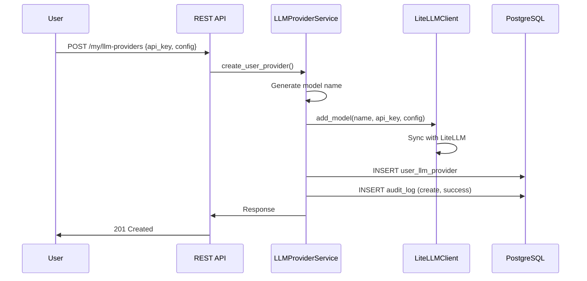
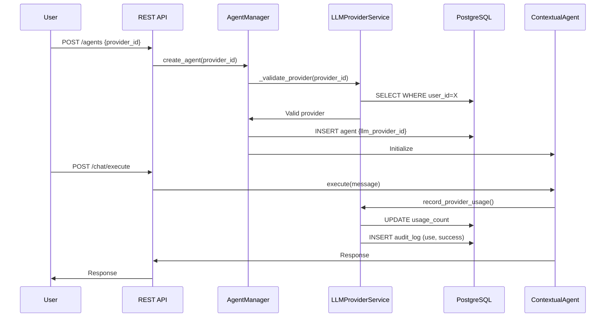
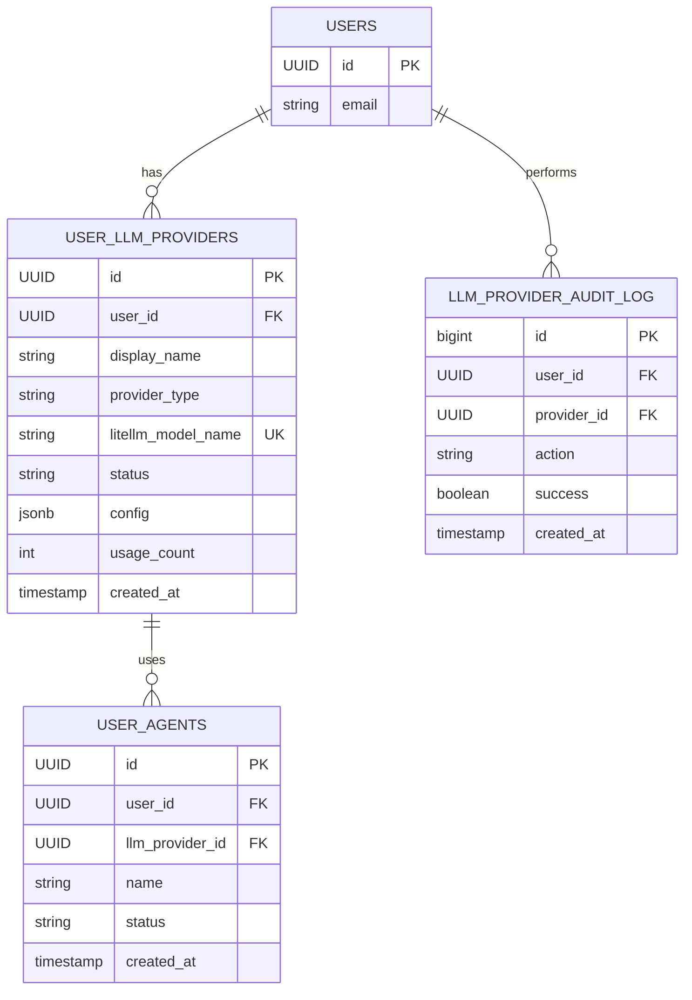

# Архитектура управления LLM провайдерами - Фаза 1

## 1. Обзор (Фаза 1)

### 1.1 Концепция

Система управления персональными LLM провайдерами для каждого пользователя:
- **Core Service** хранит только метаданные провайдеров в PostgreSQL
- **LiteLLM** хранит и управляет API ключами безопасно
- **Изоляция** реализована на уровне БД через `user_id`
- **Аудит** всех операций с провайдерами в отдельной таблице

### 1.2 Архитектурная диаграмма

```
User Request
    │
    ▼
┌─────────────────────────────────────────┐
│  Core Service (FastAPI)                 │
│  ┌─────────────────────────────────────┐│
│  │  REST API Layer                     ││
│  │  - /my/llm-providers                ││
│  │  - /my/llm-providers/{id}           ││
│  │  - /my/llm-providers/{id}/test      ││
│  └─────────────────────────────────────┘│
│  ┌─────────────────────────────────────┐│
│  │  Service Layer                      ││
│  │  - LLMProviderService               ││
│  │  - LiteLLMClient                    ││
│  │  - LLMProviderAuditService          ││
│  └─────────────────────────────────────┘│
└─────────────────────────────────────────┘
    │              │              │
    ▼              ▼              ▼
┌──────────┐  ┌──────────┐  ┌──────────┐
│PostgreSQL│  │ LiteLLM  │  │  Redis   │
│Metadata  │  │ API Keys │  │  Cache   │
└──────────┘  └──────────┘  └──────────┘
```

---

## 2. Модели данных (Фаза 1)

### 2.1 Таблица `user_llm_providers`

```sql
CREATE TABLE user_llm_providers (
    id UUID PRIMARY KEY DEFAULT gen_random_uuid(),
    user_id UUID NOT NULL REFERENCES users(id) ON DELETE CASCADE,
    
    -- Основные поля
    display_name VARCHAR(255) NOT NULL,
    provider_type VARCHAR(50) NOT NULL,
    litellm_model_name VARCHAR(255) NOT NULL UNIQUE,
    
    -- Статус
    status VARCHAR(20) NOT NULL DEFAULT 'active' 
        CHECK (status IN ('active', 'inactive', 'error')),
    
    -- Тестирование
    last_tested_at TIMESTAMP WITH TIME ZONE,
    test_error_message TEXT,
    
    -- Конфигурация (не включает API ключ!)
    config JSONB DEFAULT '{}',
    metadata JSONB DEFAULT '{}',
    
    -- Использование
    usage_count INTEGER DEFAULT 0,
    last_used_at TIMESTAMP WITH TIME ZONE,
    
    -- Timestamping
    created_at TIMESTAMP WITH TIME ZONE NOT NULL DEFAULT NOW(),
    updated_at TIMESTAMP WITH TIME ZONE NOT NULL DEFAULT NOW(),
    
    CONSTRAINT valid_provider_type CHECK (provider_type IN (
        'openai', 'anthropic', 'google', 'cohere', 'openrouter', 'azure', 'ollama'
    ))
);

-- Индексы
CREATE INDEX ix_user_llm_providers_user_id ON user_llm_providers(user_id);
CREATE INDEX ix_user_llm_providers_user_id_status ON user_llm_providers(user_id, status);
CREATE INDEX ix_user_llm_providers_provider_type ON user_llm_providers(provider_type);
CREATE INDEX ix_user_llm_providers_litellm_model_name ON user_llm_providers(litellm_model_name);
CREATE INDEX ix_user_llm_providers_last_used_at ON user_llm_providers(last_used_at DESC NULLS LAST);
```

### 2.2 Таблица `llm_provider_audit_log`

```sql
CREATE TABLE llm_provider_audit_log (
    id BIGSERIAL PRIMARY KEY,
    
    -- Идентификация
    user_id UUID NOT NULL REFERENCES users(id) ON DELETE CASCADE,
    provider_id UUID,
    
    -- Действие
    action VARCHAR(50) NOT NULL CHECK (action IN (
        'create', 'update', 'delete', 'test', 'activate', 'deactivate', 'use', 'error'
    )),
    
    -- Детали операции
    old_values JSONB,
    new_values JSONB,
    
    -- Результат
    success BOOLEAN NOT NULL DEFAULT true,
    error_message TEXT,
    
    -- Контекст
    ip_address INET,
    user_agent TEXT,
    
    -- Timestamping
    created_at TIMESTAMP WITH TIME ZONE NOT NULL DEFAULT NOW()
);

-- Индексы
CREATE INDEX ix_audit_log_user_id ON llm_provider_audit_log(user_id, created_at DESC);
CREATE INDEX ix_audit_log_provider_id ON llm_provider_audit_log(provider_id);
CREATE INDEX ix_audit_log_action ON llm_provider_audit_log(action);
CREATE INDEX ix_audit_log_created_at ON llm_provider_audit_log(created_at DESC);
```

### 2.3 Обновления в `user_agents`

```sql
-- Добавить связь с провайдером
ALTER TABLE user_agents ADD COLUMN IF NOT EXISTS llm_provider_id UUID 
    REFERENCES user_llm_providers(id) ON DELETE SET NULL;

CREATE INDEX ix_user_agents_llm_provider_id ON user_agents(llm_provider_id);
```

### 2.4 SQLAlchemy модели

```python
# app/models/user_llm_provider.py
from datetime import datetime
from uuid import UUID, uuid4
from sqlalchemy import DateTime, ForeignKey, Index, JSON, String, Integer, Text
from sqlalchemy.dialects.postgresql import UUID as PGUUID
from sqlalchemy.orm import Mapped, mapped_column, relationship

from app.database import Base

class UserLLMProvider(Base):
    """User LLM provider model."""
    
    __tablename__ = "user_llm_providers"
    
    id: Mapped[UUID] = mapped_column(PGUUID(as_uuid=True), primary_key=True, default=uuid4, index=True)
    user_id: Mapped[UUID] = mapped_column(
        PGUUID(as_uuid=True), ForeignKey("users.id", ondelete="CASCADE"), nullable=False, index=True
    )
    
    display_name: Mapped[str] = mapped_column(String(255), nullable=False)
    provider_type: Mapped[str] = mapped_column(String(50), nullable=False, index=True)
    litellm_model_name: Mapped[str] = mapped_column(String(255), nullable=False, unique=True, index=True)
    
    status: Mapped[str] = mapped_column(String(20), default="active", nullable=False, index=True)
    last_tested_at: Mapped[datetime | None] = mapped_column(DateTime(timezone=True), nullable=True)
    test_error_message: Mapped[str | None] = mapped_column(Text, nullable=True)
    
    config: Mapped[dict] = mapped_column(JSON, nullable=False, default=dict)
    metadata: Mapped[dict] = mapped_column(JSON, nullable=False, default=dict)
    
    usage_count: Mapped[int] = mapped_column(Integer, default=0, nullable=False)
    last_used_at: Mapped[datetime | None] = mapped_column(DateTime(timezone=True), nullable=True)
    
    created_at: Mapped[datetime] = mapped_column(DateTime(timezone=True), default=datetime.utcnow, nullable=False)
    updated_at: Mapped[datetime] = mapped_column(DateTime(timezone=True), default=datetime.utcnow, onupdate=datetime.utcnow, nullable=False)
    
    # Relationships
    user: Mapped["User"] = relationship("User", back_populates="llm_providers")
    agents: Mapped[list["UserAgent"]] = relationship("UserAgent", back_populates="llm_provider")
    
    __table_args__ = (
        Index("ix_user_llm_providers_user_id_status", "user_id", "status"),
    )
    
    def __repr__(self) -> str:
        return f"<UserLLMProvider(id={self.id}, display_name={self.display_name})>"
```

```python
# app/models/llm_provider_audit_log.py
from datetime import datetime
from uuid import UUID
from sqlalchemy import DateTime, ForeignKey, Index, JSON, String, Boolean, Text, BigInteger
from sqlalchemy.dialects.postgresql import UUID as PGUUID, INET
from sqlalchemy.orm import Mapped, mapped_column

from app.database import Base

class LLMProviderAuditLog(Base):
    """Audit log for LLM provider operations."""
    
    __tablename__ = "llm_provider_audit_log"
    
    id: Mapped[int] = mapped_column(BigInteger, primary_key=True, autoincrement=True)
    
    user_id: Mapped[UUID] = mapped_column(PGUUID(as_uuid=True), ForeignKey("users.id", ondelete="CASCADE"), nullable=False, index=True)
    provider_id: Mapped[UUID | None] = mapped_column(PGUUID(as_uuid=True), nullable=True, index=True)
    
    action: Mapped[str] = mapped_column(String(50), nullable=False, index=True)
    
    old_values: Mapped[dict | None] = mapped_column(JSON, nullable=True)
    new_values: Mapped[dict | None] = mapped_column(JSON, nullable=True)
    
    success: Mapped[bool] = mapped_column(Boolean, default=True, nullable=False)
    error_message: Mapped[str | None] = mapped_column(Text, nullable=True)
    
    ip_address: Mapped[str | None] = mapped_column(INET, nullable=True)
    user_agent: Mapped[str | None] = mapped_column(Text, nullable=True)
    
    created_at: Mapped[datetime] = mapped_column(DateTime(timezone=True), default=datetime.utcnow, nullable=False, index=True)
    
    __table_args__ = (
        Index("ix_audit_log_user_id_created_at", "user_id", "created_at"),
    )
    
    def __repr__(self) -> str:
        return f"<LLMProviderAuditLog(id={self.id}, action={self.action})>"
```

---

## 3. REST API endpoints (Фаза 1)

### 3.1 POST /my/llm-providers

Добавить новый провайдер.

**Request:**
```json
{
    "display_name": "My OpenAI GPT-4",
    "provider_type": "openai",
    "api_key": "sk-...",
    "config": {
        "model": "gpt-4-turbo-preview"
    },
    "metadata": {
        "tags": ["production"]
    }
}
```

**Response (201 Created):**
```json
{
    "id": "550e8400-e29b-41d4-a716-446655440000",
    "display_name": "My OpenAI GPT-4",
    "provider_type": "openai",
    "litellm_model_name": "user550e8400_openai_abc12345",
    "status": "active",
    "created_at": "2026-03-08T07:30:00Z"
}
```

### 3.2 GET /my/llm-providers

Получить список провайдеров пользователя.

**Query Parameters:**
- `status`: active, inactive, error (default: active)
- `skip`: 0
- `limit`: 50

**Response (200 OK):**
```json
{
    "data": [
        {
            "id": "550e8400-e29b-41d4-a716-446655440000",
            "display_name": "My OpenAI GPT-4",
            "provider_type": "openai",
            "status": "active",
            "usage_count": 5,
            "last_used_at": "2026-03-08T07:25:00Z"
        }
    ],
    "total": 1,
    "skip": 0,
    "limit": 50
}
```

### 3.3 GET /my/llm-providers/{id}

Получить детали провайдера.

**Response (200 OK):**
```json
{
    "id": "550e8400-e29b-41d4-a716-446655440000",
    "display_name": "My OpenAI GPT-4",
    "provider_type": "openai",
    "litellm_model_name": "user550e8400_openai_abc12345",
    "status": "active",
    "config": {
        "model": "gpt-4-turbo-preview"
    },
    "usage_count": 5,
    "created_at": "2026-03-08T07:30:00Z"
}
```

### 3.4 PATCH /my/llm-providers/{id}

Обновить конфигурацию (кроме API ключа).

**Request:**
```json
{
    "display_name": "Updated OpenAI GPT-4",
    "config": {
        "temperature": 0.7
    }
}
```

**Response (200 OK):**
```json
{
    "id": "550e8400-e29b-41d4-a716-446655440000",
    "display_name": "Updated OpenAI GPT-4",
    "updated_at": "2026-03-08T07:35:00Z"
}
```

### 3.5 DELETE /my/llm-providers/{id}

Удалить провайдер.

**Response (204 No Content)**

**Errors:**
- `400 Bad Request` - Provider is in use by agents
- `404 Not Found` - Provider not found

### 3.6 POST /my/llm-providers/{id}/test

Протестировать провайдер.

**Request:**
```json
{
    "test_message": "Hello, are you working?",
    "max_tokens": 100
}
```

**Response (200 OK):**
```json
{
    "status": "success",
    "response": "Yes, I'm working fine!",
    "latency_ms": 1234
}
```

**Error Response (422 Unprocessable Entity):**
```json
{
    "status": "error",
    "error": "Invalid API key"
}
```

### 3.7 GET /my/llm-providers/available

Получить все доступные модели пользователя.

**Response (200 OK):**
```json
{
    "providers": [
        {
            "id": "550e8400-e29b-41d4-a716-446655440000",
            "display_name": "My OpenAI GPT-4",
            "provider_type": "openai",
            "litellm_model_name": "user550e8400_openai_abc12345"
        }
    ]
}
```

### 3.8 GET /llm-providers/types

Получить поддерживаемые типы провайдеров.

**Response (200 OK):**
```json
{
    "providers": [
        {
            "type": "openai",
            "display_name": "OpenAI",
            "description": "OpenAI API for GPT models",
            "required_fields": ["api_key"],
            "models": ["gpt-4-turbo-preview", "gpt-4", "gpt-3.5-turbo"]
        },
        {
            "type": "anthropic",
            "display_name": "Anthropic",
            "description": "Anthropic API for Claude models",
            "required_fields": ["api_key"],
            "models": ["claude-3-opus-20240229", "claude-3-sonnet-20240229"]
        }
    ]
}
```

---

## 4. Сервисный слой (Фаза 1)

### 4.1 `LiteLLMClient`

```python
# app/services/litellm_client.py
import httpx
from typing import Optional
from app.config import settings
from app.logging_config import get_logger

logger = get_logger(__name__)

class LiteLLMClient:
    """Client for LiteLLM REST API."""
    
    def __init__(self):
        self.base_url = settings.litellm_url or "http://litellm:4000"
        self.api_key = settings.litellm_master_key or "super-secret-key-change-in-production"
        self.headers = {
            "Authorization": f"Bearer {self.api_key}",
            "Content-Type": "application/json",
        }
    
    async def add_model(
        self,
        model_name: str,
        provider_type: str,
        api_key: str,
        config: dict,
    ) -> dict:
        """Add a new model to LiteLLM."""
        litellm_params = {
            "model": self._build_model_id(provider_type, config),
            "api_key": api_key,
        }
        
        # Add additional config if present
        if "api_base" in config:
            litellm_params["api_base"] = config["api_base"]
        if "api_version" in config:
            litellm_params["api_version"] = config["api_version"]
        if "organization_id" in config:
            litellm_params["organization_id"] = config["organization_id"]
        
        payload = {
            "model_name": model_name,
            "litellm_params": litellm_params,
        }
        
        async with httpx.AsyncClient() as client:
            response = await client.post(
                f"{self.base_url}/model/new",
                json=payload,
                headers=self.headers,
                timeout=30.0,
            )
            response.raise_for_status()
            logger.info(f"Added model to LiteLLM: {model_name}")
            return response.json()
    
    async def delete_model(self, model_name: str) -> bool:
        """Delete a model from LiteLLM."""
        payload = {"model_name": model_name}
        
        async with httpx.AsyncClient() as client:
            response = await client.post(
                f"{self.base_url}/model/delete",
                json=payload,
                headers=self.headers,
                timeout=30.0,
            )
            response.raise_for_status()
            logger.info(f"Deleted model from LiteLLM: {model_name}")
            return True
    
    async def test_model(
        self,
        model_name: str,
        message: str = "Hello, are you working?",
        max_tokens: int = 100,
    ) -> dict:
        """Test a model."""
        payload = {
            "model": model_name,
            "messages": [{"role": "user", "content": message}],
            "max_tokens": max_tokens,
        }
        
        async with httpx.AsyncClient() as client:
            response = await client.post(
                f"{self.base_url}/chat/completions",
                json=payload,
                headers=self.headers,
                timeout=60.0,
            )
            response.raise_for_status()
            data = response.json()
            
            return {
                "status": "success",
                "response": data["choices"][0]["message"]["content"],
                "model": model_name,
            }
    
    @staticmethod
    def _build_model_id(provider_type: str, config: dict) -> str:
        """Build full model ID from provider type and config."""
        model_id = config.get("model")
        
        provider_map = {
            "openai": "openai",
            "anthropic": "anthropic",
            "google": "vertex_ai",
            "cohere": "cohere",
            "openrouter": "openrouter",
            "azure": "azure",
            "ollama": "ollama",
        }
        
        provider_prefix = provider_map.get(provider_type, provider_type)
        
        if "/" in model_id:
            return model_id
        
        return f"{provider_prefix}/{model_id}"
```

### 4.2 `LLMProviderAuditService`

```python
# app/services/llm_provider_audit_service.py
from typing import Optional
from uuid import UUID
from sqlalchemy.ext.asyncio import AsyncSession
from datetime import datetime
from sqlalchemy import select, and_, func

from app.models.llm_provider_audit_log import LLMProviderAuditLog
from app.logging_config import get_logger

logger = get_logger(__name__)

class LLMProviderAuditService:
    """Service for auditing LLM provider operations."""
    
    def __init__(self, db: AsyncSession):
        self.db = db
    
    async def log_action(
        self,
        user_id: UUID,
        action: str,
        success: bool = True,
        provider_id: Optional[UUID] = None,
        old_values: Optional[dict] = None,
        new_values: Optional[dict] = None,
        error_message: Optional[str] = None,
        ip_address: Optional[str] = None,
        user_agent: Optional[str] = None,
    ) -> LLMProviderAuditLog:
        """Log an action."""
        audit_entry = LLMProviderAuditLog(
            user_id=user_id,
            provider_id=provider_id,
            action=action,
            old_values=old_values,
            new_values=new_values,
            success=success,
            error_message=error_message,
            ip_address=ip_address,
            user_agent=user_agent,
            created_at=datetime.utcnow(),
        )
        
        self.db.add(audit_entry)
        await self.db.flush()
        
        level = "info" if success else "warning"
        logger.log(
            getattr(logger, level),
            f"LLM Provider audit: {action}",
            extra={"user_id": str(user_id), "action": action, "success": success}
        )
        
        return audit_entry
    
    async def get_audit_log(
        self,
        user_id: UUID,
        action: Optional[str] = None,
        skip: int = 0,
        limit: int = 100,
    ) -> tuple[list[LLMProviderAuditLog], int]:
        """Get audit log for user."""
        filters = [LLMProviderAuditLog.user_id == user_id]
        
        if action:
            filters.append(LLMProviderAuditLog.action == action)
        
        # Count
        count_query = select(func.count()).select_from(LLMProviderAuditLog).where(and_(*filters))
        total = (await self.db.execute(count_query)).scalar() or 0
        
        # Results
        query = select(LLMProviderAuditLog).where(and_(*filters))
        result = await self.db.execute(
            query.order_by(LLMProviderAuditLog.created_at.desc()).offset(skip).limit(limit)
        )
        entries = result.scalars().all()
        
        return entries, total
```

### 4.3 `LLMProviderService`

```python
# app/services/llm_provider_service.py
from typing import Optional
from uuid import UUID
from sqlalchemy.ext.asyncio import AsyncSession
from sqlalchemy import select, and_, func
from datetime import datetime

from app.models.user_llm_provider import UserLLMProvider
from app.models.user_agent import UserAgent
from app.schemas.llm_provider import (
    UserLLMProviderCreate,
    UserLLMProviderUpdate,
    UserLLMProviderResponse,
)
from app.services.litellm_client import LiteLLMClient
from app.services.llm_provider_audit_service import LLMProviderAuditService
from app.logging_config import get_logger

logger = get_logger(__name__)

class LLMProviderService:
    """Service for managing LLM providers."""
    
    def __init__(
        self,
        db: AsyncSession,
        litellm_client: LiteLLMClient,
        audit_service: LLMProviderAuditService,
    ):
        self.db = db
        self.litellm_client = litellm_client
        self.audit_service = audit_service
    
    async def create_user_provider(
        self,
        user_id: UUID,
        provider_data: UserLLMProviderCreate,
        ip_address: Optional[str] = None,
        user_agent: Optional[str] = None,
    ) -> UserLLMProviderResponse:
        """Create a new user provider."""
        try:
            # Generate unique LiteLLM model name
            litellm_model_name = self._generate_litellm_model_name(
                user_id, provider_data.provider_type
            )
            
            # Add to LiteLLM
            await self.litellm_client.add_model(
                model_name=litellm_model_name,
                provider_type=provider_data.provider_type,
                api_key=provider_data.api_key,
                config=provider_data.config,
            )
            
            # Create DB record
            db_provider = UserLLMProvider(
                user_id=user_id,
                display_name=provider_data.display_name,
                provider_type=provider_data.provider_type,
                litellm_model_name=litellm_model_name,
                config=provider_data.config,
                metadata=provider_data.metadata or {},
                status="active",
            )
            self.db.add(db_provider)
            await self.db.flush()
            
            # Log audit
            await self.audit_service.log_action(
                user_id=user_id,
                provider_id=db_provider.id,
                action="create",
                success=True,
                new_values={"display_name": db_provider.display_name},
                ip_address=ip_address,
                user_agent=user_agent,
            )
            
            await self.db.commit()
            return UserLLMProviderResponse.from_orm(db_provider)
            
        except Exception as e:
            await self.db.rollback()
            
            await self.audit_service.log_action(
                user_id=user_id,
                action="create",
                success=False,
                error_message=str(e),
                ip_address=ip_address,
                user_agent=user_agent,
            )
            
            logger.error(f"Failed to create provider: {e}", exc_info=True)
            raise
    
    async def get_user_providers(
        self,
        user_id: UUID,
        status: Optional[str] = "active",
        skip: int = 0,
        limit: int = 50,
    ) -> tuple[list[UserLLMProvider], int]:
        """Get user's providers."""
        filters = [UserLLMProvider.user_id == user_id]
        
        if status:
            filters.append(UserLLMProvider.status == status)
        
        # Count
        count_query = select(func.count()).select_from(UserLLMProvider).where(and_(*filters))
        total = (await self.db.execute(count_query)).scalar() or 0
        
        # Results
        query = select(UserLLMProvider).where(and_(*filters))
        result = await self.db.execute(
            query.offset(skip).limit(limit).order_by(UserLLMProvider.created_at.desc())
        )
        providers = result.scalars().all()
        
        return providers, total
    
    async def get_user_provider(
        self,
        user_id: UUID,
        provider_id: UUID,
    ) -> Optional[UserLLMProvider]:
        """Get specific user provider."""
        result = await self.db.execute(
            select(UserLLMProvider).where(
                and_(
                    UserLLMProvider.id == provider_id,
                    UserLLMProvider.user_id == user_id,
                )
            )
        )
        return result.scalar_one_or_none()
    
    async def update_user_provider(
        self,
        user_id: UUID,
        provider_id: UUID,
        update_data: UserLLMProviderUpdate,
        ip_address: Optional[str] = None,
        user_agent: Optional[str] = None,
    ) -> UserLLMProviderResponse:
        """Update user provider."""
        try:
            provider = await self.get_user_provider(user_id, provider_id)
            if not provider:
                raise ValueError("Provider not found")
            
            old_values = {
                "display_name": provider.display_name,
                "config": provider.config,
            }
            
            # Update
            if update_data.display_name:
                provider.display_name = update_data.display_name
            if update_data.config:
                provider.config = update_data.config
            if update_data.metadata:
                provider.metadata = update_data.metadata
            
            provider.updated_at = datetime.utcnow()
            await self.db.flush()
            
            # Log audit
            await self.audit_service.log_action(
                user_id=user_id,
                provider_id=provider_id,
                action="update",
                success=True,
                old_values=old_values,
                new_values={"display_name": provider.display_name},
                ip_address=ip_address,
                user_agent=user_agent,
            )
            
            await self.db.commit()
            return UserLLMProviderResponse.from_orm(provider)
            
        except Exception as e:
            await self.db.rollback()
            
            await self.audit_service.log_action(
                user_id=user_id,
                provider_id=provider_id,
                action="update",
                success=False,
                error_message=str(e),
                ip_address=ip_address,
                user_agent=user_agent,
            )
            
            logger.error(f"Failed to update provider: {e}", exc_info=True)
            raise
    
    async def delete_user_provider(
        self,
        user_id: UUID,
        provider_id: UUID,
        ip_address: Optional[str] = None,
        user_agent: Optional[str] = None,
    ) -> bool:
        """Delete user provider."""
        try:
            provider = await self.get_user_provider(user_id, provider_id)
            if not provider:
                return False
            
            # Check if in use
            agents_count = await self._count_agents_using_provider(provider_id)
            if agents_count > 0:
                raise ValueError(
                    f"Cannot delete: {agents_count} agent(s) are using this provider"
                )
            
            # Remove from LiteLLM
            await self.litellm_client.delete_model(provider.litellm_model_name)
            
            # Delete from DB
            await self.db.delete(provider)
            
            # Log audit
            await self.audit_service.log_action(
                user_id=user_id,
                provider_id=provider_id,
                action="delete",
                success=True,
                ip_address=ip_address,
                user_agent=user_agent,
            )
            
            await self.db.commit()
            return True
            
        except Exception as e:
            await self.db.rollback()
            
            await self.audit_service.log_action(
                user_id=user_id,
                provider_id=provider_id,
                action="delete",
                success=False,
                error_message=str(e),
                ip_address=ip_address,
                user_agent=user_agent,
            )
            
            logger.error(f"Failed to delete provider: {e}", exc_info=True)
            raise
    
    async def test_provider(
        self,
        user_id: UUID,
        provider_id: UUID,
        test_message: str = "Hello, are you working?",
        ip_address: Optional[str] = None,
        user_agent: Optional[str] = None,
    ) -> dict:
        """Test provider."""
        try:
            provider = await self.get_user_provider(user_id, provider_id)
            if not provider:
                raise ValueError("Provider not found")
            
            # Test via LiteLLM
            response = await self.litellm_client.test_model(
                model_name=provider.litellm_model_name,
                message=test_message,
            )
            
            # Update state
            provider.last_tested_at = datetime.utcnow()
            provider.test_error_message = None
            await self.db.flush()
            
            # Log audit
            await self.audit_service.log_action(
                user_id=user_id,
                provider_id=provider_id,
                action="test",
                success=True,
                ip_address=ip_address,
                user_agent=user_agent,
            )
            
            await self.db.commit()
            return response
            
        except Exception as e:
            await self.db.rollback()
            
            # Update error state
            provider = await self.get_user_provider(user_id, provider_id)
            if provider:
                provider.test_error_message = str(e)
                provider.last_tested_at = datetime.utcnow()
                await self.db.flush()
            
            # Log audit
            await self.audit_service.log_action(
                user_id=user_id,
                provider_id=provider_id,
                action="test",
                success=False,
                error_message=str(e),
                ip_address=ip_address,
                user_agent=user_agent,
            )
            
            await self.db.commit()
            raise
    
    async def record_provider_usage(
        self,
        user_id: UUID,
        provider_id: UUID,
    ) -> None:
        """Record provider usage."""
        provider = await self.get_user_provider(user_id, provider_id)
        if provider:
            provider.usage_count += 1
            provider.last_used_at = datetime.utcnow()
            
            await self.audit_service.log_action(
                user_id=user_id,
                provider_id=provider_id,
                action="use",
                success=True,
            )
            
            await self.db.flush()
    
    @staticmethod
    def _generate_litellm_model_name(user_id: UUID, provider_type: str) -> str:
        """Generate unique LiteLLM model name."""
        import random
        import string
        
        suffix = ''.join(random.choices(string.ascii_lowercase + string.digits, k=8))
        sanitized_user_id = str(user_id).replace('-', '')[:16]
        return f"user{sanitized_user_id}_{provider_type}_{suffix}"
    
    async def _count_agents_using_provider(self, provider_id: UUID) -> int:
        """Count agents using provider."""
        result = await self.db.execute(
            select(func.count()).select_from(UserAgent).where(
                UserAgent.llm_provider_id == provider_id
            )
        )
        return result.scalar() or 0
```

---

## 5. Интеграция с агентами (Фаза 1)

### 5.1 Обновление `AgentManager`

В `app/agents/manager.py` добавить поддержку провайдеров:

```python
async def create_agent(
    self,
    name: str,
    config: AgentConfig,
    llm_provider_id: Optional[UUID] = None,
) -> AgentResponse:
    """Create new agent with optional LLM provider."""
    
    # Validate provider if specified
    if llm_provider_id:
        provider = await self._validate_provider(llm_provider_id)
        # Override model to use provider's model
        config.model = provider.litellm_model_name
    
    # Rest of creation logic...

async def _validate_provider(self, provider_id: UUID) -> UserLLMProvider:
    """Validate provider exists and is active."""
    from sqlalchemy import select, and_
    
    result = await self.db.execute(
        select(UserLLMProvider).where(
            and_(
                UserLLMProvider.id == provider_id,
                UserLLMProvider.user_id == self.user_id,
                UserLLMProvider.status == "active",
            )
        )
    )
    provider = result.scalar_one_or_none()
    
    if not provider:
        raise ValueError("Provider not found or not active")
    
    return provider
```

### 5.2 Обновление `ContextualAgent`

В `app/agents/contextual_agent.py` добавить логирование использования:

```python
async def execute(self, message: str, **kwargs) -> str:
    """Execute agent with provider tracking."""
    
    # Log provider usage
    if self.agent_id:
        provider_id = await self._get_agent_provider_id()
        if provider_id:
            await self._record_provider_usage(provider_id)
    
    # Rest of execution logic...

async def _get_agent_provider_id(self) -> Optional[UUID]:
    """Get provider ID associated with agent."""
    from sqlalchemy import select
    
    result = await self.db.execute(
        select(UserAgent.llm_provider_id).where(
            UserAgent.id == self.agent_id
        )
    )
    return result.scalar_one_or_none()

async def _record_provider_usage(self, provider_id: UUID) -> None:
    """Record that provider was used."""
    from app.services.llm_provider_service import LLMProviderService
    
    service = LLMProviderService(self.db, None, None)
    await service.record_provider_usage(self.user_id, provider_id)
```

---

## 6. Безопасность (Фаза 1)

### 6.1 Изоляция данных

**На уровне БД:**
```python
# Всегда добавлять WHERE user_id = :user_id
query = select(UserLLMProvider).where(
    UserLLMProvider.user_id == user_id
)
```

**На уровне API:**
```python
@router.get("/my/llm-providers")
async def get_providers(
    db: AsyncSession = Depends(get_db),
    current_user_id: UUID = Depends(get_current_user_id),
):
    return await provider_service.get_user_providers(current_user_id)
```

### 6.2 Хранение API ключей

**ВАЖНО:** API ключи хранятся ТОЛЬКО в LiteLLM!
- Core Service НИКОГДА не хранит и не логирует API ключи
- Все чувствительные данные остаются в LiteLLM

---

## 7. Диаграммы (Фаза 1)

### 7.1 Sequence: Добавление провайдера



### 7.2 Sequence: Использование в агенте



### 7.3 ER-диаграмма



---

## 8. План реализации Фазы 1

### Задачи

- [ ] Создать миграцию БД для таблиц
- [ ] Создать SQLAlchemy ORM модели
- [ ] Реализовать `LiteLLMClient`
- [ ] Реализовать `LLMProviderAuditService`
- [ ] Реализовать `LLMProviderService`
- [ ] Создать REST API endpoints
- [ ] Создать Pydantic schemas
- [ ] Обновить `AgentManager` и `ContextualAgent`
- [ ] Написать unit тесты
- [ ] Написать интеграционные тесты
- [ ] Обновить документацию

---

## 9. Конфигурация

### app/config.py

```python
class Settings(BaseSettings):
    # ... существующие настройки ...
    
    # LiteLLM Configuration
    litellm_url: str = Field(default="http://litellm:4000")
    litellm_master_key: str = Field(default="super-secret-key-change-in-production")
```

### .env

```bash
LITELLM_URL=http://litellm:4000
LITELLM_MASTER_KEY=super-secret-key-change-in-production
```

---

## 10. Ключевые отличия Фазы 1

✅ **Только пользовательские провайдеры** - каждый пользователь управляет своими  
✅ **Полный аудит операций** - все действия логируются  
✅ **Интеграция с LiteLLM** - безопасное хранение API ключей  
✅ **Интеграция с агентами** - агенты могут выбирать провайдера  
✅ **Простота реализации** - минимум компонентов для быстрого запуска  

**Фаза 2 добавит:**
- Глобальные администраторские провайдеры
- Admin endpoints для управления
- Rate limiting и мониторинг
- Расширенный аудит
