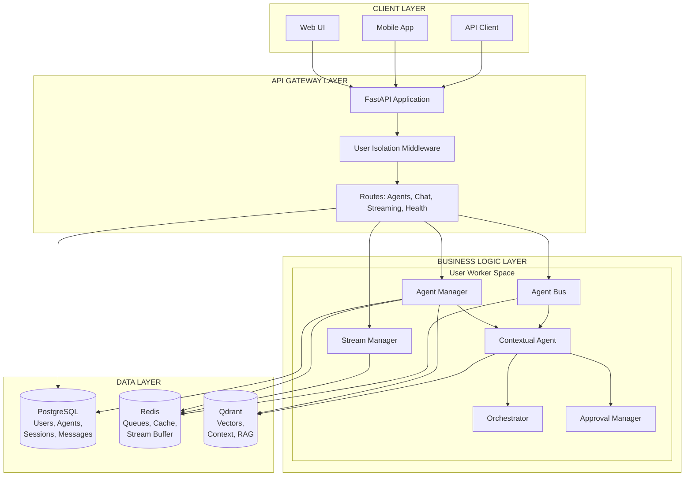
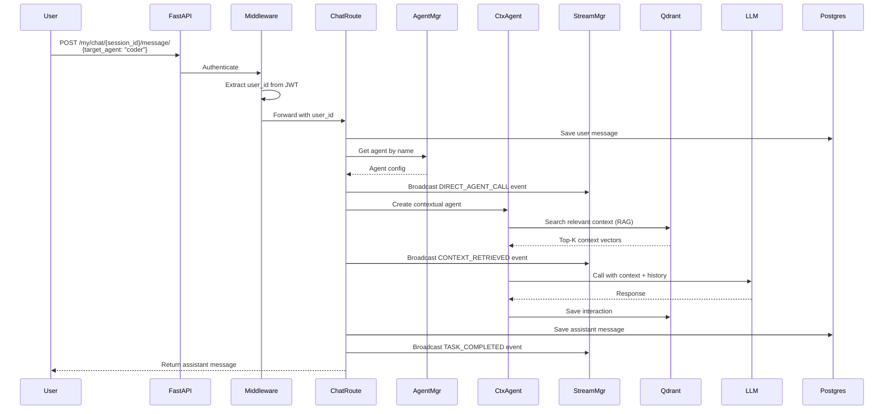
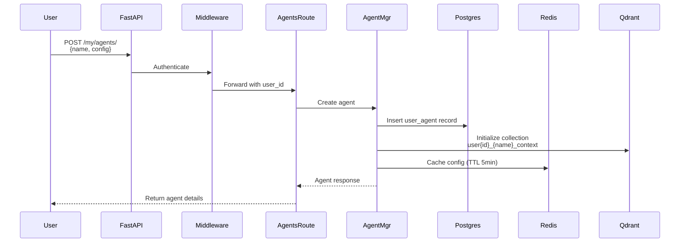
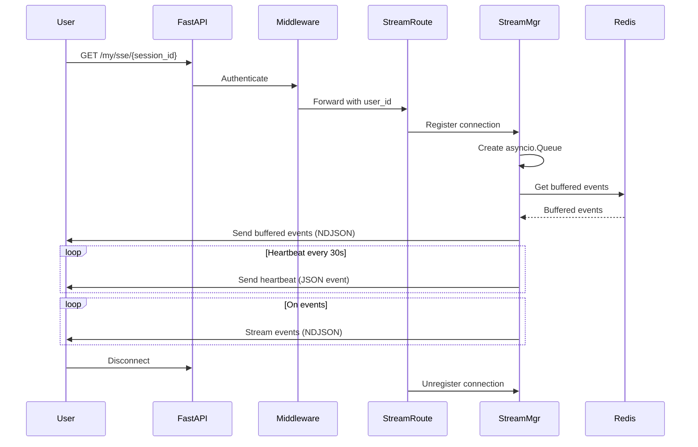
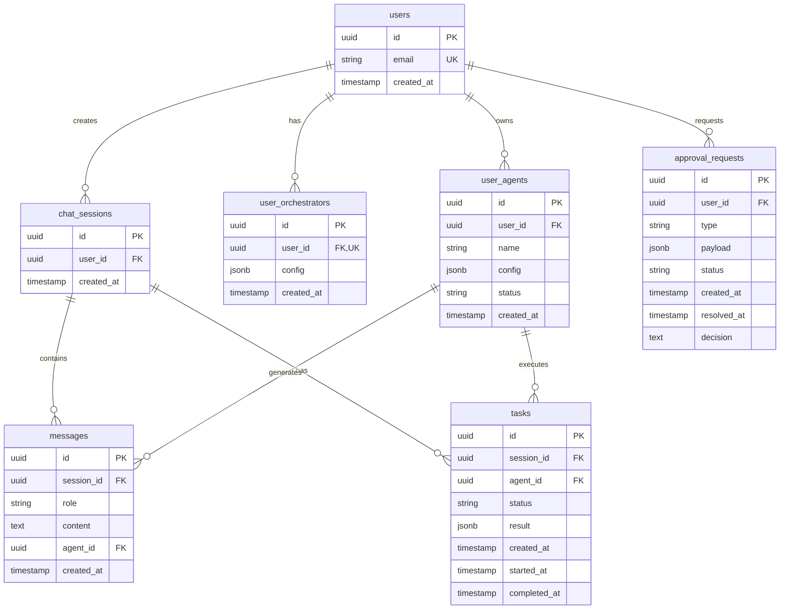
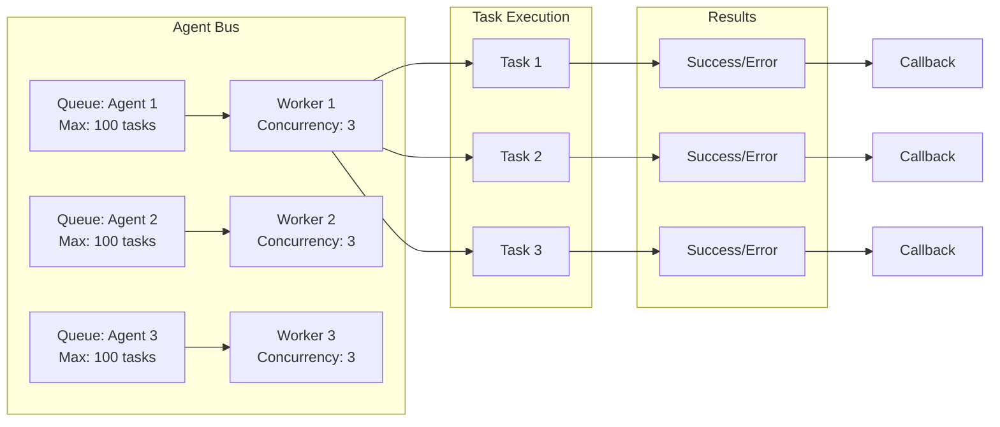
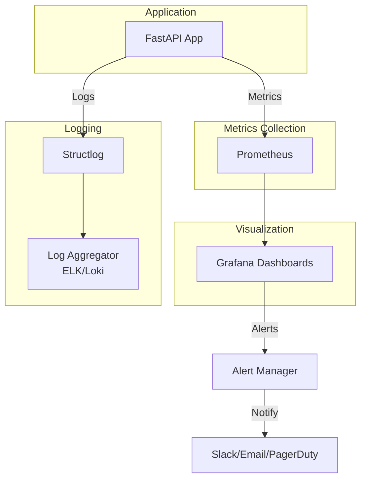

# Обзор архитектуры системы CodeLab Core Service

## Введение

CodeLab Core Service - это персональная мультиагентная AI платформа с полной изоляцией пользователей. Каждый пользователь имеет свою изолированную AI команду с персональными агентами, семантической памятью и взаимодействием в реальном времени.

## Ключевые принципы архитектуры

### 1. 100% Изоляция пользователей
- Каждый пользователь имеет только своих агентов
- Нет глобального состояния между пользователями
- Middleware-based изоляция на всех `/my/*` endpoints
- Персональные коллекции в Qdrant для каждого агента

### 2. Два режима работы

#### 🧠 Автоматический режим
- Оркестратор планирует граф задач
- Координирует выполнение между агентами
- Время выполнения: 5-10 секунд
- Подходит для сложных многошаговых задач

#### ⚡ Прямой вызов
- Пользователь вызывает конкретного агента через `@agent_name`
- Обходит оркестратор для скорости
- Время выполнения: 1-2 секунды
- Подходит для простых запросов

### 3. Семантическая память
- Каждый агент имеет персональный Qdrant контекст
- Поддержка 1M+ векторов для RAG
- Гибридный поиск с фильтрацией
- Автоматическое управление памятью

### 4. Real-time взаимодействие
- Streaming Fetch API для мгновенных обновлений (NDJSON формат)
- Буферизация событий в Redis (последние 100 событий, TTL 5 минут)
- Поддержка переподключений
- Heartbeat для поддержания соединения

## Высокоуровневая архитектура



## Компоненты системы

### API Gateway Layer

#### FastAPI Application
- **Назначение**: Основной HTTP сервер и точка входа
- **Технологии**: FastAPI 0.115+, Uvicorn
- **Функции**:
  - Маршрутизация запросов
  - Валидация данных (Pydantic)
  - OpenAPI документация
  - CORS middleware

#### User Isolation Middleware
- **Назначение**: Обеспечение изоляции пользователей
- **Механизм**: JWT токен → User ID → Request State
- **Защита**: Все `/my/*` endpoints требуют аутентификации
- **Инъекция контекста**:
  - `request.state.user_id` - UUID пользователя
  - `request.state.user_prefix` - префикс для ресурсов
  - `request.state.db_filter` - фильтр для БД запросов

### Business Logic Layer

#### Agent Manager
- **Назначение**: Управление жизненным циклом агентов
- **Операции**:
  - Создание агента (CRUD)
  - Обновление конфигурации
  - Удаление агента
  - Получение списка агентов
- **Интеграция**:
  - PostgreSQL для метаданных
  - Redis для кэширования конфигураций
  - Qdrant для инициализации контекста

#### Agent Bus
- **Назначение**: Координация задач между агентами
- **Архитектура**: asyncio.Queue per agent
- **Функции**:
  - Регистрация агентов
  - Управление очередями задач
  - Контроль параллелизма (max 3 задачи)
  - Обработка результатов и ошибок
- **Метрики**:
  - Размер очереди
  - Активные задачи
  - Статистика выполнения

#### Contextual Agent
- **Назначение**: Агент с семантической памятью
- **Компоненты**:
  - LLM интеграция (OpenAI/LiteLLM)
  - RAG контекст (Qdrant)
  - История сессий
  - Обработка инструментов (tools)
- **Процесс выполнения**:
  1. Получение запроса пользователя
  2. Поиск релевантного контекста (RAG)
  3. Формирование промпта с контекстом
  4. Вызов LLM
  5. Сохранение взаимодействия в контекст

#### Stream Manager
- **Назначение**: Управление real-time событиями через Streaming Fetch API
- **Функции**:
  - Регистрация streaming соединений (NDJSON формат)
  - Broadcast событий по сессиям
  - Буферизация событий в Redis
  - Heartbeat для поддержания соединений
  - Буферизация в Redis
  - Heartbeat (30 сек)
  - Восстановление при переподключении
- **Типы событий**:
  - `DIRECT_AGENT_CALL` - прямой вызов агента
  - `TASK_STARTED` - начало задачи
  - `TASK_COMPLETED` - завершение задачи
  - `CONTEXT_RETRIEVED` - получен контекст
  - `ERROR` - ошибка выполнения

### Data Layer

#### PostgreSQL
- **Назначение**: Основное хранилище метаданных
- **Схема**:
  - `users` - пользователи системы
  - `user_agents` - персональные агенты
  - `user_orchestrators` - конфигурации оркестраторов
  - `chat_sessions` - чат сессии
  - `messages` - сообщения в чатах
  - `tasks` - задачи агентов
  - `approval_requests` - запросы на подтверждение
- **Индексы**: Оптимизированы для user_id фильтрации
- **Миграции**: Alembic для версионирования схемы

#### Redis
- **Назначение**: Кэш и очереди
- **Использование**:
  - Кэш конфигураций агентов (TTL 5 мин)
  - Буфер streaming событий (последние 100, TTL 5 мин)
  - Agent Bus очереди
  - Rate limiting
  - Distributed locks
- **Структуры данных**:
  - Strings для кэша
  - Lists для буферов событий
  - Pub/Sub для уведомлений

#### Qdrant
- **Назначение**: Векторная база для семантической памяти
- **Коллекции**: `user{id}_{agent_name}_context`
- **Параметры**:
  - Размер вектора: 1536 (OpenAI embeddings)
  - Метрика: Cosine similarity
  - Индексация: HNSW
- **Данные**:
  - Векторы сообщений
  - Метаданные взаимодействий
  - История выполнения задач
- **Операции**:
  - Hybrid search (векторный + фильтры)
  - Upsert взаимодействий
  - Pruning старых векторов

## Потоки данных

### Поток 1: Прямой вызов агента



### Поток 2: Создание агента



### Поток 3: Streaming подключение



## Схема базы данных



## Архитектура Agent Bus



## Масштабируемость и производительность

### Горизонтальное масштабирование
- **Stateless API**: Все состояние в БД/Redis/Qdrant
- **Load Balancer**: Nginx/HAProxy перед FastAPI
- **Database Sharding**: По user_id для PostgreSQL
- **Redis Cluster**: Для высокой доступности
- **Qdrant Cluster**: Для больших объемов векторов

### Оптимизации
- **Connection Pooling**: PostgreSQL (10-30 соединений)
- **Redis Pipeline**: Батчинг операций
- **Qdrant HNSW**: Быстрый approximate search
- **Async I/O**: Полностью асинхронная архитектура
- **Кэширование**: Redis для горячих данных

### Метрики производительности
- **Direct call latency**: P95 < 2 сек
- **Qdrant search**: < 50ms
- **Streaming connections**: 1000+ per user
- **Agent concurrency**: 3 задачи параллельно
- **Database queries**: < 100ms P95

## Безопасность

### Аутентификация и авторизация
- **JWT токены**: HS256 алгоритм
- **User isolation**: Middleware на всех endpoints
- **Token expiration**: 30 минут (access), 7 дней (refresh)
- **Secret rotation**: Поддержка смены ключей

### Изоляция данных
- **Database level**: WHERE user_id = :user_id на всех запросах
- **Qdrant level**: Отдельные коллекции per user/agent
- **Redis level**: Префиксы ключей с user_id
- **API level**: Middleware проверка владения ресурсами

### Защита от атак
- **Rate limiting**: Redis-based (100 req/min)
- **Input validation**: Pydantic schemas
- **SQL injection**: SQLAlchemy ORM
- **XSS protection**: Content-Type headers
- **CORS**: Настраиваемые origins

## Мониторинг и наблюдаемость



### Логирование
- **Структурированные логи**: structlog
- **Уровни**: DEBUG, INFO, WARNING, ERROR
- **Контекст**: user_id, session_id, agent_id
- **Формат**: JSON для парсинга

### Метрики (Prometheus)
- HTTP запросы (latency, throughput, errors)
- Database connections и query time
- Redis operations
- Agent tasks (queued, running, completed, failed)
- Streaming connections (active, total)
- Qdrant operations (search time, vector count)

### Алерты
- High error rate (> 5%)
- Slow queries (> 1s)
- Queue overflow
- Memory/CPU usage
- Database connection exhaustion

## Развертывание

### Docker Compose (Development)
```yaml
services:
  - app (FastAPI)
  - postgres (PostgreSQL 16)
  - redis (Redis 7)
  - qdrant (Qdrant latest)
```

### Production (Kubernetes)

```mermaid
graph TB
    subgraph "Kubernetes Cluster"
        subgraph "Ingress"
            Ingress[Ingress Controller<br/>HTTPS, Rate Limiting]
        end
        
        subgraph "Application"
            API1[API Pod 1]
            API2[API Pod 2]
            API3[API Pod 3]
        end
        
        subgraph "Databases"
            PG[PostgreSQL<br/>StatefulSet]
            Redis[Redis<br/>StatefulSet]
            Qdrant[Qdrant<br/>StatefulSet]
        end
        
        subgraph "Storage"
            PV1[PersistentVolume<br/>PostgreSQL]
            PV2[PersistentVolume<br/>Redis]
            PV3[PersistentVolume<br/>Qdrant]
        end
    end
    
    Internet[Internet] --> Ingress
    Ingress --> API1
    Ingress --> API2
    Ingress --> API3
    
    API1 --> PG
    API2 --> PG
    API3 --> PG
    
    API1 --> Redis
    API2 --> Redis
    API3 --> Redis
    
    API1 --> Qdrant
    API2 --> Qdrant
    API3 --> Qdrant
    
    PG --> PV1
    Redis --> PV2
    Qdrant --> PV3
```

## Будущие улучшения

### Запланированные функции
1. **Orchestrator** - автоматическое планирование задач
2. **Approval Manager** - контроль опасных операций
3. **Tool System** - расширяемые инструменты для агентов
4. **Multi-modal support** - изображения, аудио, видео
5. **Agent collaboration** - взаимодействие между агентами
6. **Advanced RAG** - гибридный поиск, re-ranking
7. **Cost tracking** - учет затрат на LLM вызовы
8. **A/B testing** - эксперименты с промптами

### Технические улучшения
1. **GraphQL API** - альтернатива REST
2. **WebSocket** - двусторонняя коммуникация
3. **Event Sourcing** - полная история изменений
4. **CQRS** - разделение чтения и записи
5. **Distributed tracing** - OpenTelemetry
6. **Service mesh** - Istio для микросервисов

## Заключение

CodeLab Core Service представляет собой современную, масштабируемую архитектуру для персональных мультиагентных AI систем. Ключевые преимущества:

- ✅ **Полная изоляция** пользователей
- ✅ **Гибкие режимы** работы (прямой/автоматический)
- ✅ **Семантическая память** через RAG
- ✅ **Real-time** взаимодействие
- ✅ **Масштабируемость** и производительность
- ✅ **Безопасность** и надежность

Архитектура спроектирована с учетом лучших практик и готова к production использованию.
