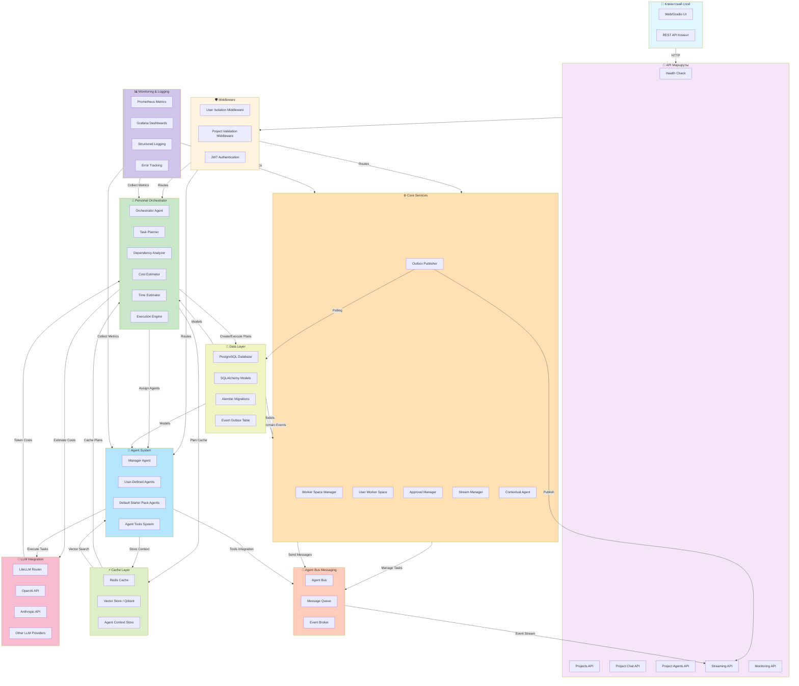
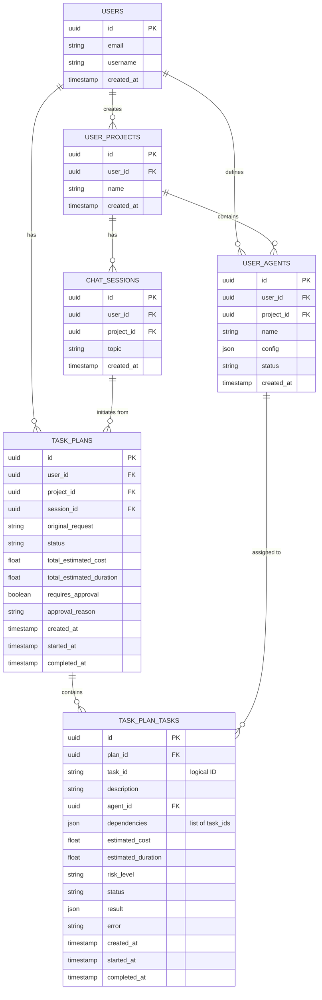
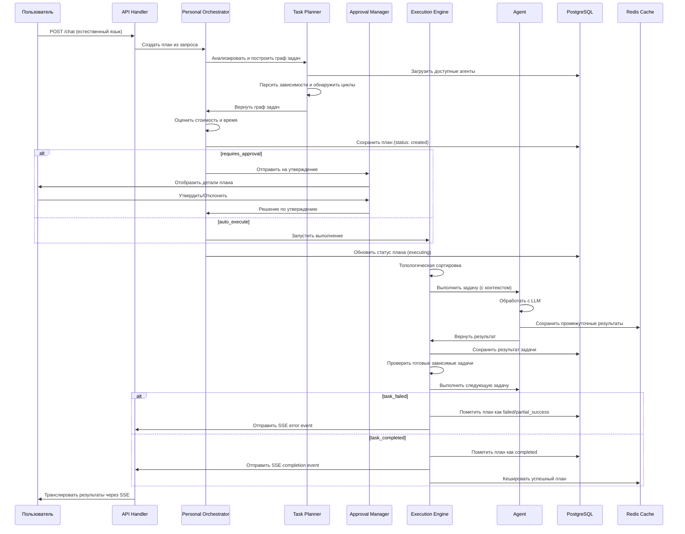
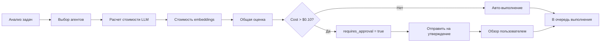
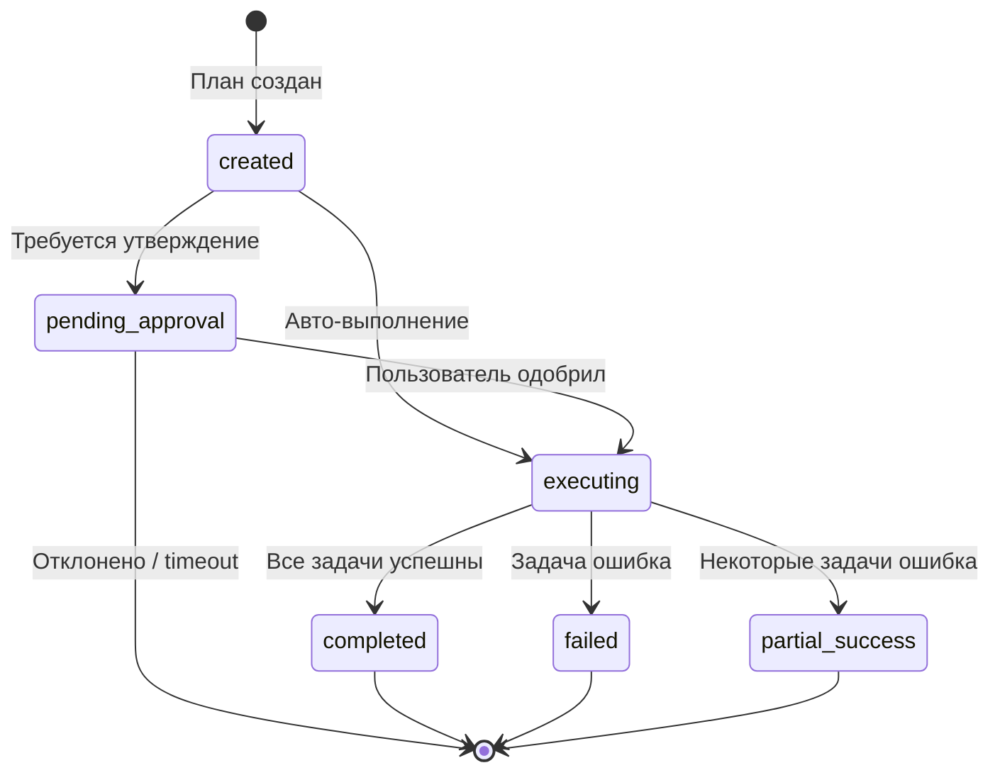

# Обзор архитектуры системы CodeLab Core Service v0.2.0

## 📖 Введение

CodeLab Core Service - это персональная мультиагентная AI платформа с полной изоляцией пользователей. Архитектура основана на **проектах** - каждый пользователь создает проекты, каждый проект имеет своих агентов, сессии чатов и семантическую память.

---

## 🎯 Ключевые принципы архитектуры

### 1. 100% Изоляция пользователей

- **User Level**: Каждый пользователь видит только свои проекты
- **Project Level**: Каждый проект содержит собственные агенты и сессии
- **Agent Level**: Каждый агент имеет персональный Qdrant контекст
- **Middleware**: Автоматическая проверка доступа на всех `/my/*` endpoints

```
User123
├─ Project A
│  ├─ CodeAssistant (со своим Qdrant контекстом)
│  ├─ DataAnalyst (со своим Qdrant контекстом)
│  └─ Chat Sessions
└─ Project B
   ├─ FrontendDeveloper
   ├─ BackendDeveloper
   └─ Chat Sessions

User456 (изолирован, не видит User123 ресурсы)
├─ Project C
│  └─ ...
```

### 2. Два режима работы с агентами

#### ⚡ Прямой вызов (Direct Call) - 1-2 сек
- Пользователь указывает конкретного агента: `target_agent: "CodeAssistant"`
- Агент сразу выполняет задачу
- Минимальная задержка, максимальная скорость
- Идеально для простых запросов

#### 🧠 Автоматический режим (Orchestrated) - 5-10 сек
- Оркестратор анализирует запрос
- Планирует последовательность задач (DAG)
- Координирует несколько агентов
- Идеально для сложных многошаговых задач

### 3. Семантическая память каждого агента

- **Per-Agent Storage**: Каждый агент имеет свою Qdrant коллекцию
- **RAG Integration**: Автоматический поиск релевантного контекста при запросе
- **Масштабируемость**: До 1M+ векторов на агента
- **Метаданные**: Фильтрация по типу взаимодействия, времени, успеху

### 4. Real-time взаимодействие

- **Server-Sent Events (SSE)**: NDJSON формат для streaming
- **Event Buffering**: Redis кэширует последние события (TTL 5 минут)
- **Heartbeat**: Автоматическое поддержание соединения
- **Auto-reconnect**: Клиент может переподключиться и получить историю

---

## 🏗️ Общая архитектура системы


```mermaid
graph TB
    subgraph Клиент["👤 Клиентский слой"]
        UI["Web/Gradio UI"]
        API["REST API Клиент"]
    end

    subgraph API_Layer["🔌 API Маршруты"]
        Health["Health Check"]
        Projects["Projects API"]
        Chat["Project Chat API"]
        Agents["Project Agents API"]
        Streaming["Streaming API"]
        Monitor["Monitoring API"]
    end

    subgraph Middleware_Layer["🛡️ Middleware"]
        UserIsolation["User Isolation Middleware"]
        ProjectValidation["Project Validation Middleware"]
        Auth["JWT Authentication"]
    end

    subgraph Core_Orchestrator["🎯 Personal Orchestrator"]
        OrchestratorAgent["Orchestrator Agent"]
        TaskPlanner["Task Planner"]
        DependencyAnalyzer["Dependency Analyzer"]
        CostEstimator["Cost Estimator"]
        TimeEstimator["Time Estimator"]
        ExecutionEngine["Execution Engine"]
    end

    subgraph Core_Bus["📡 Agent Bus Messaging"]
        AgentBus["Agent Bus"]
        MessageQueue["Message Queue"]
        EventBroker["Event Broker"]
    end

    subgraph Core_System["⚙️ Core Services"]
        WorkerSpaceManager["Worker Space Manager"]
        UserWorkerSpace["User Worker Space"]
        ApprovalManager["Approval Manager"]
        StreamManager["Stream Manager"]
        ContextAgent["Contextual Agent"]
        OutboxPublisher["Outbox Publisher"]
    end

    subgraph Agent_System["🤖 Agent System"]
        ManagerAgent["Manager Agent"]
        UserAgents["User-Defined Agents"]
        StarterPack["Default Starter Pack Agents"]
        AgentToolsSystem["Agent Tools System"]
    end

    subgraph Storage_Layer["💾 Data Layer"]
        PostgreSQL["PostgreSQL Database"]
        Models["SQLAlchemy Models"]
        Migrations["Alembic Migrations"]
        EventOutbox["Event Outbox Table"]
    end

    subgraph Cache_Layer["⚡ Cache Layer"]
        Redis["Redis Cache"]
        VectorStore["Vector Store / Qdrant"]
        AgentContextStore["Agent Context Store"]
    end

    subgraph LLM_Layer["🧠 LLM Integration"]
        LiteLLM["LiteLLM Router"]
        OpenAI["OpenAI API"]
        Anthropic["Anthropic API"]
        OtherLLMs["Other LLM Providers"]
    end

    subgraph Monitoring["📊 Monitoring & Logging"]
        Prometheus["Prometheus Metrics"]
        Grafana["Grafana Dashboards"]
        Logging["Structured Logging"]
        ErrorTracking["Error Tracking"]
    end

    Клиент -->|HTTP| API_Layer
    API_Layer --> Middleware_Layer
    Middleware_Layer -->|Routes| Core_Orchestrator
    Middleware_Layer -->|Routes| Core_System
    Middleware_Layer -->|Routes| Agent_System

    Core_Orchestrator -->|Create/Execute Plans| Storage_Layer
    Core_Orchestrator -->|Plan Cache| Cache_Layer
    Core_Orchestrator -->|Assign Agents| Agent_System
    Core_Orchestrator -->|Estimate Costs| LLM_Layer

    Core_System -->|Manage Tasks| Core_Bus
    Core_System -->|Send Messages| Core_Bus
    Core_System -->|Record Domain Events| Storage_Layer
    OutboxPublisher -->|Polling| Storage_Layer
    OutboxPublisher -->|Publish| Streaming
    Core_Bus -->|Event Stream| Streaming

    Agent_System -->|Execute Tasks| LLM_Layer
    Agent_System -->|Store Context| Cache_Layer
    Agent_System -->|Tools Integration| Core_Bus

    Storage_Layer -->|Models| Core_Orchestrator
    Storage_Layer -->|Models| Core_System
    Storage_Layer -->|Models| Agent_System

    Cache_Layer -->|Cache Plans| Core_Orchestrator
    Cache_Layer -->|Vector Search| Agent_System

    LLM_Layer -->|Token Costs| Core_Orchestrator

    Monitoring -->|Collect Metrics| Core_Orchestrator
    Monitoring -->|Collect Metrics| Core_System
    Monitoring -->|Collect Metrics| Agent_System

    style Клиент fill:#e1f5ff
    style API_Layer fill:#f3e5f5
    style Middleware_Layer fill:#fff3e0
    style Core_Orchestrator fill:#c8e6c9
    style Core_Bus fill:#ffccbc
    style Core_System fill:#ffe0b2
    style Agent_System fill:#b3e5fc
    style Storage_Layer fill:#f0f4c3
    style Cache_Layer fill:#dcedc8
    style LLM_Layer fill:#f8bbd0
    style Monitoring fill:#d1c4e9
```

---

## 📊 Схема базы данных (Task Plans)


```mermaid
erDiagram
    USERS ||--o{ TASK_PLANS : has
    USERS ||--o{ USER_PROJECTS : creates
    USERS ||--o{ USER_AGENTS : defines
    USER_PROJECTS ||--o{ USER_AGENTS : contains
    USER_PROJECTS ||--o{ CHAT_SESSIONS : has
    CHAT_SESSIONS ||--o{ TASK_PLANS : "initiates from"
    TASK_PLANS ||--o{ TASK_PLAN_TASKS : contains
    USER_AGENTS ||--o{ TASK_PLAN_TASKS : "assigned to"

    TASK_PLANS {
        uuid id PK
        uuid user_id FK
        uuid project_id FK
        uuid session_id FK
        string original_request
        string status
        float total_estimated_cost
        float total_estimated_duration
        boolean requires_approval
        string approval_reason
        timestamp created_at
        timestamp started_at
        timestamp completed_at
    }

    TASK_PLAN_TASKS {
        uuid id PK
        uuid plan_id FK
        string task_id "logical ID"
        string description
        uuid agent_id FK
        json dependencies "list of task_ids"
        float estimated_cost
        float estimated_duration
        string risk_level
        string status
        json result
        string error
        timestamp created_at
        timestamp started_at
        timestamp completed_at
    }

    USERS {
        uuid id PK
        string email
        string username
        timestamp created_at
    }

    USER_PROJECTS {
        uuid id PK
        uuid user_id FK
        string name
        timestamp created_at
    }

    USER_AGENTS {
        uuid id PK
        uuid user_id FK
        uuid project_id FK
        string name
        json config
        string status
        timestamp created_at
    }

    CHAT_SESSIONS {
        uuid id PK
        uuid user_id FK
        uuid project_id FK
        string topic
        timestamp created_at
    }
```

---

## 🔄 Workflow Personal Orchestrator


```mermaid
sequenceDiagram
    participant User as Пользователь
    participant API as API Handler
    participant Orchestrator as Personal Orchestrator
    participant Planner as Task Planner
    participant ApprovalMgr as Approval Manager
    participant Executor as Execution Engine
    participant Agent as Agent
    participant DB as PostgreSQL
    participant Cache as Redis Cache

    User->>API: POST /chat (естественный язык)
    API->>Orchestrator: Создать план из запроса
    
    Orchestrator->>Planner: Анализировать и построить граф задач
    Planner->>DB: Загрузить доступные агенты
    Planner->>Planner: Парсить зависимости и обнаружить циклы
    
    Planner->>Orchestrator: Вернуть граф задач
    Orchestrator->>Orchestrator: Оценить стоимость и время
    
    Orchestrator->>DB: Сохранить план (status: created)
    
    alt requires_approval
        Orchestrator->>ApprovalMgr: Отправить на утверждение
        ApprovalMgr->>User: Отобразить детали плана
        User->>ApprovalMgr: Утвердить/Отклонить
        ApprovalMgr->>Orchestrator: Решение по утверждению
    else auto_execute
        Orchestrator->>Executor: Запустить выполнение
    end
    
    Orchestrator->>DB: Обновить статус плана (executing)
    
    Executor->>Executor: Топологическая сортировка
    Executor->>Agent: Выполнить задачу (с контекстом)
    
    Agent->>Agent: Обработать с LLM
    Agent->>Cache: Сохранить промежуточные результаты
    
    Agent->>Executor: Вернуть результат
    Executor->>DB: Сохранить результат задачи
    
    Executor->>Executor: Проверить готовые зависимые задачи
    Executor->>Agent: Выполнить следующую задачу
    
    alt task_failed
        Executor->>DB: Пометить план как failed/partial_success
        Executor->>API: Отправить SSE error event
    else task_completed
        Executor->>DB: Пометить план как completed
        Executor->>API: Отправить SSE completion event
        Executor->>Cache: Кешировать успешный план
    end
    
    API->>User: Транслировать результаты через SSE
```

---

## 💰 Процесс оценки стоимости


```mermaid
graph LR
    A["Анализ задач"] --> B["Выбор агентов"]
    B --> C["Расчет стоимости LLM"]
    C --> D["Стоимость embeddings"]
    D --> E["Общая оценка"]
    E --> F{"Cost > $0.10?"}
    F -->|Да| G["requires_approval = true"]
    F -->|Нет| H["Авто-выполнение"]
    G --> I["Отправить на утверждение"]
    H --> J["В очередь выполнения"]
    I --> K["Обзор пользователем"]
    K --> J
```

---

## 🏗️ Высокоуровневая архитектура

```
┌─────────────────────────────────────────────────────────────┐
│                     CLIENT LAYER                            │
│  ┌──────────────────────────────────────────────────────┐   │
│  │  Web UI / Mobile App / API Client                    │   │
│  │  (JWT Auth + User Isolation автоматическая)         │   │
│  └──────────────────────────────────────────────────────┘   │
└────────────────────────┬────────────────────────────────────┘
                         │
                         ▼
┌─────────────────────────────────────────────────────────────┐
│              API GATEWAY LAYER (FastAPI)                    │
│  ┌──────────────────────────────────────────────────────┐   │
│  │ User Isolation Middleware (JWT → user_id)           │   │
│  │ Project Validation Middleware (project ownership)    │   │
│  │ Routes:                                              │   │
│  │  ├─ /my/projects/*              (CRUD проектов)     │   │
│  │  ├─ /my/projects/{pid}/agents/* (агенты проекта)   │   │
│  │  ├─ /my/projects/{pid}/chat/*   (чат проекта)      │   │
│  │  └─ /health /ready              (здоровье)         │   │
│  └──────────────────────────────────────────────────────┘   │
└────────────────────────┬────────────────────────────────────┘
                         │
                         ▼
┌─────────────────────────────────────────────────────────────┐
│           BUSINESS LOGIC LAYER                              │
│  ┌──────────────────────────────────────────────────────┐   │
│  │  WorkerSpaceManager                                  │   │
│  │  ├─ create_worker_space(project_id)                │   │
│  │  ├─ get_worker_space(project_id)                   │   │
│  │  └─ delete_worker_space(project_id)                │   │
│  └──────────────────────────────────────────────────────┘   │
│  ┌──────────────────────────────────────────────────────┐   │
│  │  Per-Project Components                              │   │
│  │  ├─ Agent Manager (создание/удаление/обновление)   │   │
│  │  ├─ Agent Bus (координация агентов)                │   │
│  │  ├─ Contextual Agents (выполнение с RAG)           │   │
│  │  ├─ Orchestrator (планирование DAG)                │   │
│  │  ├─ Approval Manager (контроль опасных операций)   │   │
│  │  └─ Stream Manager (real-time события)             │   │
│  └──────────────────────────────────────────────────────┘   │
└────────────────────────┬────────────────────────────────────┘
                         │
                ┌────────┼────────────┬──────────┐
                ▼        ▼            ▼          ▼
          ┌─────────┐┌──────────┐┌────────┐┌──────────────┐
          │PostgreSQL│ Redis   │ Qdrant │  LLM API     │
          │         │          │       │              │
          │ Users   │ Queues   │Vectors│ (OpenAI/etc) │
          │ Projects│ Cache    │RAG    │              │
          │ Agents  │ Events   │Context│              │
          │ Sessions│ Sessions │       │              │
          │ Messages│          │       │              │
          └─────────┘└──────────┘└────────┘└──────────────┘
```

---

## 🔧 Компоненты системы

### Взаимодействие ключевых подсистем

#### 1. **Personal Orchestrator**
   - Анализирует естественный язык запросов
   - Строит графы зависимостей между задачами
   - Оценивает стоимость и длительность
   - Управляет workflow утверждения
   - Выполняет планы с правильной последовательностью

#### 2. **Agent System**
   - Загружает агенты пользователя из БД
   - Выбирает агентов по требованиям задач
   - Выполняет задачи с назначенными LLM
   - Возвращает промежуточные результаты

#### 3. **Storage Layer**
   - Сохраняет планы и задачи для восстановления
   - Ведет audit trail выполнения
   - Хранит промежуточные результаты

#### 4. **Cache Layer**
   - Redis: Кеширует похожие планы (TTL 24h)
   - Qdrant: Векторный поиск по контексту
   - Сокращает время планирования

#### 5. **Approval Manager**
   - Перехватывает планы, требующие утверждения
   - Предоставляет детали плана пользователю
   - Управляет timeout утверждения (300s)

#### 6. **Agent Bus**
   - Маршрутизирует сообщения между агентами
   - Ведет event stream для SSE
   - Координирует параллельное выполнение

#### 7. **Event Outbox + Publisher (Event Logging System)**
   - **Event Outbox**: Таблица для дурабельного хранения доменных событий
     - Записывает message_created, agent_switched и другие доменные события атомарно с изменением состояния
     - Использует JSONB для гибкого payload, индексы на (status, next_retry_at), (user_id), (project_id)
     - Гарантирует: нет потери событий, все-или-ничего при коммите
   
   - **Outbox Publisher**: Background сервис для надежной доставки
     - Периодически выбирает pending события с блокировкой FOR UPDATE SKIP LOCKED
     - Публикует в StreamManager через broadcast_event()
     - Exponential backoff retry (5s→10s→20s→40s→80s→300s)
     - Обновляет статус: pending → published/failed
     - Metrics: pending_count, published_total, failed_total, latency
   
   - **Analytics API**: Read-model на основе event_outbox
     - GET /my/projects/{project_id}/events (фильтры, пагинация)
     - GET /my/projects/{project_id}/analytics/sessions/{session_id}/events
     - GET /my/projects/{project_id}/analytics (агрегированные метрики)
     - User/Project изоляция через verify_project_access()

#### 8. **Идемпотентность и надежность**
   - **Event ID**: outbox.id используется как event_id, стабилен при ретраях
   - **Consumer Deduplication**: Клиенты дедуплицируют по event_id в payload
   - **Exactly-Once Semantics**: At-least-once доставка + client-side deduplication
   - **Архитектурное разделение**:
     - Доменные события (message_created, agent_switched) → outbox-only
     - Технические события (DIRECT_AGENT_CALL, TASK_STARTED) → direct streaming + optional outbox

### API Gateway Layer

#### FastAPI Application (`app/main.py`)
- **Назначение**: HTTP сервер и точка входа
- **Технологии**: FastAPI 0.115+, Uvicorn, Pydantic 2.0
- **Функции**:
  - Маршрутизация запросов к routes
  - Валидация данных (Pydantic schemas)
  - Документация OpenAPI (Swagger/ReDoc)
  - CORS middleware для фронтенда
  - Lifespan управление (startup/shutdown)

#### User Isolation Middleware (`app/middleware/user_isolation.py`)
- **Назначение**: Извлечение user_id из JWT токена и инъекция в контекст
- **Логика**:
  1. Проверить заголовок `Authorization: Bearer <token>`
  2. Декодировать JWT токен
  3. Извлечь `user_id` из claim `sub`
  4. Инъектировать в `request.state.user_id`
- **Защита**: 401 Unauthorized если токен отсутствует или невалидный

#### Project Validation Middleware (`app/middleware/project_validation.py`)
- **Назначение**: Проверка прав доступа к проекту
- **Логика**:
  1. Получить `project_id` из URL параметра
  2. Проверить в БД: `project.user_id == request.state.user_id`
  3. Возвращать 404 если проект не найден или не принадлежит пользователю
- **Защита**: 403 Forbidden/404 Not Found для неавторизованного доступа

---

### Business Logic Layer

#### WorkerSpaceManager (`app/core/worker_space_manager.py`)
- **Назначение**: Управление рабочими пространствами проектов
- **Ответственность**:
  - Создание новых worker space при создании проекта
  - Кэширование активных worker spaces в памяти
  - Удаление worker spaces при удалении проекта
  - Предоставление доступа к компонентам проекта
- **Структура**:
  ```python
  class WorkerSpaceManager:
      _spaces: Dict[UUID, ProjectWorkerSpace] = {}
      
      async def create_worker_space(self, project_id: UUID) -> ProjectWorkerSpace
      async def get_worker_space(self, project_id: UUID) -> ProjectWorkerSpace
      async def delete_worker_space(self, project_id: UUID) -> None
  ```

#### Agent Manager (`app/agents/manager.py`)
- **Назначение**: Управление агентами проекта
- **CRUD операции**:
  - Создание агента с инициализацией Qdrant контекста
  - Чтение метаданных агента
  - Обновление конфигурации
  - Удаление агента с очисткой контекста
- **Интеграция**:
  - PostgreSQL: метаданные агента
  - Qdrant: коллекции для каждого агента
  - Redis: кэширование конфигураций

#### Contextual Agent (`app/agents/contextual_agent.py`)
- **Назначение**: Выполнение задач с использованием семантической памяти
- **Архитектура**:
  ```
  Input (задача)
    ↓
  Retrieve Context (RAG из Qdrant)
    ↓
  Build Prompt (с контекстом + system prompt)
    ↓
  Call LLM (OpenAI/LiteLLM)
    ↓
  Store Interaction (в Qdrant контекст агента)
    ↓
  Return Response
  ```
- **RAG Integration**:
  - Вектоизация запроса в embedding
  - Поиск K похожих взаимодействий в Qdrant
  - Добавление контекста в prompt
  - Сохранение взаимодействия для будущей реиспользования

#### Agent Bus (`app/core/agent_bus.py`)
- **Назначение**: Координация выполнения задач между агентами
- **Архитектура**: asyncio.Queue per agent
- **Функции**:
  - Регистрация агентов при создании
  - Управление очередями задач
  - Контроль параллелизма (concurrency_limit)
  - Обработка результатов и ошибок
  - Метрики выполнения (успешные, ошибки, время)

#### Orchestrator (`app/core/orchestrator.py`)
- **Назначение**: Планирование и координация сложных задач
- **Алгоритм**:
  1. Анализ входного запроса
  2. Разбиение на подзадачи
  3. Определение агентов для каждой подзадачи
  4. Построение DAG (directed acyclic graph)
  5. Параллельное/последовательное выполнение
  6. Агрегирование результатов
- **Метрики**: время планирования, время выполнения, успех

#### Approval Manager (`app/core/approval.py`)
- **Назначение**: Контроль выполнения опасных операций
- **Типы одобрений**:
  - Tool approval (разрешение использовать специфический инструмент)
  - Plan approval (разрешение выполнить сложный план)
- **Процесс**:
  1. Агент или оркестратор запрашивают одобрение
  2. Отправляется SSE событие пользователю
  3. Пользователь подтверждает или отклоняет
  4. Агент разблокируется или отменяется
- **Timeout**: 5 минут по умолчанию

#### Stream Manager (`app/core/stream_manager.py`)
- **Назначение**: Управление SSE подписками и буферизацией событий
- **Функции**:
  - Подписка на события сессии
  - Отправка событий всем подписчикам
  - Буферизация в Redis (FIFO, 100 событий, TTL 5 минут)
  - Отправка истории при переподключении
  - Heartbeat для поддержания соединения

---

## 🗄️ Data Layer

### PostgreSQL Database

**Таблицы**:
```
users
├─ id (UUID PK)
├─ email (unique)
└─ created_at

user_projects
├─ id (UUID PK)
├─ user_id (FK → users)
├─ name (varchar)
├─ workspace_path (varchar, nullable)
├─ created_at
└─ updated_at

user_agents
├─ id (UUID PK)
├─ project_id (FK → user_projects)
├─ user_id (FK → users, denormalized for performance)
├─ name (varchar)
├─ status (enum: ready/busy/error)
├─ config (jsonb: system_prompt, model, tools, etc)
├─ created_at
└─ updated_at

chat_sessions
├─ id (UUID PK)
├─ project_id (FK → user_projects)
├─ user_id (FK → users)
├─ created_at
└─ updated_at

messages
├─ id (UUID PK)
├─ session_id (FK → chat_sessions)
├─ user_id (FK → users)
├─ agent_id (FK → user_agents, nullable)
├─ role (enum: user/assistant/system)
├─ content (text)
├─ timestamp
└─ metadata (jsonb)
```

### Redis Cache

**Назначение**: Высокоскоростной кэш и очереди

**Структуры данных**:
```
Keys:
agent_config:{agent_id}              → JSON конфиг агента
agent_status:{agent_id}              → строка статуса
session_events:{session_id}          → List (FIFO очередь событий)
user_sessions:{user_id}             → Set активных сессий пользователя

Queues:
agent_task_queue:{agent_id}         → asyncio.Queue для задач
```

**TTLs**:
- Конфиги агентов: 1 час
- События сессии: 5 минут
- Статусы: 10 минут

### Qdrant Vector Database

**Назначение**: Хранение эмбеддингов и RAG поиск

**Коллекции** (per agent):
```
{agent_id}_context
├─ Points: эмбеддинги взаимодействий
├─ Payload:
│  ├─ agent_id (string)
│  ├─ user_id (string)
│  ├─ project_id (string)
│  ├─ session_id (string, optional)
│  ├─ content (text, indexed)
│  ├─ interaction_type (enum: task/tool/direct_call)
│  ├─ timestamp (datetime)
│  ├─ success (boolean)
│  ├─ tags (array: для категоризации)
│  └─ metadata (object: дополнительные данные)
├─ Vectors: 1536-dim (OpenAI embeddings)
└─ Search: semantic + metadata filtering
```

**Использование**:
```python
# RAG поиск с фильтрацией
results = await qdrant.search(
    collection_name=f"{agent_id}_context",
    query_vector=embedding,
    query_filter=Filter(
        must=[
            HasPayload(key="agent_id", value=agent_id),
            Range(key="timestamp", gte=week_ago)
        ]
    ),
    limit=5
)
```

---

## 🔄 Потоки данных

### Сценарий 1: Создание проекта

```
User → POST /my/projects/
  ↓
User Isolation Middleware (extract user_id)
  ↓
ProjectCreate validation
  ↓
Create UserProject in DB
  ↓
Initialize Starter Pack (3 agents: CodeAssistant, DataAnalyst, DocumentWriter)
  ↓
For each agent:
  ├─ Create UserAgent in DB
  ├─ Initialize Qdrant collection
  └─ Cache config in Redis
  ↓
Create ProjectWorkerSpace
  ↓
Return ProjectResponse
```

### Сценарий 2: Прямой вызов агента (⚡ быстро)

```
User → POST /my/projects/{pid}/chat/{sid}/message/ with target_agent="CodeAssistant"
  ↓
User Isolation + Project Validation
  ↓
Save user message to DB
  ↓
Get agent from cache/DB
  ↓
Contextual Agent:
  ├─ Retrieve context from Qdrant (RAG)
  ├─ Build prompt with system_prompt + context
  ├─ Call LLM (with timeout)
  ├─ Stream response to client (SSE)
  └─ Store interaction in Qdrant
  ↓
Save agent message to DB
  ↓
Emit SSE event (agent_completed)
```

### Сценарий 3: Автоматический режим (🧠 медленнее)

```
User → POST /my/projects/{pid}/chat/{sid}/message/ without target_agent
  ↓
User Isolation + Project Validation
  ↓
Save user message to DB
  ↓
Emit SSE event (message_received)
  ↓
Orchestrator:
  ├─ Analyze request
  ├─ Plan task DAG
  ├─ Identify required agents
  └─ Emit SSE event (plan_created)
  ↓
For each task in DAG (parallel where possible):
  ├─ Get agent from bus
  ├─ Send task to agent_task_queue
  ├─ Agent executes (with RAG + Qdrant)
  ├─ Emit SSE events (agent_started, agent_working, agent_completed)
  └─ Store results in message chain
  ↓
Aggregate results
  ↓
Save final message to DB
  ↓
Emit SSE event (orchestration_completed)
```

---

## 📊 Переходы статусов


```mermaid
stateDiagram-v2
    [*] --> created: План создан
    created --> pending_approval: Требуется утверждение
    created --> executing: Авто-выполнение
    pending_approval --> executing: Пользователь одобрил
    pending_approval --> [*]: Отклонено / timeout
    executing --> completed: Все задачи успешны
    executing --> failed: Задача ошибка
    executing --> partial_success: Некоторые задачи ошибка
    completed --> [*]
    failed --> [*]
    partial_success --> [*]
```

---

## 🗂️ Индексы БД для производительности

```sql
-- таблица task_plans
CREATE INDEX ix_task_plans_user_id_project_id ON task_plans(user_id, project_id);
CREATE INDEX ix_task_plans_session_id ON task_plans(session_id);
CREATE INDEX ix_task_plans_status_created_at ON task_plans(status, created_at);

-- таблица task_plan_tasks
CREATE INDEX ix_task_plan_tasks_plan_id ON task_plan_tasks(plan_id);
CREATE INDEX ix_task_plan_tasks_agent_id ON task_plan_tasks(agent_id);
CREATE INDEX ix_task_plan_tasks_status ON task_plan_tasks(status);

-- таблица event_outbox (Event Logging System)
CREATE INDEX ix_event_outbox_status_next_retry ON event_outbox(status, next_retry_at, created_at);
CREATE INDEX ix_event_outbox_aggregate_id_created ON event_outbox(aggregate_id, created_at);
CREATE INDEX ix_event_outbox_project_id_created ON event_outbox(project_id, created_at);
CREATE INDEX ix_event_outbox_user_id_created ON event_outbox(user_id, created_at);
-- GIN индекс для JSONB поля payload (опционально для полнотекстового поиска)
CREATE INDEX ix_event_outbox_payload_gin ON event_outbox USING GIN (payload);
```

---

## 🔐 Безопасность

### User Isolation

- **Middleware-level**: Все `/my/*` endpoints требуют JWT
- **Database-level**: Запросы фильтруются по `user_id`
- **Application-level**: Проверка ownership перед операциями
- **Metric**: `USER_ISOLATION_VIOLATIONS` должен быть = 0

### Authentication

- **JWT Bearer Tokens**: Stateless аутентификация
- **Token Claims**: `sub` (user UUID), `iat` (issued at), `exp` (expiration)
- **Secret Key**: Конфигурируется через `JWT_SECRET_KEY`
- **Token Validation**: На каждый `/my/*` запрос

### Authorization

- **Per-Project ACL**: Пользователь видит только свои проекты
- **Per-Agent ACL**: Агенты привязаны к проекту пользователя
- **Approval Workflow**: Критические операции требуют подтверждения

---

## 📈 Масштабируемость

### Горизонтальное масштабирование

- **Stateless API**: Можно запустить N инстансов FastAPI
- **Shared Redis**: Для координации между инстансами
- **Shared PostgreSQL**: Для хранения состояния
- **Shared Qdrant**: Для RAG поиска

### Вертикальное масштабирование

- **Worker Spaces in Memory**: Кэширование активных проектов
- **Async I/O**: Все операции async для эффективного использования CPU
- **Connection Pooling**: PostgreSQL asyncpg, Redis connection pooling

### Оптимизации

- **Кэширование конфигов агентов в Redis**: Избежать частых DB запросов
- **Lazy loading контекстов**: Инициализировать только когда нужно
- **Burstable concurrency**: Динамическое управление concurrency_limit
- **Batch operations**: Группировка операций для БД

---

## 📊 Мониторинг и Метрики

### Prometheus Metrics

```
# Counters
projects_created_total{user_id}
agents_created_total{project_id}
messages_sent_total{project_id}
direct_calls_total{agent_id}
orchestrations_total{project_id}

# Histograms
agent_execution_seconds{agent_id,status}
orchestration_planning_seconds{project_id}
qdrant_search_latency_seconds{agent_id}
user_isolation_check_duration_seconds

# Gauges
active_projects_count
active_agents_count
redis_queue_size{agent_id}
qdrant_collection_size{agent_id}
```

### Health Checks

- **GET /health** - базовая проверка (должна всегда вернуть 200)
- **GET /ready** - проверка зависимостей (PostgreSQL, Redis, Qdrant)

---

## 🚀 Развертывание

### Docker Compose (local development)

```yaml
services:
  api:
    image: codelab-core-service:latest
    ports: [8000:8000]
    depends_on: [postgres, redis, qdrant]
  
  postgres:
    image: postgres:16
    environment:
      POSTGRES_DB: codelab
  
  redis:
    image: redis:7
  
  qdrant:
    image: qdrant/qdrant:v1.7.1
```

### Kubernetes (production)

```yaml
apiVersion: apps/v1
kind: Deployment
metadata:
  name: codelab-core-service
spec:
  replicas: 3
  selector:
    matchLabels:
      app: codelab
  template:
    spec:
      containers:
      - name: api
        image: codelab-core-service:v0.2.0
        ports:
        - containerPort: 8000
        livenessProbe:
          httpGet:
            path: /health
            port: 8000
          initialDelaySeconds: 30
          periodSeconds: 10
        readinessProbe:
          httpGet:
            path: /ready
            port: 8000
          initialDelaySeconds: 10
          periodSeconds: 5
        env:
        - name: DATABASE_URL
          valueFrom:
            secretKeyRef:
              name: codelab-secrets
              key: database-url
```

---

## 📚 Дополнительные ресурсы

- [REST API документация](./rest-api.md)
- [Component Details](./component-details.md)
- [Developer Guide](./developer-guide.md)
- [Deployment Guide](./deployment-guide.md)
- [Примеры кода](../samples.md)
