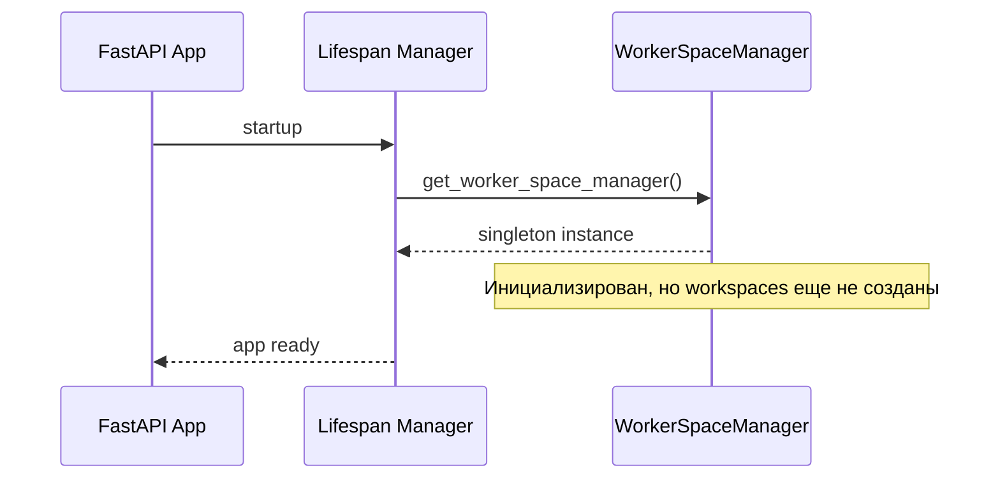
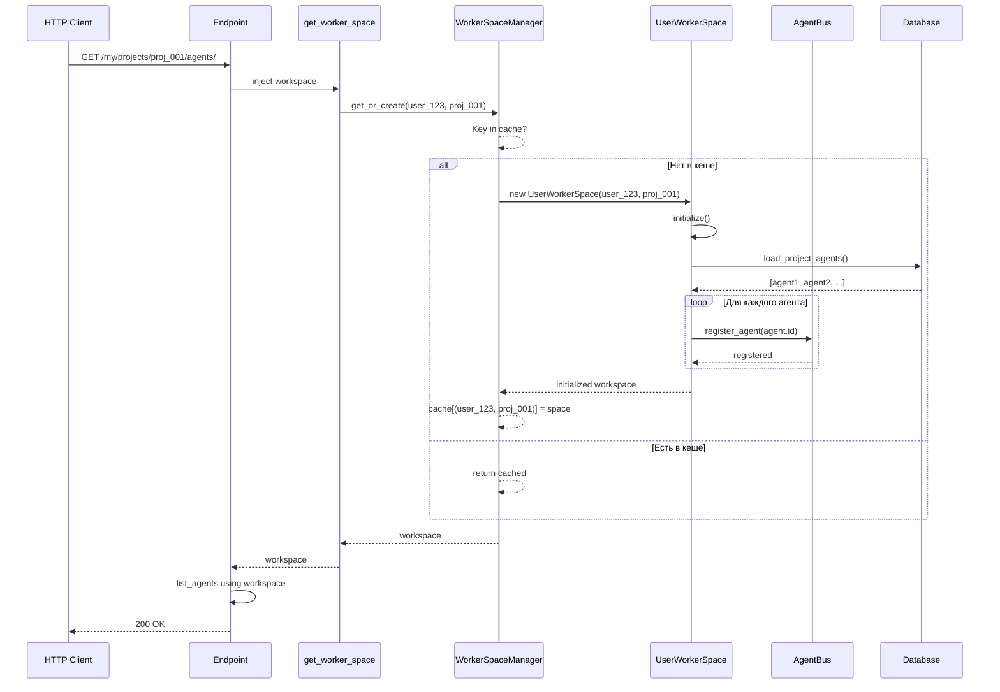
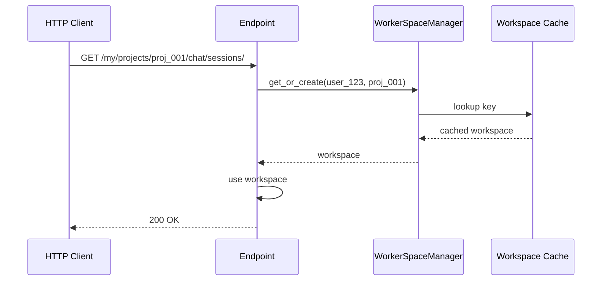
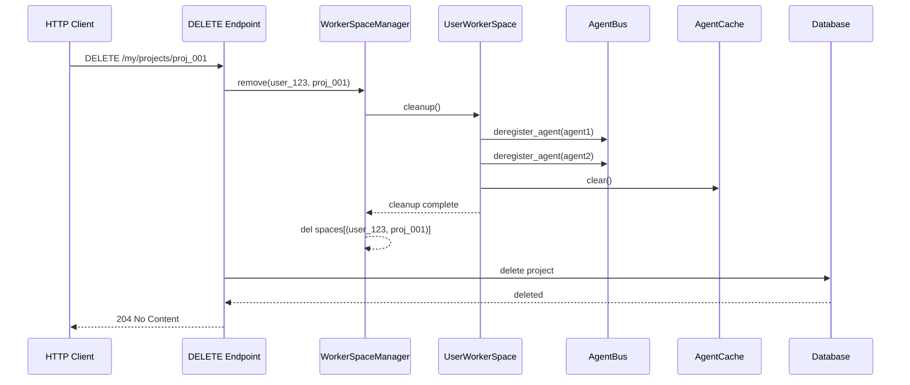
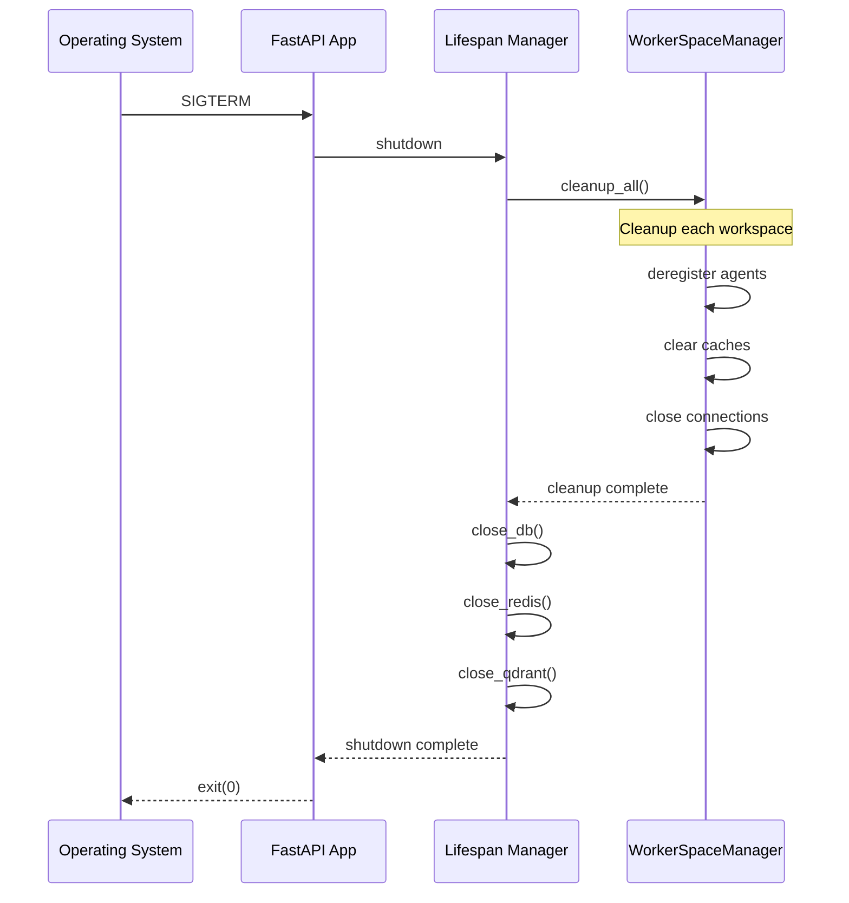
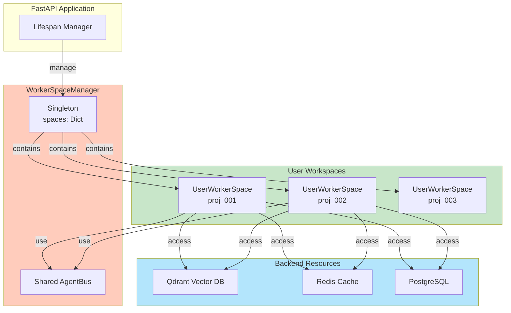
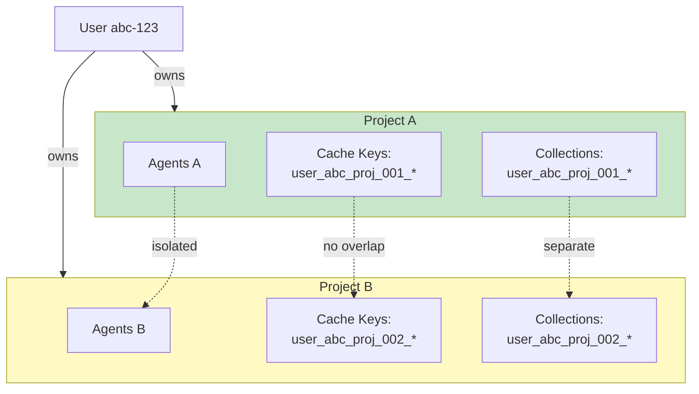
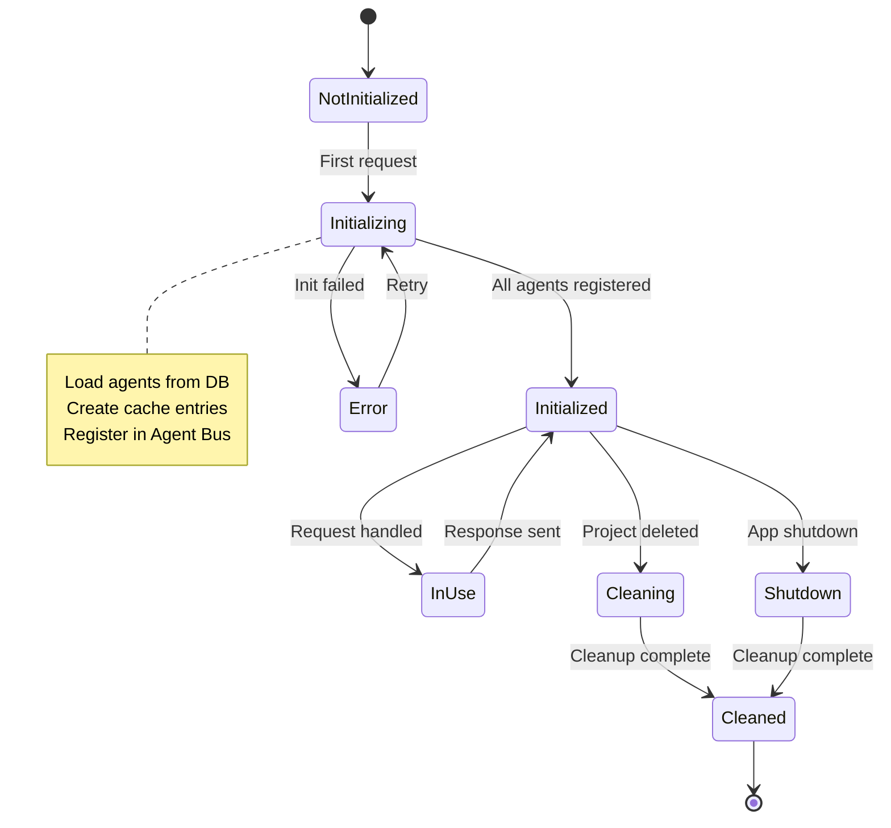

# User Worker Space - Per-Project архитектура

**Дата:** 18 февраля 2026  
**Версия:** 1.0  
**Статус:** ✅ Реализовано и протестировано

## 📋 Оглавление

1. [Обзор архитектуры](#обзор-архитектуры)
2. [Компоненты системы](#компоненты-системы)
3. [Per-Project структура](#per-project-структура)
4. [Жизненный цикл Workspace](#жизненный-цикл-workspace)
5. [Диаграммы взаимосвязей](#диаграммы-взаимосвязей)
6. [Диаграммы последовательности](#диаграммы-последовательности)
7. [Изоляция и безопасность](#изоляция-и-безопасность)
8. [Примеры использования](#примеры-использования)

---

## Обзор архитектуры

### Ключевые концепции

**User Worker Space** - это per-project контейнер, который управляет всеми backend ресурсами конкретного проекта пользователя:

- **Agent Cache** - кеширование конфигураций агентов проекта
- **Agent Bus** - обработка задач агентов проекта
- **Qdrant Collections** - векторное хранилище контекста агентов проекта
- **Lifecycle Management** - инициализация и cleanup ресурсов

### Архитектурные принципы

```
🎯 Per-Project изоляция
   └─ Каждый проект имеет отдельный workspace
   └─ Полная изоляция backend ресурсов
   └─ Независимые жизненные циклы

🔄 Явное управление lifecycle
   └─ Инициализация при первом обращении
   └─ Graceful cleanup при удалении проекта
   └─ Graceful shutdown при остановке приложения

📊 Мониторинг и диагностика
   └─ Статистика по активным workspace
   └─ Health check для workspace
   └─ Детальное логирование
```

---

## Компоненты системы

### 1. WorkerSpaceManager (Singleton)

**Роль:** Управление жизненным циклом всех workspace  
**Файл:** [`app/core/worker_space_manager.py`](../../app/core/worker_space_manager.py)

```python
class WorkerSpaceManager:
    """Singleton manager for all user worker spaces.
    
    Each (user_id, project_id) pair has exactly one UserWorkerSpace.
    """
    
    # Хранилище workspace
    spaces: dict[str, UserWorkerSpace]  # Key: "{user_id}_{project_id}"
    
    # Общий Agent Bus для всех workspace
    agent_bus: AgentBus
    
    # Методы
    async def get_or_create(user_id, project_id, ...) -> UserWorkerSpace
    async def get(user_id, project_id) -> Optional[UserWorkerSpace]
    async def remove(user_id, project_id) -> bool
    async def cleanup_all() -> None  # Вызывается при shutdown приложения
    def get_stats() -> dict  # Статистика
```

**Ответственность:**
- Создание workspace при первом обращении
- Кеширование workspace в памяти
- Thread-safe доступ через double-check locking
- Graceful cleanup всех workspace

### 2. UserWorkerSpace (Per-Project)

**Роль:** Управление ресурсами конкретного проекта  
**Файл:** [`app/core/user_worker_space.py`](../../app/core/user_worker_space.py)

```python
class UserWorkerSpace:
    """Worker space for managing user's project resources."""
    
    # Идентификаторы
    user_id: UUID
    project_id: str
    user_prefix: str = f"user{user_id}"
    project_prefix: str = f"project{project_id}"
    
    # Backend ресурсы
    agent_cache: AgentCache  # Per-project cache
    agent_manager: AgentManager  # Database access
    agent_bus: AgentBus  # Task queue manager
    qdrant: AsyncQdrantClient  # Vector store
    redis: Redis  # Distributed cache
    
    # Состояние
    initialized: bool
    active_agents: dict[UUID, ContextualAgent]
    
    # Методы
    async def initialize() -> None
    async def get_agent(agent_id) -> Optional[ContextualAgent]
    async def add_agent(agent_config) -> UUID
    async def remove_agent(agent_id) -> bool
    async def cleanup() -> None
    async def reset() -> None
```

**Ответственность:**
- Инициализация backend ресурсов проекта
- Управление кешем агентов проекта
- Регистрация/дерегистрация агентов в Agent Bus
- Graceful cleanup при удалении проекта

### 3. get_worker_space Dependency

**Роль:** Автоматическое получение или создание workspace  
**Файл:** [`app/dependencies.py`](../../app/dependencies.py)

```python
async def get_worker_space(
    project_id: UUID,
    request: Request,
    db: AsyncSession = Depends(get_db),
    redis: Redis = Depends(get_redis),
    qdrant: AsyncQdrantClient = Depends(get_qdrant),
) -> UserWorkerSpace:
    """Get or create UserWorkerSpace for current user and project."""
    
    user_id = get_current_user_id(request)
    manager = get_worker_space_manager()
    
    # Автоматический вызов get_or_create
    space = await manager.get_or_create(
        user_id=user_id,
        project_id=str(project_id),
        db=db,
        redis=redis,
        qdrant=qdrant,
    )
    return space
```

**Ответственность:**
- Injection workspace в endpoints
- Автоматическое создание при первом обращении
- Логирование получения workspace

### 4. Endpoints (Per-Project)

**Маршруты:**
- `/my/projects/{project_id}/chat/` - Chat endpoints
- `/my/projects/{project_id}/agents/` - Agent endpoints
- `/my/projects/{project_id}/chat/{session_id}/events/` - Streaming

**Интеграция:**
```python
@router.get("/agents/")
async def list_agents(
    project_id: UUID,
    workspace: UserWorkerSpace = Depends(get_worker_space),  # ← Автоинъекция
) -> AgentListResponse:
    # workspace уже инициализирован и готов к использованию
    agents = await workspace.agent_manager.list_agents_by_project(project_id)
    return AgentListResponse(agents=agents, total=len(agents))
```

---

## Per-Project структура

### Многопроектная архитектура пользователя

```
User (user_id=abc-123, email=user@example.com)
│
├─ Project A (project_id=proj_001)
│  ├─ UserWorkerSpace(abc-123, proj_001)
│  │  ├─ AgentCache
│  │  │  └─ agent1_config: {name, system_prompt, model, ...}
│  │  │  └─ agent2_config: {name, system_prompt, model, ...}
│  │  │
│  │  ├─ AgentBus
│  │  │  └─ agent1_queue: asyncio.Queue
│  │  │  └─ agent2_queue: asyncio.Queue
│  │  │
│  │  └─ Qdrant Collections
│  │     └─ user_abc_project_proj_001_agent1_context
│  │     └─ user_abc_project_proj_001_agent2_context
│  │
│  └─ Database
│     └─ agents (project_id=proj_001)
│     └─ chat_sessions (project_id=proj_001)
│     └─ messages (project_id=proj_001)
│
├─ Project B (project_id=proj_002)  ← ОТДЕЛЬНЫЙ WORKSPACE!
│  ├─ UserWorkerSpace(abc-123, proj_002)
│  │  ├─ AgentCache (только для Project B)
│  │  ├─ AgentBus (независимый)
│  │  └─ Qdrant Collections (user_abc_project_proj_002_*)
│  │
│  └─ Database
│     └─ agents (project_id=proj_002)
│     └─ chat_sessions (project_id=proj_002)
│
└─ Project C (project_id=proj_003)
   └─ UserWorkerSpace(abc-123, proj_003)
      ├─ AgentCache
      ├─ AgentBus
      └─ Qdrant Collections
```

### Ключевые моменты

1. **Каждый проект имеет свой workspace** - не общие ресурсы
2. **Изоляция на всех уровнях:**
   - Cache: разные ключи `user{id}_project{id}`
   - Agent Bus: разные очереди для каждого проекта
   - Qdrant: разные collections для каждого проекта
3. **Независимые жизненные циклы** - можно удалить Project A без влияния на B, C

---

## Жизненный цикл Workspace

### 1️⃣ Инициализация (Startup)



### 2️⃣ Создание Workspace (First Request)



### 3️⃣ Использование Workspace (Subsequent Requests)



### 4️⃣ Cleanup Workspace (Project Deletion)



### 5️⃣ Shutdown (Application Termination)



---

## Диаграммы взаимосвязей

### Архитектура компонентов



### Per-Project Изоляция



### Состояния Workspace (State Machine)



---

## Примеры использования

### Пример 1: Первый запрос к проекту

```
1. HTTP GET /my/projects/proj_001/agents/
2. get_worker_space dependency вызывается
3. WorkerSpaceManager.get_or_create(user_123, proj_001) вызывается
4. Проверка: key в cache? НЕТ
5. Создание: new UserWorkerSpace(user_123, proj_001)
6. Инициализация: space.initialize()
   - Загрузка агентов из БД
   - Создание cache entries
   - Регистрация в Agent Bus
7. Возврат: UserWorkerSpace в endpoint
8. Использование: endpoint обрабатывает запрос
9. Ответ: 200 OK с списком агентов
```

### Пример 2: Второй запрос к тому же проекту

```
1. HTTP GET /my/projects/proj_001/chat/sessions/
2. get_worker_space dependency вызывается
3. WorkerSpaceManager.get_or_create(user_123, proj_001) вызывается
4. Проверка: key в cache? ДА!
5. Возврат: cached UserWorkerSpace (FAST PATH!)
6. Использование: endpoint использует кешированный workspace
7. Ответ: 200 OK с сессиями
```

### Пример 3: Переключение между проектами

```
Timeline:
t=0ms:  GET /my/projects/proj_001/agents/ 
        → Creates UserWorkerSpace(user_123, proj_001)

t=100ms: GET /my/projects/proj_002/agents/
         → Creates UserWorkerSpace(user_123, proj_002)
         → proj_001 workspace остается в памяти

t=200ms: POST /my/projects/proj_001/chat/msg
         → Returns cached UserWorkerSpace(user_123, proj_001)

t=300ms: DELETE /my/projects/proj_002
         → Calls manager.remove(user_123, proj_002)
         → Cleanup workspace для proj_002
         → proj_001 workspace остается нетронутым
```

---

## Мониторинг

### Health Check Endpoint

```bash
GET /admin/workspaces/health

Response:
{
    "healthy": true,
    "total_spaces": 3,
    "healthy_spaces": 3,
    "unhealthy_spaces": [],
    "details": {
        "user123_proj001": {
            "healthy": true,
            "agents": 3,
            "initialized": true
        },
        "user123_proj002": {
            "healthy": true,
            "agents": 2,
            "initialized": true
        },
        "user456_proj001": {
            "healthy": true,
            "agents": 5,
            "initialized": true
        }
    }
}
```

### Statistics Endpoint

```bash
GET /admin/workspaces/stats

Response:
{
    "active_spaces": 3,
    "spaces": {
        "user123_proj001": {
            "user_id": "user123",
            "project_id": "proj_001",
            "initialized": true,
            "active_agents": 3,
            "cache_size": 3,
            "agent_ids": ["agent1-id", "agent2-id", "agent3-id"],
            "initialization_time": "2026-02-18T12:00:00"
        }
    }
}
```

---

## Резюме

| Аспект | Решение |
|--------|---------|
| Per-Project Изоляция | Отдельный UserWorkerSpace для каждого проекта |
| Автоинициализация | get_worker_space dependency вызывает get_or_create |
| Кеширование | WorkerSpaceManager кеширует workspace в памяти |
| Thread-Safety | Double-check locking паттерн |
| Graceful Shutdown | cleanup_all() вызывается при остановке |
| Мониторинг | Endpoints для статистики и health check |
| Масштабируемость | Поддерживает множество проектов и агентов |

Полная интеграция обеспечивает надежное управление ресурсами на уровне проектов.
