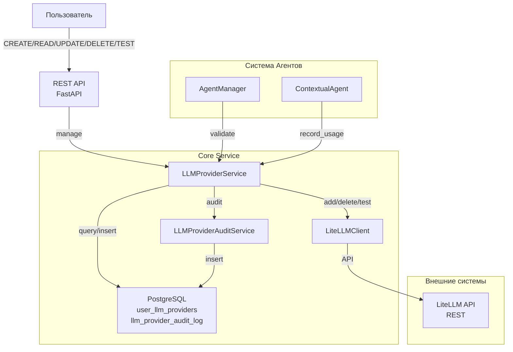
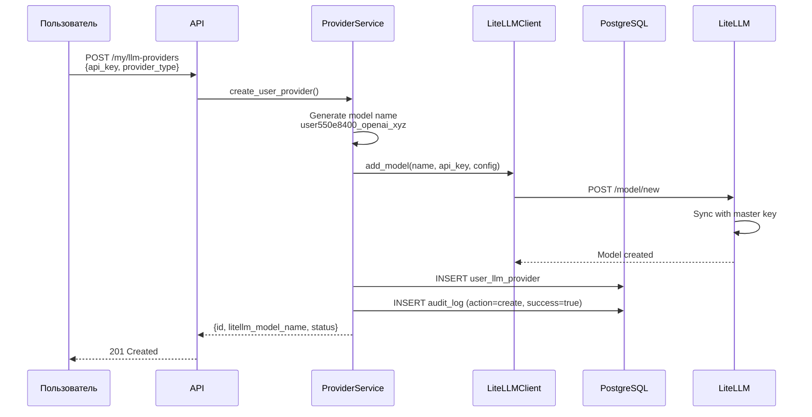
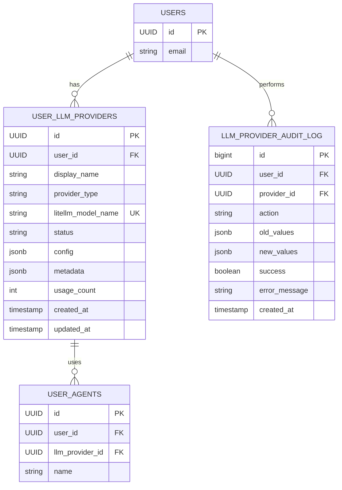

# Design: Система управления LLM провайдерами

## Context

В текущей системе CodeLab Core Service нет механизма для управления пользовательскими LLM провайдерами. Все агенты работают с единой конфигурацией LLM. Требуется реализовать систему, позволяющую пользователям регистрировать и управлять собственными провайдерами, при этом API ключи должны храниться безопасно в LiteLLM, а метаданные - в PostgreSQL Core Service.

**Текущее состояние:**
- Agenti используют фиксированную LLM конфигурацию
- Нет управления провайдерами на уровне пользователя
- Нет аудита операций с провайдерами

**Constraints:**
- API ключи НЕ должны храниться в Core Service PostgreSQL
- Каждый пользователь видит только свои провайдеры
- LiteLLM используется как источник истины для API ключей
- Все операции должны быть залогированы для аудита

## Goals / Non-Goals

**Goals:**
- Позволить пользователям регистрировать и управлять своими LLM провайдерами
- Безопасно хранить API ключи только в LiteLLM
- Обеспечить полную изоляцию данных между пользователями
- Логировать все операции для аудита и отладки
- Интегрировать провайдеры с системой агентов
- Предоставить тестирование провайдеров перед использованием
- Отслеживать статистику использования провайдеров

**Non-Goals:**
- Администраторское управление глобальными провайдерами (Фаза 2)
- Rate limiting и enforcement квот (Фаза 2)
- Автоматическое переключение между провайдерами при ошибках (Фаза 2)
- Web UI для управления (Фаза 2)
- Интеграция с маркетплейсом моделей (Фаза 2)

## Decisions

### 1. Хранение данных: Split между Core Service и LiteLLM

**Решение:** Core Service хранит метаданные (display_name, provider_type, config без ключей), LiteLLM хранит API ключи и выполняет операции с моделями.

**Rationale:**
- Обеспечивает безопасность API ключей
- Снижает нагрузку на аудит Core Service (не логируем чувствительные данные)
- Позволяет LiteLLM независимо управлять ключами
- Упрощает миграцию на другой backstorage LLM позже

**Альтернативы рассмотренные:**
- Хранить ALL в LiteLLM → слишком высокая связанность, сложный поиск по метаданным
- Шифровать ключи в Core Service → усложняет audit log, требует управления ключами шифрования

### 2. Изоляция провайдеров: На уровне БД через user_id

**Решение:** Все таблицы содержат user_id, все queries фильтруют по user_id на уровне БД и API.

**Rationale:**
- Defense in depth: даже если баг в коде, БД constraints защитят
- Простая и понятная архитектура
- Стандартный паттерн в многопользовательских системах
- Легко аудитировать (весь audit log фильтруется по user_id)

**Альтернативы:**
- Только на уровне приложения → недостаточно безопасно
- Row-level security в PostgreSQL → сложнее отлаживать

### 3. Генерация имени модели: UUID пользователя + тип + случайный суффикс

**Решение:** `user{sanitized_user_id}_{provider_type}_{random_suffix}` (e.g., `user550e84001eb241d4a716_openai_abc12345`)

**Rationale:**
- Уникально идентифицирует провайдер пользователя
- Встраивает user_id для быстрого поиска в LiteLLM
- Не содержит чувствительных данных
- Позволяет LiteLLM понять, к какому пользователю относится модель

**Альтернативы:**
- UUID → потеряем информацию о принадлежности пользователю
- Email пользователя → может измениться, чувствительные данные

### 4. Аудит: Отдельная таблица с полной историей операций

**Решение:** Таблица `llm_provider_audit_log` с action, old_values, new_values, success, error_message, контекст (IP, user_agent).

**Rationale:**
- Полная история всех операций
- Можно отследить, когда и как изменялись провайдеры
- Помогает отлаживать ошибки
- Соответствует требованиям безопасности
- Не логируем сам API ключ

**Альтернативы:**
- Встроить в основную таблицу (audit columns) → усложнит queries, займет больше места
- Event sourcing → слишком сложно для MVP

### 5. Интеграция с агентами: Обязательный llm_provider_id на UserAgent

**Решение:** Добавить ОБЯЗАТЕЛЬНЫЙ FK на user_llm_providers. Все агенты ДОЛЖНЫ указывать провайдер при создании.

**Rationale:**
- Явная привязка провайдера к агенту
- Гибкость: разные агенты могут использовать разные провайдеры
- Простая и понятная интеграция
- Упрощает отслеживание использования провайдеров
- Предотвращает неопределенное поведение при отсутствии провайдера

**Альтернативы:**
- Опциональный провайдер → может привести к undefined behavior
- Global переменная для выбора провайдера → усложнит управление и отслеживание

### 6. Тестирование провайдера: Synchronous endpoint через LiteLLM

**Решение:** POST /my/llm-providers/{id}/test отправляет простой prompt в LiteLLM и возвращает результат или ошибку.

**Rationale:**
- Быстрая обратная связь пользователю
- Позволяет валидировать API ключи до использования
- Простая реализация
- Помогает отловить ошибки конфигурации

**Альтернативы:**
- Асинхронное тестирование → усложняет UX, требует websocket/SSE
- Параллельное тестирование нескольких провайдеров → может быть медленным

### 7. Миграция БД: Отдельная миграция алембика

**Решение:** Создать миграцию, которая добавляет таблицы user_llm_providers и llm_provider_audit_log, плюс колонку llm_provider_id в user_agents.

**Rationale:**
- Чистая структура миграций
- Версионирование схемы БД
- Возможность откатить при необходимости

## Risks / Trade-offs

| Risk | Mitigation |
|------|-----------|
| LiteLLM недоступен при добавлении провайдера → ошибка | Retry logic с exponential backoff, graceful degradation. Пользователь получит ошибку и может повторить. |
| API ключ инвалиден в LiteLLM → операция создания агента фейлится | Добавить endpoint для тестирования провайдера перед использованием. Логировать все ошибки. |
| Мы теряем synchronization между Core Service и LiteLLM | Audit log в Core Service фиксирует все операции. При несоответствии - пересоздать модель в LiteLLM. |
| Большой audit log может медленить queries | Добавить индексы на user_id, created_at. Реализовать retention policy позже (Фаза 2). |
| Пользователь может перегрузить систему множеством провайдеров | Rate limiting на уровне API (Фаза 2). На MVP - просто логировать и мониторить. |
| LiteLLM может отказать при создании модели (лимит) | Обработать ошибку, вернуть понятное сообщение пользователю. Логировать в audit. |

## Миграция / Развертывание

**Шаги развертывания:**
1. Развернуть миграцию БД (создать таблицы, индексы)
2. Развернуть обновления кода (модели, сервисы, routes)
3. Обновить конфиг: добавить LITELLM_URL, LITELLM_MASTER_KEY
4. Запустить тесты для валидации
5. Обновить документацию API

**Rollback стратегия:**
- Откатить код
- Хранить таблицы user_llm_providers, llm_provider_audit_log для истории
- Agenti без llm_provider_id будут работать с конфигом по умолчанию

**Backward compatibility:**
- Существующие агенты продолжат работать (llm_provider_id = NULL)
- API endpoints новые, не конфликтуют со старыми

## Open Questions

- Как часто вызывать тестирование провайдера? (Фаза 2 - health checks)
- Какой размер лимита на количество провайдеров на пользователя? (Фаза 2)
- Нужны ли предустановленные конфиги для популярных провайдеров? (Фаза 2)
- Как обновлять API ключи? (Фаза 2)

## Диаграммы

### Архитектура системы

### Sequence: Добавление провайдера

### ER диаграмма

