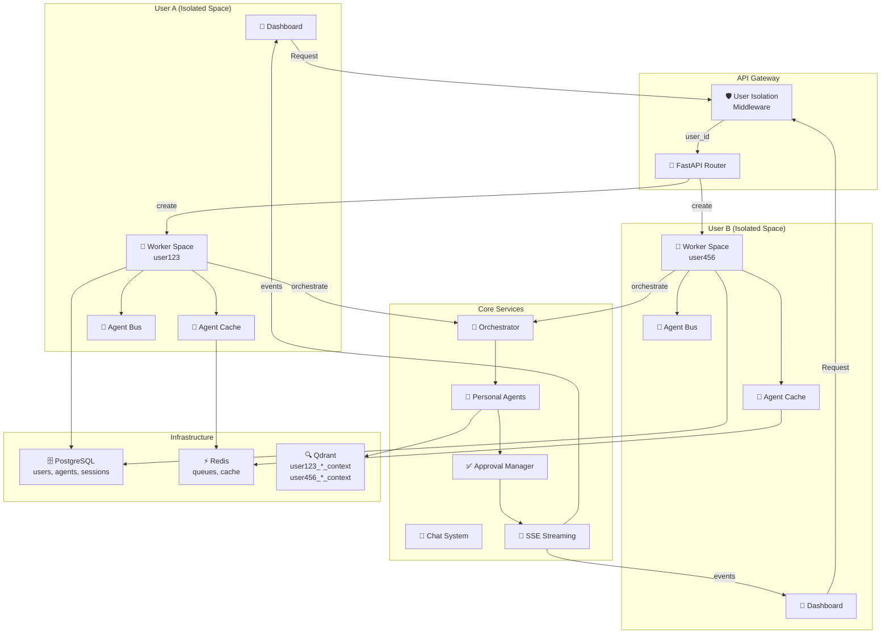

# OpenSpec Change: implement-core-service
## Personal Multi-Agent AI Platform - Core Service Implementation
**Версия:** 5.1 FINAL  
**Дата:** 11 февраля 2026  

---

## Why

Создать **полностью децентрализованную персональную мультиагентную AI платформу** с полной изоляцией пользователей и двумя режимами работы (автоматический + прямой вызов). Это решение позволит:

- **100% персональные агенты** - каждый пользователь имеет только своих агентов, нет глобального состояния
- **Полная изоляция** - User123 НЕ имеет доступа к агентам User456 на любом уровне (API, база данных, память)
- **Два режима работы**:
  - 🧠 **Автоматический** - оркестратор планирует граф задач и координирует агентов
  - ⚡ **Прямой вызов** - пользователь вызывает конкретного агента напрямую через `@agent_name` (1-2 сек)
- **Семантическая память** - каждый агент имеет персональный Qdrant контекст с 1M+ векторов для RAG
- **Real-time взаимодействие** - SSE события для мгновенных обновлений в UI
- **Контроль исполнения** - Approval Manager контролирует опасные tools и планы перед выполнением

Ключевой архитектурный принцип: **каждый пользователь = независимая AI команда с собственной изолированной инфраструктурой**.

---

## What Changes

### Новые компоненты системы

1. **User Isolation Middleware**
   - Middleware-слой для FastAPI, обеспечивающий 100% изоляцию пользователей
   - Автоматическое извлечение user_id из JWT токена
   - Injection `user_prefix`, `db_filters`, `user_space` в scope запроса
   - Проверка прав доступа на все endpoints `/my/*`

2. **User Worker Space (КОР)**
   - Персональное рабочее пространство для каждого пользователя
   - Управление кешем агентов (agent_cache)
   - Интеграция с Personal Agent Bus
   - Интеграция с Qdrant контекстом
   - Координация между режимами (direct/orchestrated)

3. **Personal Agents Management**
   - CRUD операции для персональных агентов
   - Каждый агент с уникальным ID: `user{id}_{name}_{version}`
   - Config schema: name, system_prompt, model config, tools, concurrency_limit
   - Agent status tracking (ready, busy, error)
   - Isolation: агент может быть использован только его владельцем

4. **Agent Context Store (Qdrant RAG)**
   - Персональный Qdrant контекст **для каждого агента**
   - Коллекции: `user123_coder_context`, `user123_researcher_context`, итд
   - Хранение взаимодействий с метаданными (task_id, timestamp, success, type)
   - Retrieval API для RAG поиска в контексте агента
   - Memory management: clear, prune, export операции

5. **Personal Orchestrator**
   - Планирование графа задач на основе запроса пользователя
   - Анализ зависимостей между задачами
   - Топологическая сортировка для параллельного выполнения
   - Estimation: стоимость ($ API calls) и время выполнения
   - Approval Manager интеграция перед выполнением плана

6. **Agent Bus (шина сообщений)**
   - asyncio.Queue per agent для управления задачами
   - Регистрация и управление жизненным циклом агентов
   - Параллельное выполнение (max concurrency per agent)
   - Координация при авто-планировании

7. **Chat System (два режима)**
   - POST `/my/chat/{session_id}/message/` главный endpoint
   - **Режим 1 (Direct)**: `target_agent` указан → прямой вызов (⚡ 1-2 сек)
   - **Режим 2 (Orchestrated)**: `target_agent` не указан → авто-план (🧠 5-10 сек)
   - Session management и история сообщений
   - Bypass orchestrator опция для direct calls

8. **SSE Event Stream**
   - GET `/my/chat/{session_id}/events/` для real-time событий
   - Event типы: direct_agent_call, agent_status_changed, task_plan_created, task_started, task_progress, task_completed, tool_request, plan_request, context_retrieved, approval_required
   - JSON payload с metadata (agent_id, status, timestamps, context info)
   - 1000+ одновременных connections per user

9. **Approval Manager**
   - Tool approval: агент просит разрешение перед использованием инструмента
   - Plan approval: пользователь одобряет сложный план перед выполнением
   - SSE уведомление → Modal UI → User OK/Reject → API confirmation
   - Timeout 300 сек, после которого план отклоняется

10. **REST API Layer**
    - Полный набор endpoints для управления агентами, оркестраторами, чатами, approvals
    - JWT Authentication на все endpoints `/my/*`
    - JSON Schema validation для всех моделей
    - Rate limiting: 100 req/min per user
    - Swagger docs на `/my/docs`
    - Error responses с деталью изоляции нарушений

### Обновленные компоненты

- **PostgreSQL schema** - таблицы для agents, orchestrators, sessions, messages, tasks, approvals
- **Redis** - кеширование agent configs, task queues, SSE buffers
- **Qdrant** - миграция на per-agent collections вместо per-user

---

## Capabilities

### New Capabilities

Каждая capability ниже будет реализована как отдельная спецификация в `specs/<name>/spec.md`:

1. **user-isolation-middleware**
   - Обеспечение 100% изоляции через middleware слой
   - JWT extraction и user context injection
   - Automatic filtering всех queries по user_id
   - Перехват несанкционированного доступа между пользователями

2. **user-worker-space**
   - Инициализация персонального рабочего пространства
   - Управление lifecycle (initialization, cleanup, reset)
   - Кеширование и синхронизация agentов и конфигураций
   - Медиация между режимами выполнения

3. **personal-agents-management**
   - CRUD операции (GET list, POST create, PUT update, DELETE remove)
   - Agent config validation и persistence
   - Agent status tracking и health checks
   - Per-agent metrics и monitoring

4. **agent-context-store**
   - Initialization per-agent Qdrant collections
   - Storage of agent interactions with embeddings
   - Retrieval API for RAG context (hybrid search)
   - Memory management operations (clear, prune, export, stats)

5. **personal-orchestrator**
   - Task graph planning from natural language
   - Dependency analysis и topological sorting
   - Cost estimation (LLM API calls)
   - Duration estimation
   - Plan approval workflow integration

6. **agent-bus-messaging**
   - Agent registration и deregistration
   - Task queue management per agent
   - Parallel task execution coordination
   - Task status propagation

7. **chat-system-modes**
   - Direct call mode: immediate agent execution
   - Orchestrated mode: planned multi-agent execution
   - Session management и message history
   - Mode selection logic и routing

8. **sse-event-streaming**
   - Event subscription management
   - Real-time event broadcasting
   - Event serialization (JSON)
   - Connection lifecycle management

9. **approval-manager**
   - Tool approval workflow (request → SSE → confirm/reject)
   - Plan approval workflow (complex plans)
   - Timeout management
   - Result handling и agent unblocking

10. **rest-api-endpoints**
    - Agent management endpoints
    - Orchestrator configuration endpoints
    - Chat endpoints (sessions, messages, events)
    - Approval endpoints
    - Context management endpoints
    - Authentication & error handling

### Modified Capabilities

- **database-schema** - добавление новых таблиц и миграции для agentов, orchestrators, approvals
- **redis-integration** - расширение для task queues и SSE buffers
- **qdrant-integration** - миграция на per-agent collections вместо per-user

---

## Impact

### Затронутый код

- **Backend (FastAPI)**:
  - `middleware/` - новый слой для user isolation
  - `workers/` - User Worker Space
  - `agents/` - Personal Agents CRUD и ContextualAgent
  - `routes/` - REST API endpoints
  - `core/` - Agent Bus, Orchestrator, Approval Manager
  - `vectorstore/` - Agent Context Store (Qdrant)
  - `models/` - SQLAlchemy ORM models
  - `schemas/` - Pydantic models для validation

- **Database (PostgreSQL)**:
  - `users` table (existing)
  - `user_agents` - новая таблица для агентов
  - `user_orchestrators` - конфигурация оркестратора
  - `chat_sessions` - сессии чатов
  - `messages` - история сообщений
  - `tasks` - задачи в графе
  - `approval_requests` - запросы на подтверждение

- **Infrastructure (Qdrant)**:
  - Per-user collections → Per-agent collections (миграция)
  - Новая структура payload с agent_id, task_id, success
  - Индексы для гибридного поиска

- **API Changes**:
  - Все endpoints под `/my/*` для изоляции
  - Новые endpoints для agents, orchestrators, chat, approvals
  - SSE streaming for real-time events
  - Swagger docs на `/my/docs`

### Зависимости

- **FastAPI 0.115+** - async framework
- **SQLAlchemy 2.0** с asyncpg - async ORM
- **Qdrant** - vector database для контекста
- **Redis 7+** - кеширование и queues
- **PostgreSQL 16+** - основная БД
- **OpenAI/Anthropic SDK** - для LLM calls и embeddings
- **Pydantic 2.0** - validation
- **JWT** - authentication

### Performance SLA

- **Direct calls**: P95 < 2 сек (обход оркестратора)
- **Task planning**: < 5 сек (генерация графа)
- **Qdrant search**: < 50ms (RAG retrieval)
- **SSE latency**: P99 < 100ms (event delivery)
- **Approval flow**: < 5 сек end-to-end
- **User isolation**: violations = 0 (критично!)

### Scalability

- **1000+ SSE connections** per user simultaneously
- **1M+ vectors** per agent в Qdrant
- **5M+ total vectors** per active user
- **100 req/min** rate limit per user
- **Concurrent agents**: max 3 per orchestration

---

## Architecture Diagram

---

## Success Criteria

✅ **User Isolation**
- violations = 0 (нулевые нарушения)
- User123 не может видеть agents, messages, context User456
- Все queries автоматически филтруются по user_id

✅ **Direct Calls Performance**
- P95 latency < 2 сек
- Обход оркестратора работает корректно
- Agent context retrieval < 50ms

✅ **Orchestration**
- Планирование сложных задач < 5 сек
- Граф задач с корректными зависимостями
- Parallel execution до 3 агентов одновременно

✅ **Real-time**
- SSE connections 1000+ per user
- Event delivery P99 < 100ms
- UI получает updates в реальном времени

✅ **Approval Workflow**
- Tool approval requests через SSE
- Plan approval перед сложным выполнением
- Timeout 300 сек с graceful decline

✅ **API & Documentation**
- Все endpoints покрыты Swagger docs
- JSON Schema validation
- Error responses с деталями изоляции

✅ **Data Persistence**
- PostgreSQL: users, agents, sessions, messages, tasks, approvals
- Qdrant: per-agent context collections
- Redis: agent configs, SSE buffers

---

## Next Steps

1. Создать спецификации для каждой capability в `specs/` директории
2. Реализовать middleware layer (user-isolation)
3. Реализовать User Worker Space с интеграцией компонентов
4. Реализовать REST API endpoints
5. Интегрировать Qdrant per-agent contexts
6. Реализовать SSE streaming
7. Реализовать Approval Manager workflow
8. Написать unit + integration тесты (90%+ coverage)
9. Deployment на Docker + Kubernetes
10. Production monitoring и alerting

---

**Статус:** 🚀 Ready for artifact generation  
**Версия:** 5.1 FINAL  
**Утверждено:** 11 февраля 2026