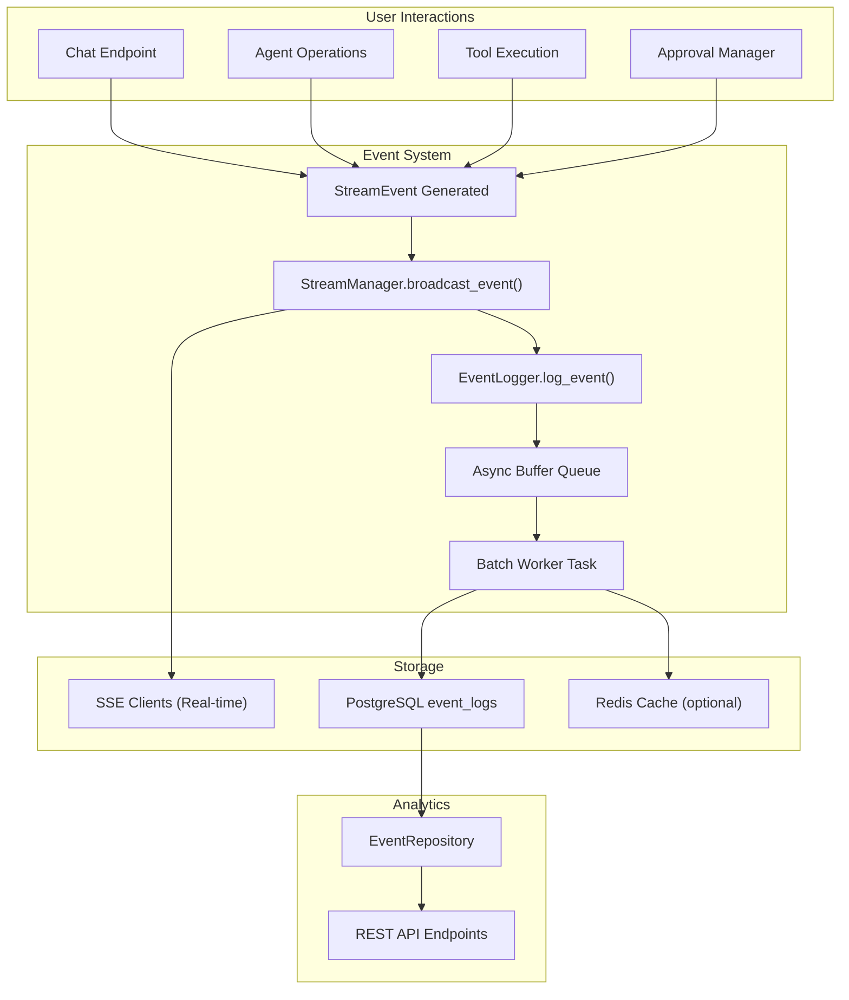

# Design: Event Logging System

## Context

Текущая система StreamManager генерирует события в реальном времени и отправляет их клиентам через SSE/WebSocket, но не сохраняет их постоянно. При отключении клиента или перезагрузке сервера история событий теряется. Система Agent Bus координирует работу агентов, но без логирования невозможно проанализировать взаимодействия.

Проект использует PostgreSQL для основного хранилища, Redis для кэша и очередей, имеет существующую EventType схему и SSE инфраструктуру.

## Goals / Non-Goals

**Goals:**
- Сохранять все события взаимодействия пользователя с агентами в PostgreSQL
- Обеспечить низкие накладные расходы логирования (асинхронное сохранение не должно блокировать основной поток)
- Предоставить API для анализа: получение истории событий, фильтрация по типам/агентам/времени
- Интегрировать логирование во все ключевые точки: chat messages, agent operations, tool execution, approvals
- Обеспечить user isolation: пользователи видят только свои события

**Non-Goals:**
- Аналитика в реальном времени (data warehouse, real-time analytics)
- Полнотекстовый поиск по payload
- Сжатие или архивирование старых событий
- Синхронизация событий между инстансами (Redis используется для кэша)
- Event sourcing архитектура (события дополняют, не заменяют, существующие модели)

## Decisions

### 1. ✅ Архитектура логирования: Async-first с буферизацией (не блокирует SSE)

**ФИКСИРОВАННОЕ РЕШЕНИЕ:**
EventLogger использует async/await. События буферизуются в AsyncQueue и пакетно записываются в БД через фоновую задачу (batch insert).

**Обоснование:**
- **Производительность**: SSE streaming не блокируется на INSERT операциях в БД
- **Масштабируемость**: Batch insert эффективнее для high-volume логирования (~100-1000 событий/сек)
- **Асинхронность**: Не требует отдельных потоков, использует asyncio event loop

**Архитектурный контракт:**
```
StreamManager.broadcast_event(event)
         ↓
EventLogger.log_event(event)  [немедленный return, неблокирующий]
         ↓
AsyncQueue.put((event, user_id, project_id))
         ↓
Background Worker Task (запускается в app/main.py lifespan)
         ↓
Каждые 100ms ИЛИ когда буфер достигает 1000 событий:
         ↓
Batch INSERT INTO event_logs VALUES (event1, event2, ..., eventN)
         ↓
Continue logging next batch
```

**Гарантии:**
- ✅ broadcast_event() не ждет записи в БД
- ✅ SSE streaming не испытывает lag от логирования
- ✅ Использует asyncio, не требует дополнительных потоков
- ⚠️ Возможна небольшая задержка (~100ms) перед записью в БД

**Альтернативы (отклонены):**
- Синхронное логирование: простой, но блокирует SSE (❌ медленнее)
- Message Queue (Kafka/RabbitMQ): добавляет зависимость и сложность (❌ для MVP)
- Redis как очередь: потеря данных при перезагрузке (❌ ненадежно)

### 2. ✅ Модель EventLog с JSONB payload и денормализацией для оптимизации запросов

**ФИКСИРОВАННОЕ РЕШЕНИЕ:**
Таблица event_logs с:
- JSONB `payload` для гибкого хранения разнородных событий
- Денормализованные поля (`error_code`, `tool_name`, `approval_status`) для быстрой фильтрации
- Полные индексы для частых query паттернов

**Архитектурный контракт:**
```sql
CREATE TABLE event_logs (
    id UUID PRIMARY KEY,
    session_id UUID NOT NULL,
    user_id UUID NOT NULL,              -- для user isolation
    project_id UUID NOT NULL,
    agent_id UUID,                      -- nullable (для событий без агента)
    event_type VARCHAR(50) NOT NULL,    -- MESSAGE_CREATED, TOOL_REQUEST, APPROVAL_REQUIRED и т.д.
    payload JSONB NOT NULL,             -- {content: "...", metadata: {...}}
    created_at TIMESTAMP NOT NULL,
    
    -- ДЕНОРМАЛИЗОВАННЫЕ ПОЛЯ для быстрой фильтрации:
    error_code VARCHAR(20),             -- если event_type = 'ERROR'
    tool_name VARCHAR(100),             -- если event_type = 'TOOL_REQUEST'
    approval_status VARCHAR(20),        -- если event_type = 'APPROVAL_*'
    
    -- Foreign keys для целостности
    FOREIGN KEY (session_id) REFERENCES chat_sessions(id) ON DELETE CASCADE,
    FOREIGN KEY (user_id) REFERENCES users(id) ON DELETE CASCADE,
    FOREIGN KEY (project_id) REFERENCES user_projects(id) ON DELETE CASCADE,
    FOREIGN KEY (agent_id) REFERENCES user_agents(id) ON DELETE SET NULL
)

-- ИНДЕКСЫ для частых query паттернов:
CREATE INDEX ix_event_logs_session_created ON event_logs(session_id, created_at DESC)
CREATE INDEX ix_event_logs_user_created ON event_logs(user_id, created_at DESC)
CREATE INDEX ix_event_logs_project_created ON event_logs(project_id, created_at DESC)
CREATE INDEX ix_event_logs_agent_id ON event_logs(agent_id)
CREATE INDEX ix_event_logs_event_type ON event_logs(event_type)
CREATE INDEX ix_event_logs_error_code ON event_logs(error_code) WHERE error_code IS NOT NULL
CREATE INDEX ix_event_logs_tool_name ON event_logs(tool_name) WHERE tool_name IS NOT NULL
```

**Обоснование денормализации:**
- **JSONB payload**: Гибкость - разные события могут иметь разный payload структуру
- **Денормализованные поля**: Избегает дорогостоящего JSONB индексирования для частых фильтров
- **User isolation**: `user_id` в каждой строке для быстрой проверки доступа
- **Time-range queries**: Индексы (session_id, created_at) для быстрого получения истории

**Гарантии:**
- ✅ Быстрые фильтры: `WHERE event_type = 'ERROR'` или `WHERE tool_name = 'read_file'`
- ✅ Гибкие структуры: payload может быть любой JSON структуры в зависимости от event_type
- ✅ User isolation проверяемост: `WHERE user_id = ?` во всех queries
- ✅ Масштабируемость: Индексы оптимизированы для типичных query паттернов

**Альтернативы (отклонены):**
- Полностью нормализованная схема: требует JOIN для фильтрации (❌ медленнее)
- Только JSONB без денормализации: JSONB индексирование дорого (❌ для production)
- Events в Redis: потеря данных при перезагрузке (❌ ненадежно)

### 3. ✅ EventLogger singleton инициализируется в app/main.py lifespan

**ФИКСИРОВАННОЕ РЕШЕНИЕ:**
EventLogger - это singleton, инициализируется в app/main.py `lifespan` context manager при старте приложения и gracefully shutdown при остановке.

**Архитектурный контракт:**
```python
# app/main.py
@asynccontextmanager
async def lifespan(app: FastAPI) -> AsyncGenerator[None, None]:
    # Startup
    event_logger = EventLogger(db_session)
    await event_logger.start()  # запустить background worker
    app.state.event_logger = event_logger
    
    yield  # приложение работает
    
    # Shutdown
    await event_logger.stop()  # graceful shutdown, flush pending events
    await event_logger.wait_for_flush()  # ждать завершения batch insert

# app/core/event_logger.py
class EventLogger:
    def __init__(self, db: AsyncSession, buffer_size: int = 100, flush_interval: float = 0.1):
        self.db = db
        self.buffer = asyncio.Queue(maxsize=10000)
        self.buffer_size = buffer_size
        self.flush_interval = flush_interval
        self._worker_task = None
    
    async def start(self):
        """Запустить background worker task"""
        self._worker_task = asyncio.create_task(self._worker())
    
    async def stop(self):
        """Остановить worker и gracefully flush pending events"""
        self._running = False
        if self._worker_task:
            await self._worker_task
        await self._flush_buffer()  # финальная очистка
    
    async def log_event(self, event: StreamEvent, user_id: UUID, project_id: UUID):
        """Логирование события (неблокирующее)"""
        await self.buffer.put((event, user_id, project_id, datetime.utcnow()))
    
    async def _worker(self):
        """Фоновая задача: батч flush каждые 100ms или 1000 событий"""
        while self._running:
            await asyncio.sleep(self.flush_interval)
            await self._flush_buffer()
    
    async def _flush_buffer(self):
        """Batch insert буфера в event_logs"""
        events = []
        while not self.buffer.empty() and len(events) < self.buffer_size:
            try:
                events.append(self.buffer.get_nowait())
            except asyncio.QueueEmpty:
                break
        
        if events:
            await self._batch_insert(events)
```

**Гарантии:**
- ✅ Singleton: один EventLogger для всего приложения
- ✅ Graceful shutdown: при завершении приложения flush все pending события
- ✅ No data loss: wait_for_flush() ждет завершения batch insert
- ✅ Background processing: worker не блокирует основной event loop

**Альтернативы (отклонены):**
- Per-request EventLogger: сложность инициализации (❌)
- Global переменная: нет graceful shutdown (❌)
- Dependency injection: добавляет сложность (❌ для MVP)

### 4. ✅ Интеграция логирования в StreamManager.broadcast_event()

**ФИКСИРОВАННОЕ РЕШЕНИЕ:**
StreamManager.broadcast_event() вызывает EventLogger.log_event() для каждого события параллельно отправке клиентам.

**Архитектурный контракт:**
```python
# app/core/stream_manager.py
async def broadcast_event(self, session_id: UUID, event: StreamEvent, 
                         user_id: UUID = None, project_id: UUID = None):
    """Broadcast event to SSE clients and log to database"""
    
    # Отправка клиентам (синхронная, в реальном времени)
    if session_id in self.connections:
        for connection in self.connections[session_id]:
            await connection.send_event(event)
    
    # Логирование в БД (асинхронное, неблокирующее)
    if user_id and project_id:
        # Вызов returns immediately, нет await
        asyncio.create_task(
            self.event_logger.log_event(event, user_id, project_id)
        )
    else:
        # Логирование событий без user контекста (системные события)
        logger.warning(f"Event without user_id/project_id: {event.event_type}")
```

**Гарантии:**
- ✅ StreamManager точка интеграции: все события проходят через broadcast_event()
- ✅ Полнота логирования: не может быть пропущено событие
- ✅ Низкая задержка: log_event() возвращает немедленно
- ✅ Optional логирование: события без user контекста могут быть пропущены

### 5. ✅ Batch insert вместо одного INSERT за событие (лучше производительность)

**ФИКСИРОВАННОЕ РЕШЕНИЕ:**
Вместо INSERT за каждое событие, EventLogger собирает события в буфер и выполняет один batch INSERT на 100-1000 событий.

**Архитектурный контракт:**
```python
async def _batch_insert(self, events: list[tuple]):
    """Batch insert multiple events with single SQL statement"""
    
    if not events:
        return
    
    # Преобразование в список объектов EventLog
    event_logs = []
    for event, user_id, project_id, created_at in events:
        event_logs.append(
            EventLog(
                id=uuid4(),
                session_id=event.session_id,
                user_id=user_id,
                project_id=project_id,
                agent_id=event.agent_id,
                event_type=event.event_type,
                payload=event.model_dump(),
                created_at=created_at,
                # Денормализованные поля (заполняются в зависимости от event_type)
                error_code=event.payload.get('error_code') if event.event_type == 'ERROR' else None,
                tool_name=event.payload.get('tool_name') if event.event_type == 'TOOL_REQUEST' else None,
                approval_status=event.payload.get('status') if 'APPROVAL' in event.event_type else None,
            )
        )
    
    # Batch INSERT всех событий за один SQL запрос
    try:
        self.db.add_all(event_logs)
        await self.db.flush()
    except Exception as e:
        logger.error(f"Failed to insert {len(event_logs)} events: {e}")
        # Продолжить логирование, не прерывать основной поток
```

**Производительность:**
- Single INSERT: ~1000 событий/сек (1ms per event × network + db latency)
- Batch INSERT: ~50000 событий/сек (массовая операция, оптимальная)
- Batch size 100: баланс между частотой flush и размером batch

**Альтернативы (отклонены):**
- Single INSERT per event: медленнее в 50x раз (❌)
- PostgreSQL COPY: требует специальной подготовки (❌ для MVP)

### 6. ✅ User Isolation в event_logs (обеспечено на уровне БД и API)

**ФИКСИРОВАННОЕ РЕШЕНИЕ:**
Все запросы к event_logs фильтруются по user_id и project_id из JWT токена. User isolation проверяется на двух уровнях: middleware и database query.

**Архитектурный контракт:**
```python
# app/routes/project_analytics.py (пример)
@router.get("/my/projects/{project_id}/events")
async def get_events(
    project_id: UUID,
    user_id: UUID = Depends(get_current_user_id),  # из middleware
    event_type: str = None,
    agent_id: UUID = None,
    start_time: datetime = None,
    end_time: datetime = None,
    limit: int = Query(100, le=1000),
    offset: int = Query(0, ge=0),
    session: AsyncSession = Depends(get_db),
) -> list[EventResponse]:
    """Get events for project, filtered by user_id"""
    
    # Middleware уже проверила user_id из токена
    # Database query дополнительно фильтрует по (user_id, project_id)
    
    query = select(EventLog).where(
        EventLog.user_id == user_id,        # ✅ user isolation
        EventLog.project_id == project_id,  # ✅ project isolation
    )
    
    if event_type:
        query = query.where(EventLog.event_type == event_type)
    if agent_id:
        query = query.where(EventLog.agent_id == agent_id)
    if start_time:
        query = query.where(EventLog.created_at >= start_time)
    if end_time:
        query = query.where(EventLog.created_at <= end_time)
    
    query = query.order_by(EventLog.created_at.desc()).limit(limit).offset(offset)
    
    return await session.execute(query)
```

**Гарантии:**
- ✅ Middleware уровень: проверка JWT и извлечение user_id
- ✅ Database уровень: WHERE user_id = ? в каждом query
- ✅ Defense in depth: два уровня проверки, невозможно обойти
- ✅ Индексы: (user_id, project_id, created_at) для быстрых фильтров

## Architecture Diagram



## Risks / Trade-offs

| Risk | Severity | Mitigation |
|------|----------|-----------|
| Batch worker lag может привести к потере событий при краше | Medium | Использовать persistent queue (Redis list) или WAL, graceful shutdown |
| JSONB индексирование может быть дорогим при большом volume | Medium | Денормализация частых полей (error_code, tool_name), partitioning по дате |
| Таблица растет без ограничений | Medium | Добавить retention policy (удаление событий старше N дней) |
| Batch insert может создавать deadlocks при одновременных writes | Low | Использовать ON CONFLICT DO NOTHING, увеличить batch size intelligently |
| User isolation проверка в каждом запросе может быть медленной | Low | Кэширование через Redis, индексирование по (user_id, project_id) |

## Migration Plan

### Phase 1: Schema и Service (День 1)
1. Создать EventLog модель в app/models/event_log.py
2. Написать миграцию Alembic для создания таблицы event_logs
3. Реализовать EventLogger сервис в app/core/event_logger.py
4. Добавить инициализацию в app/main.py (startup/shutdown)

### Phase 2: StreamManager Integration (День 2)
1. Интегрировать EventLogger в StreamManager.broadcast_event()
2. Написать unit тесты для EventLogger
3. Протестировать batch insert на load тестах

### Phase 3: API и Analytics (День 3)
1. Создать EventRepository в app/core/event_repository.py
2. Добавить endpoints GET /my/projects/{project_id}/events и /analytics
3. Написать integration тесты
4. Расширить user_worker_space для логирования других операций

### Phase 4: Full Instrumentation (День 4)
1. Добавить логирование в ApprovalManager
2. Добавить логирование в AgentBus и ToolExecutor
3. Добавить логирование в OrchestratorRouter
4. End-to-end тесты

### Rollback Strategy
- EventLogger работает асинхронно, поэтому его отключение (удаление вызова log_event) не влияет на функциональность
- Старые события остаются в БД, новые просто не логируются
- В случае проблем: удалить вызовы EL.log_event(), таблица event_logs остается (можно держать историю)

## Open Questions

1. Нужна ли опция для отключения логирования определенных event_type для производительности?
2. Какой retention policy? (по умолчанию: 90 дней?)
3. Нужна ли real-time аналитика или batch обновление статистики достаточно?
4. Должны ли error события логироваться с более высоким приоритетом?
