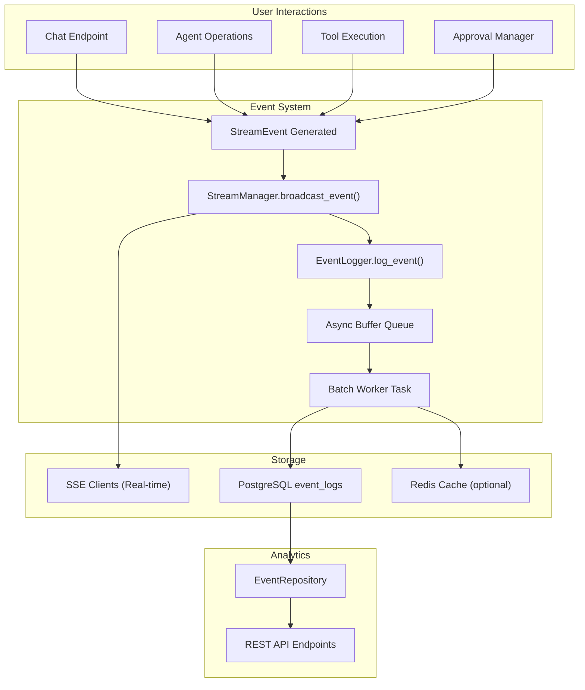

# Design: Event Logging System

## Context

Текущая система StreamManager генерирует события в реальном времени и отправляет их клиентам через SSE/WebSocket, но не сохраняет их постоянно. При отключении клиента или перезагрузке сервера история событий теряется. Система Agent Bus координирует работу агентов, но без логирования невозможно проанализировать взаимодействия.

Проект использует PostgreSQL для основного хранилища, Redis для кэша и очередей, имеет существующую EventType схему и SSE инфраструктуру.

## Goals / Non-Goals

**Goals:**
- Сохранять все события взаимодействия пользователя с агентами в PostgreSQL
- Обеспечить низкие накладные расходы логирования (асинхронное сохранение не должно блокировать основной поток)
- Предоставить API для анализа: получение истории событий, фильтрация по типам/агентам/времени
- Интегрировать логирование во все ключевые точки: chat messages, agent operations, tool execution, approvals
- Обеспечить user isolation: пользователи видят только свои события

**Non-Goals:**
- Аналитика в реальном времени (data warehouse, real-time analytics)
- Полнотекстовый поиск по payload
- Сжатие или архивирование старых событий
- Синхронизация событий между инстансами (Redis используется для кэша)
- Event sourcing архитектура (события дополняют, не заменяют, существующие модели)

## Decisions

### 1. Архитектура логирования: Async-first с буферизацией

**Решение:** EventLogger использует async/await, события буферизуются и пакетно записываются в БД через фоновую задачу (batch insert).

**Почему:**
- SSE streaming не должна блокироваться на INSERT
- Batch insert эффективнее для high-volume логирования
- Асинхронная обработка позволит масштабировать без деградации производительности

**Реализация:**
```
StreamManager.broadcast_event() → EventLogger.log_async()
                                 ↓
                          AsyncQueue для батча
                                 ↓
                          Фоновая задача (каждые 100ms или 1000 событий)
                                 ↓
                          Batch INSERT в event_logs таблицу
```

**Альтернативы:**
- Синхронное логирование: простой, но медленнее (отклонено)
- Отправка в Message Queue (Kafka/RabbitMQ): добавляет зависимость (отклонено для MVP)

### 2. Модель EventLog с денормализацией

**Решение:** Таблица event_logs с денормализованными полями для оптимизации запросов:

```sql
CREATE TABLE event_logs (
    id UUID PRIMARY KEY,
    session_id UUID NOT NULL,
    user_id UUID NOT NULL,
    project_id UUID NOT NULL,
    agent_id UUID,
    event_type VARCHAR(50) NOT NULL,
    payload JSONB NOT NULL,
    created_at TIMESTAMP NOT NULL,
    
    -- Денормализованные поля для быстрой фильтрации
    error_code VARCHAR(20),      -- если event_type = ERROR
    tool_name VARCHAR(100),      -- если event_type = TOOL_REQUEST
    approval_status VARCHAR(20), -- если event_type = APPROVAL_*
    
    FOREIGN KEY (session_id) REFERENCES chat_sessions(id),
    FOREIGN KEY (user_id) REFERENCES users(id),
    FOREIGN KEY (project_id) REFERENCES user_projects(id),
    FOREIGN KEY (agent_id) REFERENCES user_agents(id)
)

-- Индексы для частых запросов
CREATE INDEX ix_event_logs_session_id_created_at ON event_logs(session_id, created_at DESC)
CREATE INDEX ix_event_logs_user_id_created_at ON event_logs(user_id, created_at DESC)
CREATE INDEX ix_event_logs_agent_id ON event_logs(agent_id)
CREATE INDEX ix_event_logs_event_type ON event_logs(event_type)
CREATE INDEX ix_event_logs_project_id ON event_logs(project_id, created_at DESC)
```

**Почему:**
- JSONB для гибкости (разные события имеют разный payload)
- Денормализация избегает JOIN при фильтрации по error_code/tool_name
- Индексы по session_id и created_at для частых time-range запросов
- user_id и project_id в каждой строке для user isolation проверки

**Альтернативы:**
- Полностью нормализованная схема: требует JOIN при каждом запросе (медленнее)
- Таблица событий в Redis: потеря данных при перезагрузке (отклонено)

### 3. EventLogger сервис: Singleton с асинхронной буферизацией

**Решение:** Создается singleton EventLogger в app/core/event_logger.py с методом log_event() и фоновой задачей для batch insert.

```python
class EventLogger:
    def __init__(self, db: AsyncSession, buffer_size: int = 100, flush_interval: float = 0.1):
        self.db = db
        self.buffer = asyncio.Queue(maxsize=10000)
        self.buffer_size = buffer_size
        self.flush_interval = flush_interval
        self._worker_task = None
    
    async def log_event(self, event: StreamEvent, user_id: UUID, project_id: UUID):
        """Логирование события (неблокирующее)"""
        await self.buffer.put((event, user_id, project_id))
    
    async def _worker(self):
        """Фоновая задача для батчевого сохранения"""
        # Собирает события в батч и вставляет их в БД
```

**Сервис инициализируется в app/main.py при запуске приложения и останавливается при shutdown.**

### 4. Интеграция логирования в StreamManager

**Решение:** StreamManager.broadcast_event() вызывает EventLogger.log_event() для каждого события.

```python
async def broadcast_event(self, session_id: UUID, event: StreamEvent, 
                         user_id: UUID = None, project_id: UUID = None):
    # Отправка клиентам
    for connection in self.connections[session_id]:
        await connection.send_event(event)
    
    # Логирование в БД (асинхронное, неблокирующее)
    if user_id and project_id:
        await self.event_logger.log_event(event, user_id, project_id)
```

**Почему:** StreamManager является центральной точкой для всех событий системы, поэтому логирование здесь гарантирует полноту.

### 5. API endpoints для аналитики

**Решение:** Создается EventRepository с методами для запросов, добавляются endpoints в project_chat.py или новый routes/project_analytics.py:

```
GET /my/projects/{project_id}/events
  - query params: event_type, agent_id, start_time, end_time, limit, offset
  - returns: список EventLog с pagination

GET /my/projects/{project_id}/events/{session_id}
  - returns: события для конкретной session

GET /my/projects/{project_id}/analytics
  - returns: статистика: count by event_type, count by agent, timeline
```

### 6. User Isolation

**Решение:** Все запросы к event_logs фильтруются по user_id и project_id из токена.

```python
# В EventRepository.get_events():
query = select(EventLog).where(
    EventLog.user_id == user_id,
    EventLog.project_id == project_id,
    EventLog.created_at >= start_time,
    EventLog.created_at <= end_time,
)
```

## Architecture Diagram



## Risks / Trade-offs

| Risk | Severity | Mitigation |
|------|----------|-----------|
| Batch worker lag может привести к потере событий при краше | Medium | Использовать persistent queue (Redis list) или WAL, graceful shutdown |
| JSONB индексирование может быть дорогим при большом volume | Medium | Денормализация частых полей (error_code, tool_name), partitioning по дате |
| Таблица растет без ограничений | Medium | Добавить retention policy (удаление событий старше N дней) |
| Batch insert может создавать deadlocks при одновременных writes | Low | Использовать ON CONFLICT DO NOTHING, увеличить batch size intelligently |
| User isolation проверка в каждом запросе может быть медленной | Low | Кэширование через Redis, индексирование по (user_id, project_id) |

## Migration Plan

### Phase 1: Schema и Service (День 1)
1. Создать EventLog модель в app/models/event_log.py
2. Написать миграцию Alembic для создания таблицы event_logs
3. Реализовать EventLogger сервис в app/core/event_logger.py
4. Добавить инициализацию в app/main.py (startup/shutdown)

### Phase 2: StreamManager Integration (День 2)
1. Интегрировать EventLogger в StreamManager.broadcast_event()
2. Написать unit тесты для EventLogger
3. Протестировать batch insert на load тестах

### Phase 3: API и Analytics (День 3)
1. Создать EventRepository в app/core/event_repository.py
2. Добавить endpoints GET /my/projects/{project_id}/events и /analytics
3. Написать integration тесты
4. Расширить user_worker_space для логирования других операций

### Phase 4: Full Instrumentation (День 4)
1. Добавить логирование в ApprovalManager
2. Добавить логирование в AgentBus и ToolExecutor
3. Добавить логирование в OrchestratorRouter
4. End-to-end тесты

### Rollback Strategy
- EventLogger работает асинхронно, поэтому его отключение (удаление вызова log_event) не влияет на функциональность
- Старые события остаются в БД, новые просто не логируются
- В случае проблем: удалить вызовы EL.log_event(), таблица event_logs остается (можно держать историю)

## Open Questions

1. Нужна ли опция для отключения логирования определенных event_type для производительности?
2. Какой retention policy? (по умолчанию: 90 дней?)
3. Нужна ли real-time аналитика или batch обновление статистики достаточно?
4. Должны ли error события логироваться с более высоким приоритетом?
