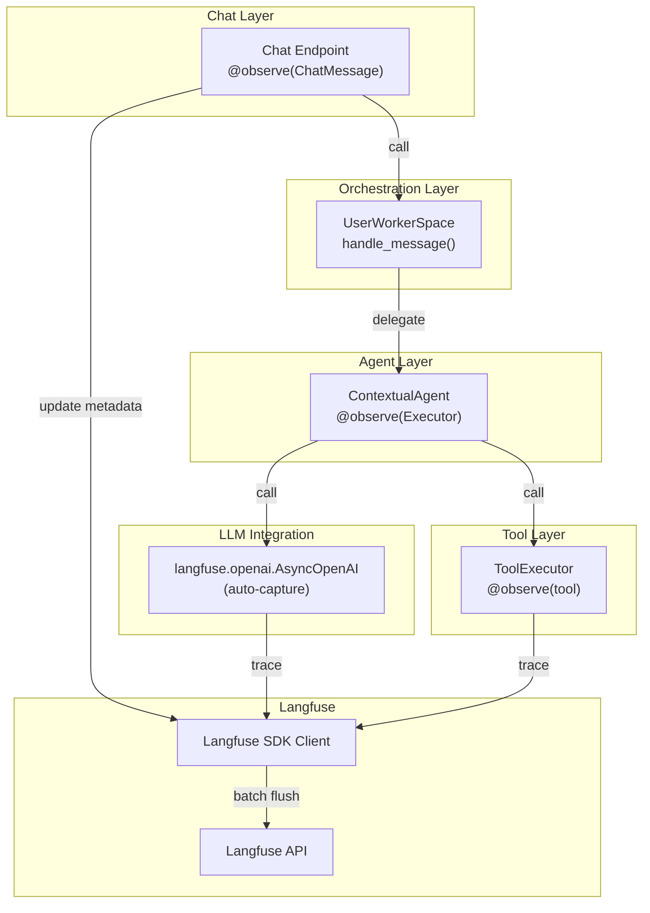

# agent-workflow-tracing Specification

## Назначение

Трейсинг multi-step агентных workflow'ов через `@observe` декораторы на компонентах chat endpoint, agent executor и tool executor с автоматической группировкой в traces и sessions.

## Requirements

### Requirement: @observe декораторы на компонентах

Система ДОЛЖНА использовать `@observe` декораторы из Langfuse SDK для трейсинга workflow компонентов.

#### Scenario: Chat Message Trace
- **WHEN** пользователь отправляет сообщение через [`send_project_message`](app/routes/project_chat.py:194-196) с `@observe(name="ChatMessage")`
- **THEN** создается root trace с именем "ChatMessage"
- **AND** trace содержит metadata: user_id, project_id, session_id (через [`update_current_trace()`](app/routes/project_chat.py:219-222))
- **AND** все дочерние операции (Agent.execute, LLM вызовы, tool execution) логируются как child spans

#### Scenario: Agent Executor Trace
- **WHEN** [`ContextualAgent.execute()`](app/agents/contextual_agent.py:147-148) вызывается с `@observe(name="Executor")`
- **THEN** создается span с именем "Executor"
- **AND** span содержит:
  - `input`: user_message, session_history, task_id
  - `output`: agent response, metadata о выполнении
  - `status`: success, error, или partial_execution
  - `duration`: время выполнения агента
- **AND** вложенные spans создаются для:
  - Context retrieval (поиск в Qdrant)
  - LLM call (через openai.AsyncOpenAI)
  - Tool execution (если инструменты вызваны)

#### Scenario: Tool Execution Trace
- **WHEN** инструменты выполняются в [`app/core/tools/executor.py`](app/core/tools/executor.py:73-74,100-101) с `@observe(as_type="tool")`
- **THEN** для каждого инструмента создается span с типом "tool"
- **AND** span содержит:
  - `tool_name`: имя инструмента
  - `input`: параметры инструмента
  - `output`: результат или ошибка
  - `status`: success или error
  - `duration`: время выполнения

### Requirement: Трейсинг контекста и метаданных

Traces ДОЛЖНЫ содержать полный контекст для отладки и аналитики.

#### Scenario: Обновление метаданных trace
- **WHEN** [`send_project_message`](app/routes/project_chat.py:195) обновляет trace metadata через [`langfuse_client.client.update_current_trace()`](app/routes/project_chat.py:219-222)
- **THEN** текущий trace получает:
  - `user_id`: идентификатор пользователя (для row-level security)
  - `session_id`: ID проекта (для группировки traces в сессию)
  - `tags`: включают версию приложения и кастомные теги

#### Scenario: Контекст в Agent.execute()
- **WHEN** [`ContextualAgent.execute()`](app/agents/contextual_agent.py:147-148) выполняется
- **THEN** metadata пропагируется через @observe decorator:
  - Наследует user_id и session_id из parent trace (ChatMessage)
  - Добавляет: agent_name, agent_id, model_name, task_id (если присутствует)
- **AND** metadata доступна во всех child spans (LLM, tools)

#### Scenario: Контекст в Tool Execution
- **WHEN** инструмент выполняется через [`app/core/tools/executor.py`](app/core/tools/executor.py)
- **THEN** span содержит:
  - Наследованный session_id из parent trace
  - `tool_name` и `tool_type`
  - `parameters`: входные параметры инструмента
  - `result`: результат выполнения или ошибка

### Requirement: Graceful degradation для traces

Система ДОЛЖНА продолжать работу если Langfuse недоступен.

#### Scenario: Отключение Langfuse
- **WHEN** LANGFUSE_ENABLED=false
- **THEN** @observe декораторы gracefully return без трейсинга
- **AND** приложение работает без ошибок

#### Scenario: Обработка ошибок в трейсинге
- **WHEN** Langfuse API вернет ошибку при обновлении метаданных
- **THEN** ошибка логируется но не пробрасывается (логируется как warning)
- **AND** обработка сообщения продолжает работу

### Requirement: Иерархия spans в workflows

Spans ДОЛЖНЫ быть правильно вложены для отражения иерархии workflow.

#### Scenario: Иерархия Chat → Agent → LLM
- **WHEN** пользователь отправляет сообщение
- **THEN** hierarchy:
  ```
  ChatMessage (root trace)
  └─ Executor (Agent.execute())
     ├─ Context.search() (поиск в Qdrant)
     ├─ LLM call (openai.AsyncOpenAI)
     │  └─ [автоматический LLM span от wrapper]
     └─ Tool execution (если инструменты вызваны)
        ├─ Tool 1 execution
        └─ Tool 2 execution
  ```

#### Scenario: Параллельные инструменты
- **WHEN** несколько инструментов выполняются параллельно
- **THEN** каждый инструмент создает свой span (siblings, не nested)
- **AND** все spans содержат общий parent_trace_id
- **AND** duration каждого span отражает фактическое время выполнения

## Текущая реализация

### Инструментированные компоненты

#### 1. Chat Endpoint ([`app/routes/project_chat.py`](app/routes/project_chat.py))

```python
@router.post("/{session_id}/message/", response_model=MessageResponse)
@observe(name="ChatMessage")
async def send_project_message(
    project_id: UUID,
    session_id: UUID,
    message_request: MessageRequest,
    ...
) -> MessageResponse:
    # Обновление метаданных trace
    langfuse_client = get_langfuse_client()
    if langfuse_client.enabled and langfuse_client.client:
        langfuse_client.client.update_current_trace(
            user_id=str(user_id),
            session_id=str(project_id),
        )
```

**Назначение:** Root trace для каждого сообщения пользователя

**Метаданные:**
- `name`: "ChatMessage"
- `user_id`: ID пользователя (для row-level security)
- `session_id`: ID проекта (для группировки в одну сессию)
- `tags`: версия приложения

#### 2. Agent Executor ([`app/agents/contextual_agent.py`](app/agents/contextual_agent.py))

```python
@observe(name="Executor")
async def execute(
    self,
    user_message: str,
    session_history: list[dict[str, str]] | None = None,
    task_id: str | None = None,
    session_id: UUID | None = None,
) -> dict[str, Any]:
    # Выполнение агента:
    # 1. Поиск контекста (AgentContextStore.search())
    # 2. Подготовка prompt с контекстом
    # 3. LLM вызов через openai_client.chat.completions.create()
    # 4. Обработка tool calls (если присутствуют)
    # 5. Возврат результата
```

**Назначение:** Трейсинг всех шагов выполнения агента

**Метаданные:**
- `name`: "Executor"
- `input`: user_message, session_history, task_id, session_id
- `output`: response, metadata о выполнении
- `duration`: время выполнения

**Child spans (автоматические):**
- LLM call (через langfuse.openai.AsyncOpenAI wrapper)
- Context retrieval (если реализовано с @observe)
- Tool execution (если инструменты используются)

#### 3. Tool Executor ([`app/core/tools/executor.py`](app/core/tools/executor.py:73-74,100-101))

```python
@observe(as_type="tool")
async def execute_tool(self, tool_name: str, **kwargs):
    # Выполнение конкретного инструмента
    tool_def = AVAILABLE_TOOLS[tool_name]
    result = await tool_def.executor(**kwargs)
    return result
```

**Назначение:** Трейсинг выполнения каждого инструмента

**Метаданные:**
- `as_type`: "tool" (для правильной классификации в Langfuse)
- `input`: параметры инструмента
- `output`: результат инструмента
- `tool_name`: имя инструмента (из span name или metadata)

### Поток трейсинга

```
1. send_project_message() вызывается
   └─ @observe(name="ChatMessage") создает root trace
      └─ update_current_trace(user_id, project_id) добавляет metadata
      
2. workspace.handle_message() выполняется
   └─ вызывает agent.execute() или orchestrator.execute()
      └─ @observe(name="Executor") создает child span
         └─ langfuse.openai.AsyncOpenAI перехватывает LLM call
            └─ создает LLM span автоматически
         └─ tool_executor.execute_tool() вызывается (если нужны инструменты)
            └─ @observe(as_type="tool") создает tool span
            
3. Результаты агрегируются и отправляются
   └─ trace завершается с status=success (или error)
   
4. Langfuse SDK async flush отправляет данные на backend
```

### Конфигурация

**Переменные окружения:**
```bash
LANGFUSE_ENABLED=true
LANGFUSE_PUBLIC_KEY=pk-...
LANGFUSE_SECRET_KEY=sk-...
LANGFUSE_HOST=http://localhost:3000
LANGFUSE_DEBUG=false
```

**Конфигурация в [`app/config.py`](app/config.py:114-119):**
```python
langfuse_enabled: bool = Field(default=True)
langfuse_public_key: str | None = Field(default=None)
langfuse_secret_key: str | None = Field(default=None)
langfuse_host: str = Field(default="http://localhost:3000")
langfuse_debug: bool = Field(default=False)
```

## Ограничения текущей реализации

1. **Нет явного spans API** - используются только @observe декораторы (не Langfuse Span API напрямую)
2. **Нет manual span creation** - все spans создаются через декораторы (более простой и безопасный подход)
3. **Нет context propagation через contextvars** - контекст пропагируется через parent/child декораторы
4. **Нет custom score recording** - feedback логируется как metadata в spans (не через Score API)
5. **Нет async context variables** - decorator handling достаточен для текущих потребностей

## Примеры использования

### Базовый workflow

```python
# 1. Chat endpoint создает root trace
@observe(name="ChatMessage")
async def send_project_message(...):
    langfuse_client.client.update_current_trace(
        user_id=str(user_id),
        session_id=str(project_id),
    )
    
    # 2. Workspace handle_message вызывает агента
    response = await workspace.handle_message(
        message=message_request.content,
        target_agent=target_agent_id,
    )
    return response

# 3. Agent.execute() создает child span
@observe(name="Executor")
async def execute(self, user_message: str, ...):
    # LLM вызов автоматически захватывается
    response = await self.openai_client.chat.completions.create(
        model=model_name,
        messages=messages,
        tools=tools,  # если нужны инструменты
    )
    
    # Обработка tool calls
    if response.choices[0].message.tool_calls:
        results = await self._execute_tools(tool_calls, ...)
    
    return {"success": True, "response": response}

# 4. Tool executor логирует выполнение инструментов
@observe(as_type="tool")
async def execute_tool(self, tool_name: str, **kwargs):
    result = await AVAILABLE_TOOLS[tool_name].executor(**kwargs)
    return result
```

## Roadmap

### Phase 1: Manual score recording (будущее)
- Добавить возможность записи оценок качества (feedback scores)
- Интеграция с Langfuse Score API
- Запись user satisfaction, relevance, accuracy
- Приоритет: высокий

### Phase 2: Advanced context propagation (будущее)
- Использование contextvars для автоматического распространения metadata
- Cross-service trace propagation
- Correlation IDs для микросервисной архитектуры
- Приоритет: средний

### Phase 3: Custom span attributes (будущее)
- Расширяемая metadata через annotation
- Custom tags и dimensions
- Performance metrics (memory, CPU)
- Приоритет: средний

## Архитектура



## Нефункциональные требования

### Performance
- Overhead на handler: < 50ms (async @observe)
- Overhead на agent execution: < 100ms (включая LLM wrapper)
- Span creation: < 5ms (in-memory)

### Reliability
- Graceful degradation если Langfuse down
- Auto-flush при завершении приложения
- Timeout on Langfuse API: 5 sec (не блокирует workflow)

### Security
- User_id используется для row-level security
- API ключи не логируются в spans
- Session_id изолирует данные проектов

### Scalability
- Поддержка 100+ concurrent traces
- In-memory buffering на SDK уровне
- Batch processing every 30 sec

---

**Version**: 2.0 (Actualizado)  
**Status**: Implemented (@observe decorators)  
**Last Updated**: 2026-03-16  
**Previous**: v1.0 (использовала manual Span API - упрощено до decorators)
