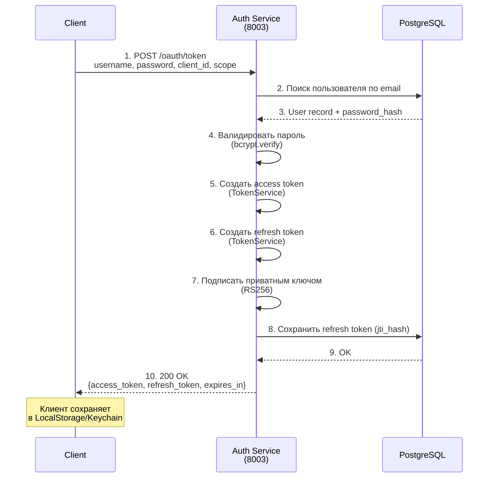
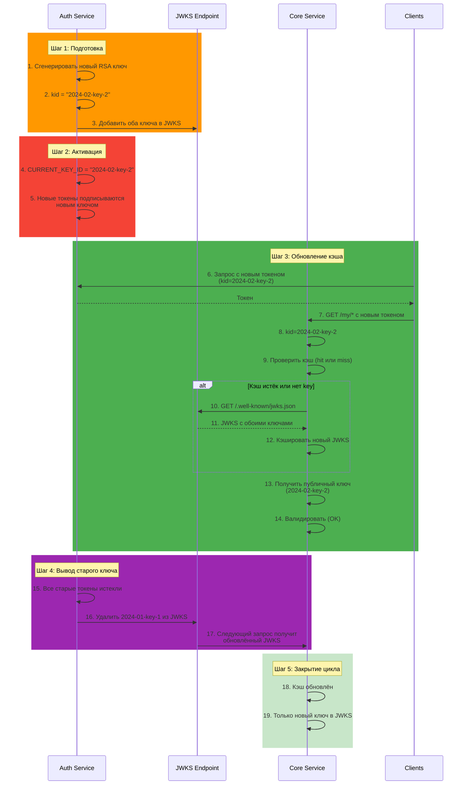
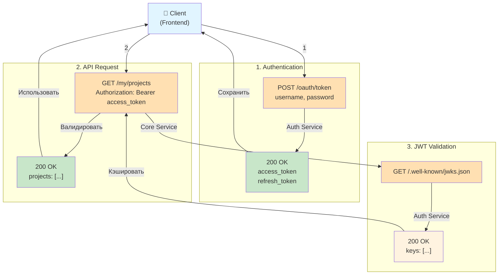
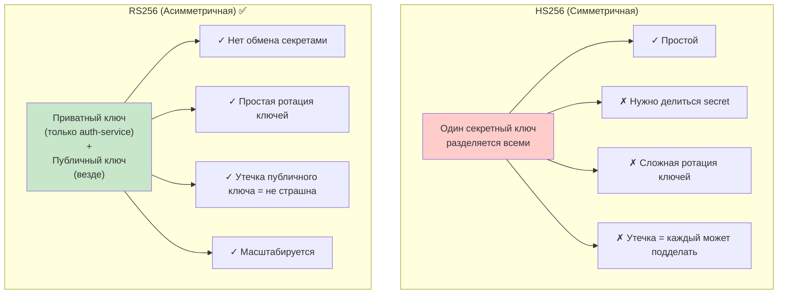

# JWT RS256 Authentication Flow Diagrams

**Версия:** 1.0.0  
**Статус:** ✅ Production Ready  
**Дата обновления:** 29 марта 2026

---

## 📋 Содержание

1. [Общая архитектура JWT RS256](#общая-архитектура)
2. [Flow: Успешная аутентификация](#flow-успешная-аутентификация)
3. [Flow: Получение нового access token через refresh token](#flow-refresh-token)
4. [Flow: Ротация ключей](#flow-ротация-ключей)
5. [Flow: Ошибка валидации](#flow-ошибка-валидации)
6. [Компоненты и их взаимодействие](#компоненты-и-их-взаимодействие)

---

## 🏗️ Общая архитектура

```mermaid
graph TB
    subgraph "Client (Frontend)"
        CLIENT["🌐 Browser/Mobile App"]
    end
    
    subgraph "Auth Service (8003)"
        AUTH_ENDPOINT["POST /oauth/token<br/>(Выдача токенов)"]
        TOKEN_SERVICE["TokenService<br/>(RS256 подпись)"]
        JWKS_ENDPOINT["GET /.well-known/jwks.json<br/>(JWKS публикация)"]
        RSA_KEY["RSAKeyManager<br/>(Приватный ключ)"]
    end
    
    subgraph "Core Service (8000)"
        MIDDLEWARE["AuthenticationMiddleware<br/>(Валидация JWT)"]
        JWKS_CLIENT["JWKSClient<br/>(Получение JWKS)"]
        CACHE["JWKS Cache<br/>(TTL 1 час)"]
    end
    
    CLIENT -->|1. username + password| AUTH_ENDPOINT
    AUTH_ENDPOINT -->|2. Проверить credentials| TOKEN_SERVICE
    TOKEN_SERVICE -->|3. Подписать приватным ключом| RSA_KEY
    AUTH_ENDPOINT -->|4. Вернуть JWT токены| CLIENT
    
    CLIENT -->|5. GET /my/projects<br/>Authorization: Bearer JWT| MIDDLEWARE
    MIDDLEWARE -->|6. Получить kid из JWT| MIDDLEWARE
    MIDDLEWARE -->|7. Запросить JWKS (если истёк кэш)| JWKS_CLIENT
    JWKS_CLIENT -->|8. GET /.well-known/jwks.json| JWKS_ENDPOINT
    JWKS_ENDPOINT -->|9. Вернуть JWKS| JWKS_CLIENT
    JWKS_CLIENT -->|10. Кэшировать| CACHE
    MIDDLEWARE -->|11. Получить публичный ключ| CACHE
    MIDDLEWARE -->|12. Валидировать подпись| MIDDLEWARE
    MIDDLEWARE -->|13. Инъекция user context| MIDDLEWARE
    
    style CLIENT fill:#e1f5ff
    style AUTH_ENDPOINT fill:#fff3e0
    style TOKEN_SERVICE fill:#fff3e0
    style JWKS_ENDPOINT fill:#fff3e0
    style RSA_KEY fill:#ffe0b2
    style MIDDLEWARE fill:#e8f5e9
    style JWKS_CLIENT fill:#e8f5e9
    style CACHE fill:#c8e6c9
```

---

## 🔄 Flow: Успешная аутентификация

### Этап 1: Получение токенов



### Этап 2: Доступ к защищённому ресурсу

```mermaid
sequenceDiagram
    participant Client
    participant CoreService as Core Service<br/>(8000)
    participant AuthService as Auth Service<br/>(8003)
    
    Client->>CoreService: 1. GET /my/projects<br/>Authorization: Bearer &lt;access_token&gt;
    
    rect rgb(200, 230, 201)
        Note over CoreService: Middleware валидация
        CoreService->>CoreService: 2. Извлечь token из header
        CoreService->>CoreService: 3. Распарсить header (без проверки подписи)
        CoreService->>CoreService: 4. Получить kid из заголовка
        CoreService->>CoreService: 5. Проверить кэш JWKS
        alt JWKS в кэше и не истёк
            CoreService->>CoreService: 6a. Использовать кэшированный JWKS
        else JWKS истёк или нет kid
            CoreService->>AuthService: 6b. GET /.well-known/jwks.json
            AuthService-->>CoreService: JWKS
            CoreService->>CoreService: 7. Кэшировать JWKS (TTL 3600)
        end
        CoreService->>CoreService: 8. Получить публичный ключ по kid
        CoreService->>CoreService: 9. Валидировать подпись RS256
        CoreService->>CoreService: 10. Проверить iss (издатель)
        CoreService->>CoreService: 11. Проверить aud (аудитория)
        CoreService->>CoreService: 12. Проверить exp (истечение)
        CoreService->>CoreService: 13. Проверить type == 'access'
        CoreService->>CoreService: 14. Инъекция user_id в request.state
    end
    
    CoreService->>CoreService: 15. Обработать запрос handler'ом
    CoreService-->>Client: 16. 200 OK<br/>{projects: [...]}
    
    style CoreService fill:#e8f5e9
```

---

## 🔄 Flow: Refresh Token

Когда access token истёк, клиент получает новый используя refresh token:

```mermaid
sequenceDiagram
    participant Client
    participant CoreService as Core Service<br/>(8000)
    participant AuthService as Auth Service<br/>(8003)
    participant DB as PostgreSQL
    
    Client->>CoreService: 1. GET /my/projects<br/>Authorization: Bearer &lt;expired_access_token&gt;
    
    rect rgb(255, 193, 7)
        Note over CoreService: Валидация падает на exp
        CoreService->>CoreService: 2. Проверить exp
        CoreService->>CoreService: 3. Token expired!
    end
    
    CoreService-->>Client: 4. 401 Unauthorized<br/>{error: "Token expired"}
    
    rect rgb(63, 81, 181)
        Note over Client: Клиент обновляет токен
        Client->>AuthService: 5. POST /oauth/token<br/>grant_type=refresh_token<br/>refresh_token=&lt;refresh_token&gt;
        AuthService->>AuthService: 6. Распарсить refresh token
        AuthService->>AuthService: 7. Получить jti из claims
        AuthService->>DB: 8. Проверить jti_hash в БД
        DB-->>AuthService: 9. JTI найден и не revoked
        AuthService->>AuthService: 10. Валидировать подпись refresh token
        AuthService->>AuthService: 11. Проверить exp (не истёк)
        AuthService->>AuthService: 12. Создать новый access token
        AuthService->>AuthService: 13. Подписать приватным ключом (RS256)
        AuthService-->>Client: 14. 200 OK<br/>{access_token: &lt;новый&gt;, expires_in: 900}
    end
    
    Client->>CoreService: 15. GET /my/projects<br/>Authorization: Bearer &lt;новый_access_token&gt;
    
    rect rgb(200, 230, 201)
        Note over CoreService: Валидация нового токена (OK)
        CoreService->>CoreService: 16. Валидировать подпись
        CoreService->>CoreService: 17. Проверить exp (OK)
    end
    
    CoreService-->>Client: 18. 200 OK<br/>{projects: [...]}
```

---

## 🔄 Flow: Ротация ключей



---

## ❌ Flow: Ошибка валидации

### Истёкший токен

```mermaid
sequenceDiagram
    participant Client
    participant CoreService as Core Service
    
    Client->>CoreService: GET /my/projects<br/>Authorization: Bearer &lt;token&gt;<br/>(exp = 10:00, now = 10:16)
    
    rect rgb(255, 193, 7)
        Note over CoreService: Валидация
        CoreService->>CoreService: 1. Извлечь token
        CoreService->>CoreService: 2. Получить kid
        CoreService->>CoreService: 3. Получить публичный ключ
        CoreService->>CoreService: 4. Валидировать подпись (✓ OK)
        CoreService->>CoreService: 5. Проверить exp
        CoreService->>CoreService: 6. exp = 10:00 < now = 10:16
        CoreService->>CoreService: 7. TOKEN EXPIRED!
    end
    
    CoreService-->>Client: 401 Unauthorized<br/>{error: "Token has expired"}
    
    Note over Client: Клиент должен использовать<br/>refresh token для получения<br/>нового access token
```

### Неверная подпись

```mermaid
sequenceDiagram
    participant Attacker
    participant CoreService as Core Service
    
    Note over Attacker: Попытка подделки
    Attacker->>Attacker: 1. Создать поддельный JWT
    Attacker->>Attacker: 2. Изменить payload: sub="attacker"
    Attacker->>Attacker: 3. Сохранить оригинальную подпись
    Attacker->>Attacker: 4. token = header.altered_payload.original_signature
    
    Attacker->>CoreService: GET /my/projects<br/>Authorization: Bearer &lt;forged_token&gt;
    
    rect rgb(255, 193, 7)
        Note over CoreService: Валидация
        CoreService->>CoreService: 1. Распарсить token
        CoreService->>CoreService: 2. Получить kid из header
        CoreService->>CoreService: 3. Получить публичный ключ
        CoreService->>CoreService: 4. Валидировать подпись
        CoreService->>CoreService: 5. hash(header.payload) != signature
        CoreService->>CoreService: 6. INVALID SIGNATURE!
    end
    
    CoreService-->>Attacker: 401 Unauthorized<br/>{error: "Invalid token signature"}
    
    Note over Attacker: Атака неудачна!<br/>Подпись проверяется публичным ключом<br/>Payload не может быть изменён без<br/>переподписи приватным ключом
```

### Неверный издатель

```mermaid
sequenceDiagram
    participant Attacker
    participant OtherAuthService as Other Auth Service
    participant CoreService as Core Service
    
    Attacker->>OtherAuthService: Получить JWT от другого сервиса
    OtherAuthService->>OtherAuthService: Создать JWT<br/>iss="https://other-auth.com"
    OtherAuthService-->>Attacker: JWT token
    
    Attacker->>CoreService: GET /my/projects<br/>Authorization: Bearer &lt;other_service_token&gt;
    
    rect rgb(255, 193, 7)
        Note over CoreService: Валидация
        CoreService->>CoreService: 1. Распарсить token
        CoreService->>CoreService: 2. Получить kid
        CoreService->>CoreService: 3. Получить публичный ключ<br/>(из other-auth.com JWKS)
        CoreService->>CoreService: 4. Валидировать подпись (✓ OK)
        CoreService->>CoreService: 5. Проверить iss claim
        CoreService->>CoreService: 6. iss="https://other-auth.com"
        CoreService->>CoreService: 7. ISSUER MISMATCH!
        CoreService->>CoreService: 8. Ожидается: "https://auth.codelab.local"
    end
    
    CoreService-->>Attacker: 401 Unauthorized<br/>{error: "Token issuer mismatch"}
    
    Note over Attacker: Атака неудачна!<br/>Проверяется издатель (iss claim)
```

---

## 🔧 Компоненты и их взаимодействие

### Архитектура компонентов

```mermaid
graph LR
    subgraph "Auth Service (Издатель)"
        A1["🔑 RSAKeyManager"]
        A2["📝 TokenService"]
        A3["🌐 JWKS Endpoint"]
        A4["🗄️ Private Key<br/>(приватный)"]
        
        A4 -->|Приватный ключ| A1
        A1 -->|Подпись| A2
        A1 -->|Публичный ключ| A3
    end
    
    subgraph "Core Service (Потребитель)"
        B1["🌐 AuthenticationMiddleware"]
        B2["📨 JWKSClient"]
        B3["💾 JWKS Cache<br/>(TTL 3600)"]
        B4["✅ Валидатор"]
    end
    
    subgraph "Сеть"
        NET["HTTP<br/>Запросы"]
    end
    
    A3 -->|/.well-known/jwks.json| NET
    NET -->|GET JWKS| B2
    B2 -->|Кэшировать| B3
    B3 -->|Публичные ключи| B4
    B1 -->|JWT из header| B4
    B4 -->|user_id| B1
    
    style A4 fill:#ffcccc
    style A1 fill:#fff3e0
    style A2 fill:#fff3e0
    style A3 fill:#fff3e0
    style B1 fill:#e8f5e9
    style B2 fill:#e8f5e9
    style B3 fill:#c8e6c9
    style B4 fill:#e8f5e9
    style NET fill:#f3e5f5
```



### Обмен данными



---

## 📊 Сравнение алгоритмов: RS256 vs HS256



---

## 🔐 Security Checklist

```mermaid
checklist
  ✓ RS256 подпись (асимметричная криптография)
  ✓ Приватный ключ хранится только в auth-service
  ✓ Публичный ключ публикуется через JWKS
  ✓ Access token TTL = 15 минут
  ✓ Refresh token TTL = 30 дней
  ✓ Валидация подписи в Core Service
  ✓ Валидация iss (издатель)
  ✓ Валидация aud (аудитория)
  ✓ Валидация exp (истечение)
  ✓ Проверка type (access/refresh)
  ✓ Кэширование JWKS (TTL 1 час)
  ✓ Fallback при ошибках сети
  ✓ Поддержка ротации ключей
  ✓ Изоляция пользователей (по user_id)
  ✓ Логирование всех событий аутентификации
```

---

## 📚 Связанная документация

- Auth Service: [`jwt-rs256-integration.md`](../../codelab-auth-service/openspec/specs/jwt-rs256-integration.md)
- Auth Service: [`security.md`](../../codelab-auth-service/openspec/specs/security.md) (раздел JWT RS256)
- Core Service: [`jwt-validation/spec.md`](jwt-validation/spec.md)
- Core Service: [`authentication-middleware/spec.md`](authentication-middleware/spec.md)
- Core Service: [`integration-with-auth-service/spec.md`](integration-with-auth-service/spec.md)

---

## 🎯 Резюме

**JWT RS256 интеграция между Auth Service и Core Service:**

1. **Auth Service**: Генерирует и подписывает JWT приватным ключом (RS256)
2. **JWKS Endpoint**: Публикует публичные ключи в стандартном формате RFC 7517
3. **Core Service**: Получает JWKS и валидирует JWT токены публичным ключом
4. **Кэширование**: JWKS кэшируется на 1 час для оптимизации производительности
5. **Ротация ключей**: Поддерживается через Key ID (kid) без перерыва сервиса
6. **Безопасность**: Асимметричная криптография обеспечивает безопасный обмен без шифровальных секретов
