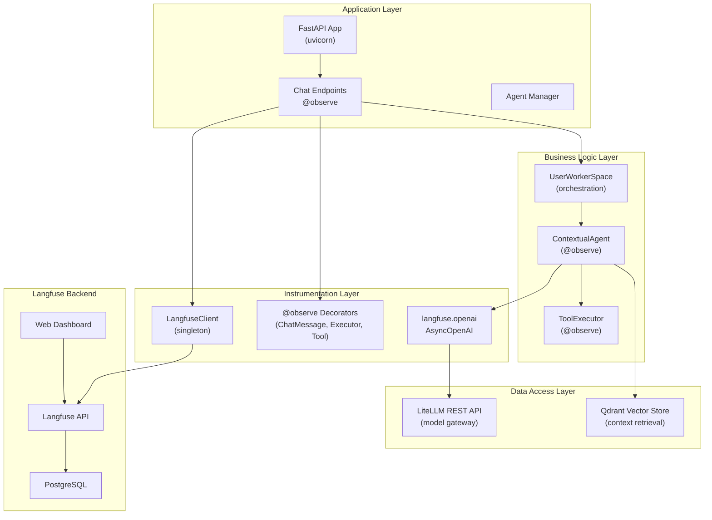

# observability-current-state Specification

## Обзор

Система observability проекта построена на **Langfuse v4 SDK** с использованием декораторного подхода и автоматического захвата через `langfuse.openai.AsyncOpenAI` wrapper. OpenTelemetry полностью удалена 16 марта 2026.

**Текущее состояние:** Production-ready минималистичная реализация без REST API, health checks и Prometheus метрик.

## Архитектура

### Компоненты системы



### Слои трейсинга

#### 1. **Entry Point Layer** - Chat Endpoints

Файл: [`app/routes/project_chat.py`](app/routes/project_chat.py)

```python
@router.post("/{session_id}/message/", response_model=MessageResponse)
@observe(name="ChatMessage")
async def send_project_message(...) -> MessageResponse:
    # Root trace для каждого пользовательского сообщения
    # Метаданные: user_id, project_id, tags
    langfuse_client.client.update_current_trace(
        user_id=str(user_id),
        session_id=str(project_id),
    )
    # Обработка сообщения через workspace
```

**Назначение:** Создать root trace для всего workflow пользовательского сообщения

**Метаданные:**
- `name`: "ChatMessage"
- `user_id`: для row-level security и фильтрации
- `session_id`: ID проекта (для группировки traces в одну сессию)
- `tags`: ["v0.2.0"] + кастомные теги

#### 2. **Orchestration Layer** - Workspace

Файл: [`app/core/user_worker_space.py`](app/core/user_worker_space.py)

**Функции:**
- `handle_message()` - маршрутизирует на direct или orchestrated execution
- `direct_execution()` - вызывает конкретного агента
- `orchestrated_execution()` - выбирает агента через orchestrator

**Трейсинг:** Implicitly через @observe на Agent.execute()

#### 3. **Agent Layer** - ContextualAgent

Файл: [`app/agents/contextual_agent.py`](app/agents/contextual_agent.py)

```python
@observe(name="Executor")
async def execute(
    self,
    user_message: str,
    session_history: list[dict[str, str]] | None = None,
    task_id: str | None = None,
    session_id: UUID | None = None,
) -> dict[str, Any]:
    # 1. Retrieve context from Qdrant
    context_results = await self.context_store.search(...)
    
    # 2. Prepare messages with context
    messages = [{"role": "system", "content": self.config.system_prompt + context_str}]
    
    # 3. Call LLM (auto-captured by langfuse.openai.AsyncOpenAI)
    response = await self.openai_client.chat.completions.create(
        model=model_to_use,
        messages=messages,
        tools=tools,  # optional
    )
    
    # 4. Handle tool calls if present
    if tool_calls:
        results = await self._execute_tools(tool_calls, ...)
        # Continue multi-turn conversation with tool results
    
    return {"success": True, "response": response}
```

**Инициализация OpenAI Client:**
```python
self.openai_client = openai.AsyncOpenAI(
    api_key=settings.litellm_master_key,
    base_url=settings.litellm_url,
)
```

**Трейсинг:**
- `@observe(name="Executor")` создает span для выполнения агента
- LLM вызовы автоматически захватываются через wrapper
- Tool execution логируется как child spans

**Метаданные:**
- `input`: user_message, session_history, task_id
- `output`: assistant_response, success_flag
- `duration`: время выполнения

#### 4. **Tool Layer** - ToolExecutor

Файл: [`app/core/tools/executor.py`](app/core/tools/executor.py)

```python
@observe(as_type="tool")
async def _execute_single_tool(self, tool_name: str, **kwargs):
    # Выполнение конкретного инструмента
    tool_def = AVAILABLE_TOOLS[tool_name]
    result = await tool_def.executor(**kwargs)
    return result
```

**Трейсинг:**
- `@observe(as_type="tool")` классифицирует span как tool в Langfuse
- Каждый инструмент логируется отдельным span
- Parameters и результаты захватываются автоматически

#### 5. **LLM Layer** - LiteLLM + Langfuse OpenAI Wrapper

Файл: Не явный (встроен в ContextualAgent)

**Механизм:**
- `langfuse.openai.AsyncOpenAI` обертывает OpenAI API
- Все `chat.completions.create()` вызовы перехватываются
- Langfuse автоматически создает LLM span с полным контекстом

**Параметры LLM span:**
- `model`: используемая модель (e.g. "gpt-4-turbo-preview")
- `input`: промпт и параметры
- `output`: ответ или ошибка
- `usage`: prompt_tokens, completion_tokens
- `duration`: время выполнения

## Инструментированные компоненты

### 1. Chat Handler

**Путь:** [`app/routes/project_chat.py:195-196`](app/routes/project_chat.py:195-196)

**Декоратор:** `@observe(name="ChatMessage")`

**Функция:**
```python
async def send_project_message(
    project_id: UUID,
    session_id: UUID,
    message_request: MessageRequest,
    ...
)
```

**Трейсинг:**
- Root trace для каждого сообщения
- Захватывает: пользовательское сообщение, обработку, ответ
- Метаданные: user_id, project_id (как session_id)

### 2. Agent Executor

**Путь:** [`app/agents/contextual_agent.py:147-148`](app/agents/contextual_agent.py:147-148)

**Декоратор:** `@observe(name="Executor")`

**Функция:**
```python
async def execute(
    self,
    user_message: str,
    session_history: list[dict[str, str]] | None = None,
    task_id: str | None = None,
    session_id: UUID | None = None,
) -> dict[str, Any]
```

**Трейсинг:**
- Основной span для выполнения агента
- Включает: context retrieval, LLM call, tool execution
- Метаданные: agent_name, model_name, task_id, session_history_length

### 3. Tool Executor

**Путь:** [`app/core/tools/executor.py:73-74,100-101`](app/core/tools/executor.py:73-74,100-101)

**Декоратор:** `@observe(as_type="tool")`

**Функция:**
```python
async def _execute_single_tool(self, tool_name: str, **kwargs) -> dict[str, Any]
```

**Трейсинг:**
- Span для каждого инструмента
- Включает: параметры инструмента, результат, статус
- Метаданные: tool_name, tool_type, execution_time

## Конфигурация

### Environment Variables

Файл: `.env` или `.env.example`

```bash
# Langfuse Configuration
LANGFUSE_ENABLED=true
LANGFUSE_PUBLIC_KEY=pk-...                    # Из Langfuse dashboard
LANGFUSE_SECRET_KEY=sk-...                    # Из Langfuse dashboard
LANGFUSE_HOST=http://localhost:3000           # Self-hosted или cloud.langfuse.com
LANGFUSE_DEBUG=false                          # Debug логирование

# Приложение продолжит работу без трейсинга если:
# - LANGFUSE_ENABLED=false
# - Отсутствуют public_key или secret_key
# - Langfuse сервер недоступен
```

### Settings Model

Файл: [`app/config.py:114-119`](app/config.py:114-119)

```python
class Settings(BaseSettings):
    # Langfuse (Observability)
    langfuse_enabled: bool = Field(default=True)
    langfuse_public_key: str | None = Field(default=None)
    langfuse_secret_key: str | None = Field(default=None)
    langfuse_host: str = Field(default="http://localhost:3000")
    langfuse_debug: bool = Field(default=False)
```

### LangfuseClient

Файл: [`app/services/langfuse_client.py`](app/services/langfuse_client.py)

**Singleton инициализация:**
```python
class LangfuseClient:
    def __init__(self) -> None:
        self.client: Optional[Langfuse] = None
        self.enabled = settings.langfuse_enabled
        
        if not self.enabled:
            logger.info("langfuse_disabled")
            return
        
        # Валидация ключей
        if not settings.langfuse_public_key or not settings.langfuse_secret_key:
            self.enabled = False
            return
        
        # Инициализация SDK
        try:
            self.client = Langfuse(
                public_key=settings.langfuse_public_key,
                secret_key=settings.langfuse_secret_key,
                host=settings.langfuse_host,
                debug=settings.langfuse_debug,
            )
        except Exception as e:
            self.enabled = False

def get_langfuse_client() -> LangfuseClient:
    global _langfuse_client
    if _langfuse_client is None:
        _langfuse_client = LangfuseClient()
    return _langfuse_client
```

## Примеры использования

### Пример 1: Базовый chat workflow

```
1. POST /my/projects/{project_id}/chat/{session_id}/message/
   └─ @observe(name="ChatMessage")
   
2. update_current_trace(user_id, project_id)
   └─ Метаданные: user, проект для фильтрации
   
3. workspace.handle_message()
   └─ Маршрутизирует на agent или orchestrator
   
4. agent.execute()
   └─ @observe(name="Executor")
   
5. openai_client.chat.completions.create()
   └─ Langfuse wrapper перехватывает
   └─ LLM span создается автоматически
   
6. Результат возвращается клиенту
   └─ Traces асинхронно отправляются в Langfuse
```

### Пример 2: Workflow с инструментами

```
1. Agent.execute() с инструментами
   └─ @observe(name="Executor")
   
2. openai_client.chat.completions.create(tools=[...])
   └─ LLM span: захват запроса и tool_calls
   
3. tool_executor._execute_single_tool()
   └─ @observe(as_type="tool")
   └─ Tool span для каждого инструмента
   
4. Multi-turn conversation с результатами
   └─ Второй LLM вызов с tool results
   └─ Новый LLM span
   
5. Итоговый результат
   └─ Все spans иерархично вложены
```

## Поток данных

```
Application
    ├─ send_project_message()
    │  └─ @observe(name="ChatMessage") → Langfuse SDK
    │
    ├─ workspace.handle_message()
    │
    ├─ agent.execute()
    │  └─ @observe(name="Executor") → Langfuse SDK
    │
    ├─ openai_client.chat.completions.create()
    │  └─ Langfuse OpenAI wrapper
    │     └─ LLM span → Langfuse SDK
    │
    ├─ tool_executor._execute_single_tool()
    │  └─ @observe(as_type="tool") → Langfuse SDK
    │
    └─ Langfuse SDK
       └─ Async flush (every 30 sec or on shutdown)
          └─ HTTP batch POST to LFAPI
             └─ LFAPI writes to PostgreSQL
```

## Производительность

| Операция | Overhead | Примечания |
|----------|----------|-----------|
| Chat endpoint | < 50ms | Асинхронное обновление метаданных |
| Agent execution | < 100ms | Включая LLM wrapper overhead |
| LLM span creation | < 10ms | In-memory buffering |
| Tool execution | < 5ms | Минимальный overhead |
| SDK flush | async | Не блокирует основной поток |

## Graceful Degradation

### Сценарий 1: LANGFUSE_ENABLED=false

```python
# Все @observe декораторы gracefully return
# Приложение работает без трейсинга
# Нет ошибок или замедления
```

### Сценарий 2: Отсутствуют API ключи

```python
if not settings.langfuse_public_key or not settings.langfuse_secret_key:
    self.enabled = False
    # Graceful degradation
```

### Сценарий 3: Langfuse сервер недоступен

```python
try:
    self.client = Langfuse(...)
except Exception as e:
    self.enabled = False
    logger.error("langfuse_initialization_failed", error=str(e))
    # Приложение продолжает работу
```

### Сценарий 4: Ошибка при обновлении метаданных

```python
try:
    langfuse_client.client.update_current_trace(...)
except Exception:
    pass  # Gracefully ignore, continue processing
```

## Ограничения текущей реализации

| Компонент | Статус | Причина |
|-----------|--------|---------|
| REST API для traces | ❌ Не реализовано | Используется Langfuse web UI |
| Health check endpoint | ❌ Не реализовано | Не требуется для production |
| Prometheus metrics | ❌ Не реализовано | Используется Langfuse dashboard |
| LiteLLM callbacks | ❌ Не реализовано | OpenAI wrapper достаточен |
| Retention policy | ❌ Не реализовано | Управляется Langfuse конфигурацией |
| Docker Compose Langfuse | ❌ Не реализовано | Используется официальный deployment |
| Custom score recording | ❌ Не реализовано | Данные логируются как metadata |
| Context propagation | Partial | Через @observe, не contextvars |

## Roadmap

### Phase 1: REST API для аналитики (Q2 2026)

**Endpoints:**
- `GET /analytics/traces` - получить traces с фильтрацией
- `GET /analytics/traces/{trace_id}` - деталь trace
- `POST /analytics/traces/{trace_id}/feedback` - записать feedback
- `GET /analytics/traces/{trace_id}/spans` - список spans

**Приоритет:** Высокий (нужно для dashboard)

### Phase 2: Prometheus метрики (Q3 2026)

**Метрики:**
- `langfuse_traces_total` - всего traces
- `langfuse_spans_total` - всего spans
- `langfuse_callback_errors_total` - ошибки отправки
- `langfuse_api_latency_ms` - latency API

**Приоритет:** Средний

### Phase 3: LiteLLM callbacks (Q4 2026)

**Функциональность:**
- Дополнительный контекст из LiteLLM (retry count, fallback)
- Параллельный трейсинг через callbacks и wrapper
- Unified view в Langfuse

**Приоритет:** Низкий (current implementation sufficient)

### Phase 4: Advanced context propagation (2027)

**Функциональность:**
- Contextvars для автоматического распространения metadata
- Distributed tracing через микросервисы
- Correlation IDs

**Приоритет:** Средний

## Безопасность

1. **API ключи НЕ логируются** - только статус инициализации
2. **User isolation** - каждый trace связан с user_id
3. **Row-level security** - Langfuse использует user_id для доступа
4. **Session isolation** - project_id изолирует данные проектов
5. **TLS/HTTPS** - все соединения зашифрованы

## Масштабируемость

- **Поддержка:** 100+ traces/минуту
- **Buffering:** In-memory (до 1000 spans)
- **Flush interval:** 30 сек или на shutdown
- **Connection pooling:** Встроено в SDK

## Мониторинг

**Текущее состояние:**
- Все traces видны в Langfuse web dashboard
- Фильтрация по user_id, session_id, tags
- Search по content
- Visualization spans hierarchy

**Не реализовано:**
- REST API для программного доступа
- Alerts на аномалии
- Custom dashboards

---

**Version**: 1.0  
**Status**: Production-ready  
**Last Updated**: 2026-03-16  
**Architecture**: Langfuse v4 SDK + @observe decorators + langfuse.openai.AsyncOpenAI wrapper
