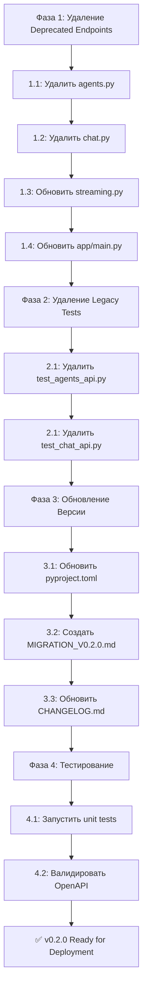

# v0.2.0 Release Plan - Удаление Deprecated Endpoints

**Статус:** 📋 В планировании  
**Версия:** v0.1.0 → v0.2.0  
**Дата:** 2026-02-17  
**Язык:** Русский

---

## 📌 Обзор

v0.2.0 - это **major release**, который полностью завершает миграцию на **per-project архитектуру**. Все deprecated endpoints (отмеченные в v0.1.0) удаляются, остаются только per-project endpoints.

### Статус миграции:

| Компонент | v0.1.0 | v0.2.0 |
|-----------|--------|--------|
| **Agent endpoints** (global) | ✅ Есть (deprecated) | ❌ Удаляются |
| **Agent endpoints** (per-project) | ✅ Есть | ✅ Остаются |
| **Chat endpoints** (global) | ✅ Есть (deprecated) | ❌ Удаляются |
| **Chat endpoints** (per-project) | ✅ Есть | ✅ Остаются |
| **Streaming** (global) | ✅ Есть (deprecated) | ❌ Удаляется |
| **Streaming** (per-project) | ✅ Есть | ✅ Остается |
| **Backward compatibility** | ✅ Есть | ❌ Нет |

---

## 🗑️ Удаляемые Endpoints

### Agent Management (Global)

**Файл:** `app/routes/agents.py`

| Метод | Path | Статус |
|-------|------|--------|
| POST | `/my/agents/` | ❌ Удалить |
| GET | `/my/agents/` | ❌ Удалить |
| GET | `/my/agents/{agent_id}` | ❌ Удалить |
| PUT | `/my/agents/{agent_id}` | ❌ Удалить |
| DELETE | `/my/agents/{agent_id}` | ❌ Удалить |

**Замена в v0.2.0:**
- `POST /my/agents/` → `POST /my/projects/{project_id}/agents/`
- `GET /my/agents/` → `GET /my/projects/{project_id}/agents/`
- `GET /my/agents/{agent_id}` → `GET /my/projects/{project_id}/agents/{agent_id}`
- `PUT /my/agents/{agent_id}` → `PUT /my/projects/{project_id}/agents/{agent_id}`
- `DELETE /my/agents/{agent_id}` → `DELETE /my/projects/{project_id}/agents/{agent_id}`

### Chat Management (Global)

**Файл:** `app/routes/chat.py`

| Метод | Path | Статус |
|-------|------|--------|
| POST | `/my/chat/sessions/` | ❌ Удалить |
| GET | `/my/chat/sessions/` | ❌ Удалить |
| GET | `/my/chat/sessions/{session_id}/messages/` | ❌ Удалить |
| POST | `/my/chat/{session_id}/message/` | ❌ Удалить |
| DELETE | `/my/chat/sessions/{session_id}` | ❌ Удалить |
| GET | `/my/chat/{session_id}/events/` | ❌ Удалить |

**Замена в v0.2.0:**
- `POST /my/chat/sessions/` → `POST /my/projects/{project_id}/chat/sessions/`
- `GET /my/chat/sessions/` → `GET /my/projects/{project_id}/chat/sessions/`
- `GET /my/chat/sessions/{session_id}/messages/` → `GET /my/projects/{project_id}/chat/sessions/{session_id}/messages/`
- `POST /my/chat/{session_id}/message/` → `POST /my/projects/{project_id}/chat/{session_id}/message/`
- `DELETE /my/chat/sessions/{session_id}` → `DELETE /my/projects/{project_id}/chat/sessions/{session_id}`
- `GET /my/chat/{session_id}/events/` → `GET /my/projects/{project_id}/chat/{session_id}/events/`

### Streaming (Global - deprecated router)

**Файл:** `app/routes/streaming.py`

| Метод | Path | Статус |
|-------|------|--------|
| GET | `/my/chat/{session_id}/events/` | ❌ Удалить (router) |

**Замена в v0.2.0:**
- `GET /my/chat/{session_id}/events/` → `GET /my/projects/{project_id}/chat/{session_id}/events/`

---

## ✅ Сохраняемые Per-Project Endpoints

### Per-Project Agent Management

**Файл:** `app/routes/project_agents.py`

| Метод | Path | Статус |
|-------|------|--------|
| POST | `/my/projects/{project_id}/agents/` | ✅ Сохранить |
| GET | `/my/projects/{project_id}/agents/` | ✅ Сохранить |
| GET | `/my/projects/{project_id}/agents/{agent_id}` | ✅ Сохранить |
| PUT | `/my/projects/{project_id}/agents/{agent_id}` | ✅ Сохранить |
| DELETE | `/my/projects/{project_id}/agents/{agent_id}` | ✅ Сохранить |

### Per-Project Chat Management

**Файл:** `app/routes/project_chat.py`

| Метод | Path | Статус |
|-------|------|--------|
| POST | `/my/projects/{project_id}/chat/sessions/` | ✅ Сохранить |
| GET | `/my/projects/{project_id}/chat/sessions/` | ✅ Сохранить |
| GET | `/my/projects/{project_id}/chat/sessions/{session_id}/messages/` | ✅ Сохранить |
| POST | `/my/projects/{project_id}/chat/{session_id}/message/` | ✅ Сохранить |
| DELETE | `/my/projects/{project_id}/chat/sessions/{session_id}` | ✅ Сохранить |
| GET | `/my/projects/{project_id}/chat/{session_id}/events/` | ✅ Сохранить |

### Per-Project Streaming (project_router)

**Файл:** `app/routes/streaming.py`

| Метод | Path | Статус |
|-------|------|--------|
| GET | `/my/projects/{project_id}/chat/{session_id}/events/` | ✅ Сохранить |

---

## 📋 Детальный План Работ

### Фаза 1: Удаление Deprecated Endpoints

#### 1.1 Удалить agents.py router

**Файл:** `app/routes/agents.py`

**Действия:**
- Удалить весь файл `app/routes/agents.py`
- Это файл содержит только deprecated endpoints

**Зависимости:** Нет (новых endpoints в `project_agents.py`)

#### 1.2 Удалить chat.py router

**Файл:** `app/routes/chat.py`

**Действия:**
- Удалить весь файл `app/routes/chat.py`
- Все функции - deprecated endpoints
- Новые per-project endpoints в `project_chat.py`

**Зависимости:** Нет (новых endpoints в `project_chat.py`)

#### 1.3 Обновить streaming.py

**Файл:** `app/routes/streaming.py` (строки 24-25)

**Текущее состояние:**
```python
router = APIRouter(prefix="/my/chat", tags=["streaming"])              # ❌ Deprecated
project_router = APIRouter(prefix="/my/projects", tags=["project-streaming"])  # ✅ Per-project
```

**Действия:**
- Удалить весь deprecated router (включая все функции с `@router.get`)
- Сохранить только `project_router` и функции с `@project_router.get`
- Обновить импорты в `app/main.py`

**Зависимости:** 
- Убедиться, что все per-project streaming функции остаются на месте

#### 1.4 Обновить app/main.py

**Файл:** `app/main.py` (строки 16, 102-109)

**Текущее состояние:**
```python
# Строка 16
from app.routes import agents, chat, health, streaming, projects, project_agents, project_chat

# Строки 102-109
app.include_router(health.router)
app.include_router(projects.router)
app.include_router(project_agents.router)
app.include_router(project_chat.router)
app.include_router(agents.router)                    # ❌ Удалить
app.include_router(chat.router)                      # ❌ Удалить
app.include_router(streaming.router)                 # ❌ Удалить (deprecated)
app.include_router(streaming.project_router)         # ✅ Оставить (per-project)
```

**Новое состояние:**
```python
# Строка 16
from app.routes import health, streaming, projects, project_agents, project_chat

# Строки 102-107
app.include_router(health.router)
app.include_router(projects.router)
app.include_router(project_agents.router)
app.include_router(project_chat.router)
app.include_router(streaming.project_router)
```

---

### Фаза 2: Удаление Legacy Tests

#### 2.1 Удалить тесты для deprecated endpoints

**Файлы для удаления:**
- `tests/test_agents_api.py` - все тесты для `/my/agents/` endpoints
- `tests/test_chat_api.py` - все тесты для `/my/chat/` endpoints (кроме SSE)

**Файлы для сохранения:**
- `tests/test_project_agents.py` - тесты для per-project agents ✅
- `tests/test_project_chat.py` - тесты для per-project chat ✅

**Действия:**
1. Удалить `tests/test_agents_api.py` полностью
2. Удалить `tests/test_chat_api.py` полностью
3. Проверить `tests/conftest.py` на предмет fixtures для deleted endpoints

---

### Фаза 3: Обновление Версии и Документации

#### 3.1 Обновить версию в pyproject.toml

**Файл:** `pyproject.toml` (строка 3)

**Текущее:**
```toml
version = "0.1.0"
```

**Новое:**
```toml
version = "0.2.0"
```

#### 3.2 Создать MIGRATION_V0.2.0.md

**Новый файл:** `doc/MIGRATION_V0.2.0.md`

**Содержание:** Migration guide с примерами обновления для каждого endpoint

#### 3.3 Обновить CHANGELOG.md

**Файл:** `CHANGELOG.md`

**Содержание:** Breaking changes и summary of v0.2.0

---

### Фаза 4: Тестирование и Валидация

#### 4.1 Запустить unit tests

```bash
pytest tests/test_project_agents.py -v
pytest tests/test_project_chat.py -v
pytest tests/ -v --cov=app
```

**Ожидаемые результаты:**
- ✅ Все тесты для per-project endpoints проходят
- ✅ Нет импортов из deleted модулей
- ✅ Нет ошибок при запуске app/main.py

#### 4.2 Валидировать OpenAPI схему

```bash
curl http://localhost:8000/openapi.json | jq .
```

**Проверки:**
- ❌ Нет endpoints с `/my/agents/`
- ❌ Нет endpoints с `/my/chat/{session_id}/events/` (только старый deprecated)
- ✅ Есть endpoints с `/my/projects/{project_id}/agents`
- ✅ Есть endpoints с `/my/projects/{project_id}/chat`

---

## 📊 Сводка изменений

| Компонент | Действие | Статус |
|-----------|---------|--------|
| `app/routes/agents.py` | Удалить | ❌ |
| `app/routes/chat.py` | Удалить | ❌ |
| `app/routes/streaming.py` | Обновить (удалить deprecated router) | 🔄 |
| `app/routes/project_agents.py` | Оставить | ✅ |
| `app/routes/project_chat.py` | Оставить | ✅ |
| `app/main.py` | Обновить (удалить импорты) | 🔄 |
| `tests/test_agents_api.py` | Удалить | ❌ |
| `tests/test_chat_api.py` | Удалить | ❌ |
| `tests/test_project_agents.py` | Оставить | ✅ |
| `tests/test_project_chat.py` | Оставить | ✅ |
| `pyproject.toml` | Обновить версию | 🔄 |
| `doc/MIGRATION_V0.2.0.md` | Создать | ✨ |
| `CHANGELOG.md` | Обновить | 🔄 |

**Итого:**
- 📝 Files to modify: 4
- ✨ Files to create: 1
- ❌ Files to delete: 4

---

## 🚀 Порядок выполнения



---

## 🔒 Проверочный Список

### Перед началом работы:

- [ ] Все тесты для per-project endpoints проходят в v0.1.0
- [ ] Сделана резервная копия проекта / branched
- [ ] Нет открытых PR с изменениями в agents.py или chat.py
- [ ] Gradio UI уже обновлен на per-project endpoints (v0.1.0)

### После завершения работы:

- [ ] Удалены файлы: agents.py, chat.py, test_agents_api.py, test_chat_api.py
- [ ] streaming.py обновлен (deprecated router удален)
- [ ] app/main.py обновлен и не импортирует old modules
- [ ] pyproject.toml версия = 0.2.0
- [ ] MIGRATION_V0.2.0.md создан и актуален
- [ ] CHANGELOG обновлен
- [ ] Все unit тесты проходят
- [ ] OpenAPI schema не содержит deprecated endpoints
- [ ] Нет ошибок при import всех модулей

---

## 📚 Дополнительные ресурсы

- Per-project implementation: `PROJECT_MANAGEMENT_ENDPOINTS.md`
- Previous migration: `doc/MIGRATION_SSE_TO_STREAMING.md`
- API docs: `doc/architecture/api-specification.md`

---

**Plan Status:** 📋 Ready for Review  
**Last Updated:** 2026-02-17 20:30 UTC+3
